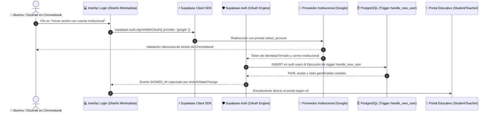

# Arquitectura de Inicio de Sesión Único (SSO) en ISkool (`ISkool_Auth_SSO.md`)

## 1. Visión y Justificación Pedagógica para Aulas Digitales

En entornos educativos modernos con despliegue de **Chromebooks**, tabletas y laboratorios de cómputo escolar, la gestión tradicional de credenciales individuales representa uno de los mayores cuellos de botella para el aprovechamiento del tiempo pedagógico:

* **Eliminación de la Fatiga de Contraseñas:** Los estudiantes (especialmente en Primaria y Secundaria) y docentes suelen perder entre 10 y 15 minutos al inicio de cada clase intentando recordar contraseñas olvidadas, bloqueando cuentas o requiriendo intervención del soporte técnico.
* **Adopción de Cero Fricción en Chromebooks:** Al encender un Chromebook escolar, el estudiante ya se encuentra autenticado en el sistema operativo con su cuenta institucional (`@colegio.edu.mx`). El botón de **Inicio de sesión con cuenta institucional** aprovecha esa sesión activa para ingresar a ISkool en **un solo clic**, sin necesidad de teclear credenciales adicionales.
* **Seguridad y Privacidad Institucional:** La escuela mantiene la gobernanza total sobre las cuentas. Al revocar o suspender una cuenta desde el panel del colegio, el acceso a ISkool queda revocado instantáneamente sin almacenar contraseñas en bases de datos intermedias.

---

## 2. Configuración Backend y Arquitectura en Supabase Auth

La autenticación se implementa mediante el proveedor federado de **Google OAuth 2.0 / OpenID Connect** integrado de forma nativa en Supabase Auth:

### 2.1 Variables de Entorno Seguras (`.env.local`)
```env
NEXT_PUBLIC_SUPABASE_URL=https://dekeyzuqpqxdfnnhohne.supabase.co
NEXT_PUBLIC_SUPABASE_ANON_KEY=...
NEXT_PUBLIC_SUPABASE_PUBLISHABLE_KEY=sb_publishable_...

# Proveedor Google OAuth para Inicio de Sesión Único (SSO Institucional)
SUPABASE_AUTH_EXTERNAL_GOOGLE_ENABLED=true
SUPABASE_AUTH_EXTERNAL_GOOGLE_CLIENT_ID=your-google-client-id.apps.googleusercontent.com
SUPABASE_AUTH_EXTERNAL_GOOGLE_SECRET=your-google-client-secret
NEXT_PUBLIC_AUTH_GOOGLE_ENABLED=true
```

### 2.2 Sincronización Automática en Base de Datos PostgreSQL
Se actualizó el trigger de seguridad `handle_new_user()` en Supabase para parsear automáticamente los metadatos de identidad retornados por el proveedor institucional (`given_name`, `family_name`, `full_name`, `email`):

```sql
CREATE OR REPLACE FUNCTION public.handle_new_user()
RETURNS trigger
LANGUAGE plpgsql
SECURITY DEFINER
AS $$
DECLARE
  v_first_name text;
  v_last_name text;
  v_role text;
BEGIN
  -- Extracción resiliente de nombres para cuentas institucionales
  v_first_name := COALESCE(
    new.raw_user_meta_data->>'first_name',
    new.raw_user_meta_data->>'given_name',
    split_part(COALESCE(new.raw_user_meta_data->>'full_name', new.raw_user_meta_data->>'name', ''), ' ', 1),
    'Estudiante'
  );

  v_last_name := COALESCE(
    new.raw_user_meta_data->>'last_name',
    new.raw_user_meta_data->>'family_name',
    trim(substring(COALESCE(new.raw_user_meta_data->>'full_name', new.raw_user_meta_data->>'name', '') from ' .*')),
    ''
  );

  v_role := COALESCE(new.raw_user_meta_data->>'role', 'student');

  INSERT INTO public.profiles (id, first_name, last_name, role, email)
  VALUES (new.id, v_first_name, v_last_name, v_role, new.email)
  ON CONFLICT (id) DO UPDATE SET
    first_name = EXCLUDED.first_name,
    last_name = EXCLUDED.last_name,
    email = EXCLUDED.email;

  IF v_role = 'student' THEN
    INSERT INTO public.students (id, school_id)
    VALUES (new.id, '00000000-0000-0000-0000-000000000000')
    ON CONFLICT (id) DO NOTHING;

    INSERT INTO public.student_stats (student_id)
    VALUES (new.id)
    ON CONFLICT (student_id) DO NOTHING;

    INSERT INTO public.student_avatars (student_id, avatar_name)
    VALUES (new.id, v_first_name)
    ON CONFLICT (student_id) DO NOTHING;
  END IF;

  RETURN NEW;
END;
$$;
```

---

## 3. Interfaz de Usuario con "Diseño Minimalista" (`src/app/login/page.tsx`)

Cumpliendo con la **Regla Corporativa de Marca Blanca** (prohibición de exponer logotipos o nombres comerciales de terceros en la interfaz del alumno o profesor):

1. **Botón Primario de Gran Escala:**
   * Etiqueta oficial: `"Iniciar sesión con cuenta institucional"` (`#btn-institutional-sso`).
   * Ícono pedagógico: Birrete académico estilizado (`GraduationCap`).
   * Estilo: Alto contraste, diseño minimalista monocromático, esquinas redondeadas (`rounded-2xl`) y retroalimentación de carga reactiva.
2. **Método de Activación Supabase Client:**
   ```typescript
   const handleInstitutionalSSO = async () => {
     setErrorMsg('');
     setIsSsoLoading(true);
     try {
       const redirectUrl = typeof window !== 'undefined' ? `${window.location.origin}/login` : undefined;
       const { data, error } = await supabase.auth.signInWithOAuth({
         provider: 'google',
         options: {
           redirectTo: redirectUrl,
           queryParams: {
             access_type: 'offline',
             prompt: 'select_account'
           }
         }
       });
       if (error) throw error;
     } catch (err: any) {
       setErrorMsg(err.message || 'No fue posible conectar con el proveedor de acceso institucional.');
     } finally {
       setIsSsoLoading(false);
     }
   };
   ```
3. **Separador con Diseño Minimalista:** Delimita el acceso rápido institucional de las opciones de credenciales manuales y perfiles de demostración docente/estudiantil.

---

## 4. Diagrama del Flujo de Autenticación SSO


