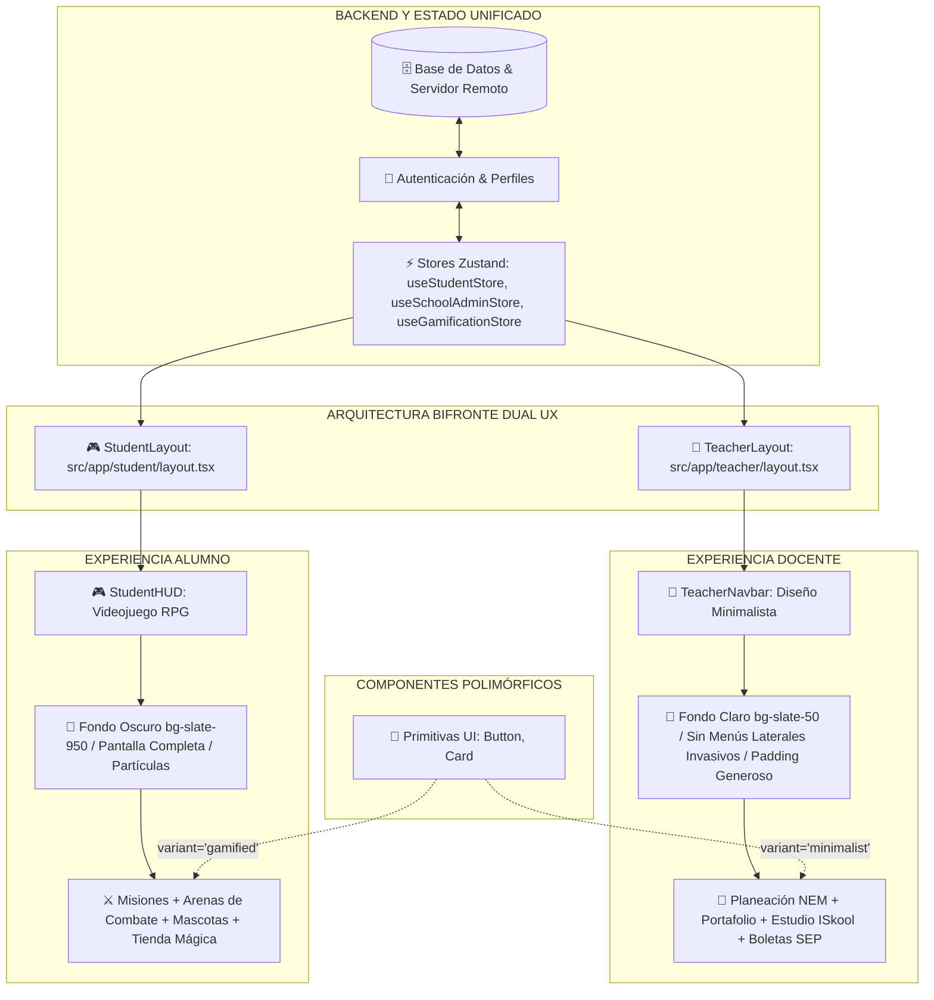

# Arquitectura Bifronte (Dual UX): Coexistencia de Diseño Minimalista y Entorno Inmersivo (`ISkool_Dual_UX_Architecture.md`)

## 1. Fundamento y Filosofía Pedagógica

En las plataformas educativas convencionales suele cometerse un error fundamental de diseño: intentar forzar una única interfaz para dos públicos con objetivos cognitivos radicalmente opuestos:
1. **El Docente y Directivo:** Requiere máxima eficiencia operativa, reducción de sobrecarga mental, captura rápida de evidencias, planeación curricular oficial alineada a la NEM y lectura sin distracciones. Necesita un **"Diseño Minimalista"**.
2. **El Alumno:** Requiere motivación intrínseca, estímulos visuales estimulantes, ciclos cortos de recompensa, sensación de aventura, progreso visual tangible y narrativa lúdica. Necesita un **"Entorno Inmersivo"**.

Para solucionar este desafío sin duplicar el backend ni fracturar el código fuente, ISkool implementa la **Arquitectura Bifronte (Dual UX)**. 

Bajo esta arquitectura, la aplicación comparte un único motor de datos, autenticación y lógica pedagógica, pero bifurca su experiencia en el punto de entrada mediante los **Layouts Especializados de Next.js App Router**:



---

## 2. Implementación de los Layouts Aislados

### 2.1. Portal Docente: "Diseño Minimalista" (`src/app/teacher/layout.tsx`)
- **Atmósfera:** Fondos claros y neutros (`bg-slate-50 text-slate-900`), contrastes WCAG AAA, tipografía Plus Jakarta Sans con kerning ajustado.
- **Top Bar No Invasiva (`TeacherNavbar`):** Reemplaza menús laterales pesados o drawers que roban espacio de pantalla por una barra superior limpia y fija con desenfoque de cristal (`backdrop-blur-md`).
- **Navegación Intuitiva:** Enlaces rápidos directos al Hub Docente, Estudio ISkool, Comunidad Docente y Boleta SEP.
- **Acceso Supervisorio:** Permite el cambio ágil a Presidencia / Supervisión para directores o administradores sin fricción.

```tsx
// src/app/teacher/layout.tsx (Extracto simplificado)
<RoleGuard allowedRoles={['teacher', 'admin', 'superadmin', 'owner', 'director', 'coordinator']}>
  <div className="min-h-screen bg-slate-50 dark:bg-zinc-950 text-slate-900 dark:text-slate-100 flex flex-col font-sans antialiased">
    <TeacherNavbar />
    <div className="flex-1 w-full">
      {children}
    </div>
  </div>
</RoleGuard>
```

### 2.2. Portal Alumno: "Entorno Inmersivo" (`src/app/student/layout.tsx`)
- **Atmósfera:** Pantalla completa en escala oscura profunda (`bg-slate-950 text-slate-100`), con iluminación radial sutil en el fondo que emula un calabozo o academia de fantasía.
- **Gamer HUD Superior (`StudentHUD`):**
  - **Ficha de Personaje:** Avatar del alumno con marco dinámico, nivel (`Nv. X`) y grado escolar.
  - **Medidor de XP en Tiempo Real:** Barra de energía dorada con cálculo proporcional hacia el siguiente nivel.
  - **Economía y Rachas:** Indicadores de Monedas Mágicas (`Coins`) con brillo dorado y Racha de aprendizaje (`Flame`) animada.
  - **Atajos del Héroe:** Navegación hacia *Misiones*, *Portafolio*, *Avatar & Compañero* y *Tienda Mágica*.

```tsx
// src/app/student/layout.tsx (Extracto simplificado)
<RoleGuard allowedRoles={['student', 'admin', 'superadmin', 'owner', 'director']}>
  <StudentSyncProvider>
    <div className="min-h-screen bg-slate-950 text-slate-100 flex flex-col relative overflow-x-hidden">
      <div className="fixed inset-0 bg-[radial-gradient(ellipse_80%_60%_at_50%_-10%,rgba(99,102,241,0.18),rgba(15,23,42,0))] pointer-events-none z-0" />
      <StudentHUD />
      <div className="flex-1 w-full flex flex-col relative z-10">
        {children}
      </div>
    </div>
  </StudentSyncProvider>
</RoleGuard>
```

---

## 3. Sistema de Tokens Cromáticos en `globals.css` (Tailwind CSS v4)

Se definen dos familias de variables CSS inyectadas en `@theme inline`:

| Token CSS | Propósito | Valores Típicos |
| :--- | :--- | :--- |
| `--color-corporate-bg` | Fondo del lienzo docente | `#f8fafc` (slate-50) |
| `--color-corporate-surface` | Tarjetas y paneles limpios | `#ffffff` |
| `--color-corporate-border` | Delimitadores sutiles | `#e2e8f0` (slate-200) |
| `--color-corporate-primary` | Acción principal docente | `#2563eb` (azul cobalto) |
| `--color-gamified-bg` | Fondo del entorno de juego | `#090d16` (obsidiana oscura) |
| `--color-gamified-surface` | Tarjetas HUD y cartas RPG | `rgba(15, 23, 42, 0.78)` |
| `--color-gamified-border` | Bordes arcanos con neón | `rgba(99, 102, 241, 0.35)` |
| `--color-gamified-xp` | Puntos de experiencia | `#f59e0b` (ámbar dorado) |
| `--color-gamified-coins` | Monedas y recompensas | `#fbbf24` (oro brillante) |
| `--color-gamified-energy` | Salud y estamina | `#10b981` (esmeralda neón) |

---

## 4. Componentes Polimórficos Base (`src/components/ui/`)

Para evitar crear componentes duplicados (`TeacherButton` vs `StudentButton`), se diseñaron componentes polimórficos que reciben la prop `variant="minimalist" | "gamified"`:

### 4.1. Botón Polimórfico (`Button.tsx`)
```tsx
import { Button } from '@/components/ui';

// Uso en panel docente (Diseño Minimalista)
<Button variant="minimalist" intent="primary" size="md">
  Guardar Planeación Didáctica
</Button>

// Uso en área de juego (Entorno Inmersivo)
<Button variant="gamified" intent="gold" size="lg" leftIcon={<Swords className="w-4 h-4" />}>
  Iniciar Misión del Gremio
</Button>
```

### 4.2. Tarjeta Polimórfica (`Card.tsx`)
```tsx
import { Card } from '@/components/ui';

// Tarjeta docente
<Card variant="minimalist" hoverable padding="md">
  <h3>Ficha Técnica del Alumno</h3>
  <p>Evaluación formativa continua.</p>
</Card>

// Tarjeta de aventura gamer
<Card variant="gamified" hoverable padding="lg">
  <h3>Cofre de Recompensas Legendarias</h3>
  <p>Desbloquea ítems cosméticos para tu compañero.</p>
</Card>
```

---

## 5. Ventajas Técnicas y Pedagógicas

1. **Cero Duplicación de Lógica de Negocio:**
   Los cálculos de asistencias, entrega de evidencias, evaluación de rúbricas y asignación de XP ocurren sobre los mismos stores (`useStudentStore`, `usePortfolioStore`, `useGamificationStore`).
2. **Eficiencia en el Bundle:**
   Next.js App Router solo descarga y renderiza las utilidades visuales correspondientes a la ruta activa.
3. **Mantenimiento Ágil:**
   Un cambio en las reglas de cálculo o base de datos impacta de inmediato a ambos mundos sin riesgo de desincronización.
4. **Respeto a la Identidad Institucional:**
   El motor de **Marca Blanca** se aplica armoniosamente tanto en el encabezado corporativo del docente como en los acentos de color del HUD del estudiante.

---

## Enlaces Relacionados
- [[WhiteLabel_Architecture]]
- [[ISkool_Studio_Architecture]]
- [[ISkool_Game_Factory_Pattern]]
- [[ISkool_Auth_SSO]]
