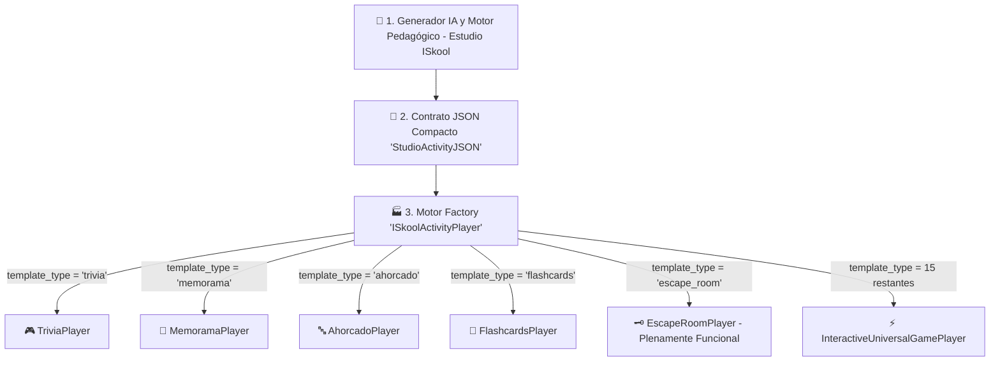

# Patrón Factory de Actividades e Integración de 20 Plantillas (`ISkool_Game_Factory_Pattern.md`)

## 1. Misión y Justificación de Arquitectura
Para escalar la plataforma educacional a decenas de minijuegos gamificados sin incrementar los costos de desarrollo ni recalibrar los prompts del Motor de IA Pedagógica, el **Estudio ISkool** adopta el **Patrón de Diseño Factory** (Fábrica Abstracta de Minijuegos y Actividades).

Un único contrato JSON estándar (`StudioActivityJSON` / `CanvasActivityJSON`) generado eficientemente alimenta indistintamente cualquier plantilla visual.



---

## 2. Ventajas del Patrón Factory para 100+ Juegos

| Dimensión | Enfoque Tradicional | Enfoque ISkool Factory |
| :--- | :--- | :--- |
| **Gasto de Cómputo IA** | Se requiere 1 prompt especializado por juego. | **1 solo prompt ultracompacto** alimenta N juegos con soporte trilingüe. |
| **Esquema de BD** | Tablas específicas por cada tipo de juego. | **0 cambios en BD** (Uso de `content_json` en `community_activities`). |
| **Mantenibilidad** | Fragilidad en frontend por esquemas dispares. | Decoupling total: La vista decide cómo interpretar el JSON. |
| **Escalabilidad** | Agregar un juego requiere semanas de backend. | Agregar un juego consiste únicamente en añadir 1 componente en `src/components/games/` y su caso en el Factory. |

---

## 3. Estado Oficial de las Plantillas Educativas

El catálogo registrado en `src/types/index.ts` bajo la constante `ISKOOL_TEMPLATES` incluye:

1. **Trivia de Preguntas** (`trivia`): [ACTIVA] Cuestionario interactivo con estrellas y feedback instantáneo.
2. **Memorama Visual** (`memorama`): [ACTIVA] Emparejamiento de tarjetas con preguntas, respuestas e imágenes.
3. **Ahorcado Educativo** (`ahorcado`): [ACTIVA] Adivinanza de palabras clave mediante pistas pedagógicas.
4. **Flashcards Animadas** (`flashcards`): [ACTIVA] Tarjetas didácticas con giro 3D e indicador de dominio.
5. **Escape Room Lógico** (`escape_room`): **[PLENAMENTE FUNCIONAL]** Comprensión lectora profunda, panel estilo pergamino para texto base de 2 párrafos y apertura secuencial de candados visuales.
6. **Emparejamiento (Match)** (`match`): [DISPONIBLE EN UNIVERSAL PLAYER] Conexión táctil entre conceptos y definiciones.
7. **Ruleta de Conceptos** (`ruleta`): [DISPONIBLE EN UNIVERSAL PLAYER] Ruleta aleatoria para dinamizar la participación en el aula.
8. **Carrera Matemática** (`carrera_math`): [DISPONIBLE EN UNIVERSAL PLAYER] Desafío de agilidad y cálculo mental a máxima velocidad.
9. **Verdadero / Falso Explosivo** (`tf_explosivo`): [DISPONIBLE EN UNIVERSAL PLAYER] Decisión rápida bajo presión de tiempo.
10. **Constructor de Oraciones** (`sentence_builder`): [DISPONIBLE EN UNIVERSAL PLAYER] Reordenamiento sintáctico de términos clave.
11. **Simón Dice Educativo** (`simon_says`): [DISPONIBLE EN UNIVERSAL PLAYER] Memorización y repetición de secuencias conceptuales.
12. **Batalla de Respuestas** (`batalla_respuestas`): [DISPONIBLE EN UNIVERSAL PLAYER] Competencia de agilidad contrarreloj.
13. **Ordenamiento Cronológico** (`ordenamiento`): [DISPONIBLE EN UNIVERSAL PLAYER] Organización secuencial de hechos o procesos.
14. **Crucigrama de Saberes** (`crucigrama`): [DISPONIBLE EN UNIVERSAL PLAYER] Resolución cruzada de términos de la asignatura.
15. **Rompecabezas Guiado** (`rompecabezas`): [DISPONIBLE EN UNIVERSAL PLAYER] Descubrimiento visual progresivo al responder reactivos.
16. **Detectives de Palabras** (`word_detective`): [DISPONIBLE EN UNIVERSAL PLAYER] Detección de errores en textos pedagógicos.
17. **Sopa de Letras** (`sopa_letras`): [DISPONIBLE EN UNIVERSAL PLAYER] Búsqueda de vocabulario en cuadrícula interactiva.
18. **Mapa Interactivo** (`mapa_interactivo`): [DISPONIBLE EN UNIVERSAL PLAYER] Localización en diagramas y esquemas técnicos.
19. **Caza-Tesoros** (`treasure_hunt`): [DISPONIBLE EN UNIVERSAL PLAYER] Exploración de pistas escondidas en el aula virtual.
20. **Desafío de Clasificación** (`clasificacion`): [DISPONIBLE EN UNIVERSAL PLAYER] Agrupamiento en campos formativos NEM.

---

## 4. Activación de la Plantilla "Escape Room Lógico"

### 4.1. Estructura de Datos (`src/types/index.ts`)
Se incorporó el campo opcional `readingText` en el contrato universal:

```typescript
export interface StudioActivityJSON {
  title: string;
  description: string;
  questions: StudioActivityQuestion[];
  readingText?: string; // Texto base de comprensión lectora (2 párrafos)
  task_type?: string;
  metadata?: any;
  language?: string;
}
```

### 4.2. Motor IA Dinámico (`src/app/api/studio/generate/route.ts`)
Cuando `template_type === 'escape_room'`, el prompt se adapta dinámicamente:
1. **Generación de Lectura Previa:** El Motor de IA redacta primero un texto base enriquecido de exactamente 2 párrafos analíticos sobre `{topic}`.
2. **Anclaje de Reactivos:** Todas las preguntas y opciones se fundamentan de forma estricta en el contenido de esos dos párrafos.
3. **Persistencia del Texto:** La respuesta API retorna la propiedad `readingText` junto con los reactivos estructurados.

### 4.3. Reproductor Visual (`src/components/games/EscapeRoomPlayer.tsx`)
Implementado con la directriz de **Diseño Minimalista**:
- **Panel Izquierdo ("Códice de Evidencias / Pergamino"):** Estilo pergamino con tipografía Serif, paleta cálida ámbar/pergamino, drop-caps y scroll fluido para máxima legibilidad.
- **Panel Derecho ("Cámara de Enigmas"):** Despliegue de la pregunta actual y sus 4 opciones con interacción táctil.
- **Mecánica de Candados Visuales:** Barra superior que representa cada reactivo como un candado (`Lock` 🔒 / `Unlock` 🔓). Al responder correctamente, el candado se desbloquea con animación y feedback formativo inmediato.
- **Pantalla de Escape Exitoso:** Resumen de precisión, aciertos, XP ganada y opción de reinicio o finalización.

---

## 5. Integración en el Patrón Factory (`src/components/ISkoolActivityPlayer.tsx`)

```tsx
export const ISkoolActivityPlayer: React.FC<ISkoolActivityPlayerProps> = ({
  activity,
  templateType = 'trivia',
  onClose,
  onComplete
}) => {
  const normTemplate = templateType.toLowerCase();

  switch (normTemplate) {
    case 'trivia':
      return <TriviaPlayer activity={activity} onClose={onClose} onComplete={onComplete} />;
    
    case 'memorama':
      return <MemoramaPlayer activity={activity} onClose={onClose} onComplete={onComplete} />;
    
    case 'ahorcado':
      return <AhorcadoPlayer activity={activity} onClose={onClose} onComplete={onComplete} />;
    
    case 'flashcards':
      return <FlashcardsPlayer activity={activity} onClose={onClose} onComplete={onComplete} />;

    case 'escape_room':
      return <EscapeRoomPlayer activity={activity} onClose={onClose} onComplete={onComplete} />;

    default:
      return (
        <InteractiveUniversalGamePlayer
          activity={activity}
          templateType={templateType}
          onClose={onClose}
          onComplete={onComplete}
        />
      );
  }
};
```
