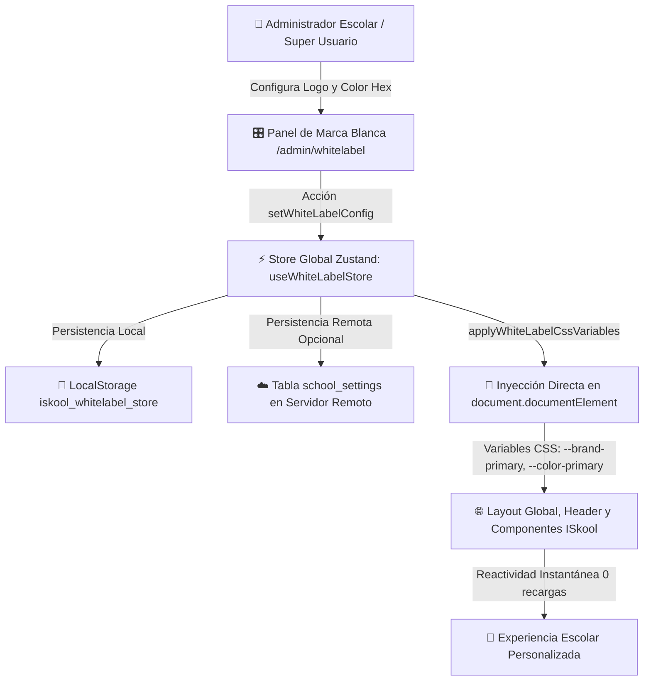

# Arquitectura de Marca Blanca Dinámica en Tiempo Real (`WhiteLabel_Architecture.md`)

## 1. Misión y Justificación de Arquitectura
Para garantizar que cada colegio, institución educativa o campus pueda desplegar el ecosistema del **Estudio ISkool** con su identidad visual oficial (logotipo institucional, nombre de la entidad y color primario corporativo) sin requerir despliegues específicos ni recargar la aplicación en el navegador de los estudiantes y profesores, se implementó una **Arquitectura de Marca Blanca Dinámica** basada en **Zustand** y variables CSS enlazadas al motor de **Tailwind CSS v4**.

Bajo la directriz institucional de **Diseño Minimalista**, la personalización de marca es completamente reactiva, fluida y transparente (*Zero-Reload Realtime Sync*).



---

## 2. Componentes Clave del Sistema

### 2.1. Estado Global Centralizado (`src/store/useWhiteLabelStore.ts`)
El estado de la marca institucional reside en un store desacoplado y reactivo de Zustand configurado con middleware de persistencia:

```typescript
export interface WhiteLabelState {
  logoUrl: string;       // URL web o Data URL Base64 del escudo o logo oficial
  primaryColor: string;  // Código Hexadecimal (#RRGGBB) del color corporativo
  schoolName: string;    // Nombre personalizado del colegio o campus
  isCustomized: boolean; // Flag indicador de personalización activa

  // Acciones reactivas
  setLogoUrl: (url: string) => void;
  setPrimaryColor: (hexColor: string) => void;
  setSchoolName: (name: string) => void;
  setWhiteLabelConfig: (config: { logoUrl?: string; primaryColor?: string; schoolName?: string }) => void;
  resetWhiteLabel: () => void;
  applyTheme: () => void;
}
```

### 2.2. Motor Matemático de Conversión Cromática
El store incluye utilidades de alta precisión que transforman el código hexadecimal ingresado por el usuario a formatos estándar de CSS y Tailwind:
- `hexToRgb(hex)`: Descompone los canales R, G y B para soporte de opacidades y gradientes.
- `hexToHsl(hex)`: Computa Tono (H), Saturación (S%) y Luminosidad (L%) para integrarse de forma nativa con el motor HSL de `globals.css` y Tailwind v4.
- `applyWhiteLabelCssVariables(primaryColorHex)`: Inyecta en `:root` del documento:
  - `--color-primary-hsl`: Componentes HSL (ej. `221 83% 53%`).
  - `--color-brand-primary-hsl`: Canal HSL corporativo.
  - `--color-primary`, `--color-brand-primary`, `--brand-primary`, `--primary-color`: Código hexadecimal directo.
  - `--brand-primary-hover`: Variante ajustada dinámicamente con `-8%` de luminosidad para interacción y contraste.
  - `--brand-primary-light`: Variante translúcida/tenue (`96%` L) para fondos de insignias y pestañas activas.

---

## 3. Panel de Administración y Configuración (`src/app/admin/whitelabel/page.tsx`)
Ubicado en la ruta administrativa protegida por control de accesos (`RoleGuard`), proporciona una interfaz con **Diseño Minimalista** dividida en:

1. **Gestor de Logotipo:**
   - Entrada manual de URL segura de imagen.
   - Carga directa de archivo local (conversión instantánea a Data URL con `FileReader` para previsualizar logotipos antes de desplegarlos en un CDN).
   - Presets de logotipos de prueba y botón para remover el logotipo y regresar al isotipo oficial de ISkool.

2. **Selector de Color y Presets Institucionales:**
   - Selector interactivo HTML5 (`input type="color"`).
   - Campo de entrada textual con validación de sintaxis Hexadecimal.
   - Presets oficiales con fundamento pedagógico y semántico (Azul Zafiro, Verde Esmeralda, Púrpura Sabiduría, Rojo Carmesí, Ámbar Dorado, Azul Marino Oxford, Grafito Minimalista, Turquesa Caribe).

3. **Previsualización en Tiempo Real (Live Sandbox):**
   - Panel lateral fijo que renderiza una barra de navegación simulada, botones de acción primarios/secundarios, tarjetas de misión pedagógica y fichas técnicas con los valores HEX, RGB y HSL calculados en vivo conforme el directivo manipula los controles.

4. **Persistencia Híbrida:**
   - Actualización sincrónica del estado en Zustand con propagación inmediata a `document.documentElement`.
   - Persistencia local en caché de cliente para navegación persistente entre sesiones.
   - Envío asíncrono con tolerancia a fallos a la tabla `school_settings` del Servidor Remoto.

---

## 4. Inyección en la Barra de Navegación y Layout Global

### 4.1. Sincronizador de Tema (`src/components/ThemeSync.tsx`)
Montado en `src/app/layout.tsx`, escucha activamente cambios en `useWhiteLabelStore` y sincroniza las variables CSS de manera transparente cada vez que el colegio modifica su color o al hidratar la página:

```tsx
export const ThemeSync: React.FC = () => {
  const primaryColor = useWhiteLabelStore(state => state.primaryColor);
  const isCustomized = useWhiteLabelStore(state => state.isCustomized);

  useEffect(() => {
    if (primaryColor) {
      applyWhiteLabelCssVariables(primaryColor);
    }
  }, [primaryColor, isCustomized]);

  return null;
};
```

### 4.2. Cabecera Institucional Unificada (`src/components/Header.tsx`)
Consume los valores de `useWhiteLabelStore`. Si el colegio ha configurado su logotipo, este sustituye al icono tradicional, y el nombre institucional acompaña la navegación:

```tsx
{effectiveLogoUrl ? (
  
) : (
  <GraduationCap className="h-7 w-7 sm:h-8 sm:w-8 group-hover:scale-105 transition-transform" style={{ color: 'var(--brand-primary, #2563EB)' }} />
)}
```

---

## 5. Beneficios de Rendimiento y Escalabilidad

| Dimensión | Enfoque Tradicional (Multi-Tenant Estático) | Enfoque Marca Blanca Dinámica ISkool |
| :--- | :--- | :--- |
| **Tiempo de Despliegue** | Requiere recompilar assets y generar builds específicos. | **0 segundos**: Se actualiza dinámicamente en tiempo de ejecución. |
| **Recarga del Navegador** | Recarga forzada de página (`location.reload()`). | **Zero-Reload**: Transición fluida e instantánea en el DOM mediante CSS Variables. |
| **Consumo de Memoria** | Duplicación de bundles CSS por tema. | **1 único bundle CSS** (Tailwind v4) gobernado por variables en `:root`. |
| **Alineación Visual** | Interfaces heterogéneas y recargadas. | **Diseño Minimalista** estandarizado con contraste y legibilidad óptimos. |
