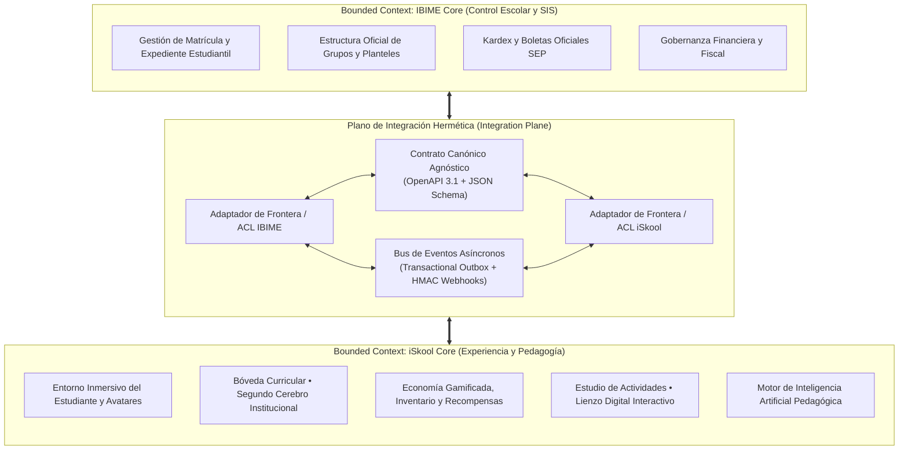
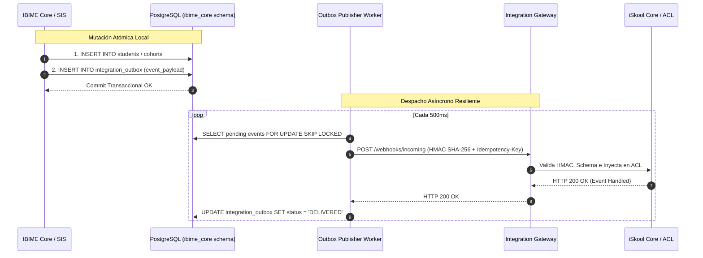
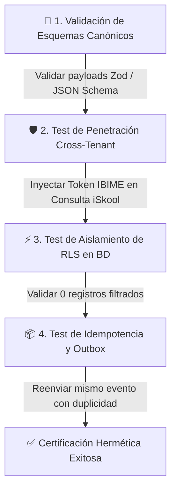

# Especificación Técnica de Arquitectura: Integración Hermética Multi-Tenant iSkool Core e IBIME (`iSkool_IBIME_Integration_Contract.md`)

## 1. Resumen Ejecutivo y Misión Arquitectónica

El presente documento formaliza el diseño arquitectónico para la coexistencia e integración federada entre **iSkool Core** (plataforma de experiencia formativa, gamificación educativa y Bóveda Curricular) y el subsistema institucional **IBIME** (gestor de control escolar, matrícula y gobernanza administrativa).

Bajo la directriz mandatoria de **DESARROLLO HERMÉTICO**, se erradica cualquier dependencia acoplada o compartición directa de base de datos a nivel de tabla sin mediación contractual. Ambos ecosistemas operan como **Bounded Contexts soberanos**:
1. **Desacoplamiento Absoluto:** Ningún cambio de esquema interno, refactorización o actualización de dependencias dentro de IBIME alterará el funcionamiento de iSkool, ni viceversa.
2. **Contratos Agnósticos:** Toda interacción se efectúa mediante contratos canónicos formalizados en **OpenAPI 3.1.0** y **JSON Schema**, complementados por un bus de eventos asíncronos basado en el patrón **Transactional Outbox**.
3. **Aislamiento Multi-Tenant Estricto (Zero Trust / Zero Leakage):** Partición criptográfica y lógica a nivel de base de datos mediante **Row Level Security (RLS)** en PostgreSQL, garantizando que ninguna consulta de iSkool devuelva registros de IBIME sin un contexto de autorización explícito, y viceversa.
4. **Cumplimiento de Marca Blanca Institucional:** Toda la infraestructura respeta estrictamente la política institucional de no exponer marcas comerciales externas en código, esquemas o interfaces de usuario.

---

## 2. Definición Formal de Bounded Contexts (Domain-Driven Design)



### 2.1 Bounded Context: `iSkool Core`
* **Misión:** Optimizar el proceso de enseñanza-aprendizaje, la motivación del alumno y la planeación didáctica docente mediante experiencias interactivas y herramientas de alta tecnología pedagógica.
* **Modelo de Dominio Autónomo:**
  * **Agregado Alumno/Avatar (`LearnerIdentity`):** Identidad pedagógica, nivel de maestría, experiencia (XP), gemas de sabiduría, artefactos desbloqueados e inventario dinámico.
  * **Agregado Planeación Didáctica (`PedagogicalPlan`):** Nodos estructurados en la Bóveda Curricular, sesiones cronometradas (Inicio, Desarrollo, Cierre), vinculación curricular nacional (NEM 2024, PDA Oficial) y adecuaciones curriculares históricas.
  * **Agregado Actividad y Lienzo Digital (`InteractiveActivity`):** Entorno interactivo de resolución, simuladores, quizzes formativos y desafíos en equipo.
  * **Agregado Resultado de Maestría (`MasteryAssessment`):** Rúbricas analíticas, feedback cualitativo inmediato del Motor de Inteligencia Artificial Pedagógica y puntaje formativo.
* **Lenguaje Ubicuo (Ubiquitous Language):** `Learner`, `Avatar`, `VaultNode`, `DidacticMoment`, `MasteryScore`, `InstitutionalMemory`, `InteractiveCanvas`.

### 2.2 Bounded Context: `IBIME Core`
* **Misión:** Garantizar la administración académica, el cumplimiento normativo ante autoridades educativas (SEP), la trazabilidad documental de expedientes y el control institucional.
* **Modelo de Dominio Autónomo:**
  * **Agregado Matrícula Escolar (`StudentEnrollment`):** Datos demográficos oficiales, CURP, expediente médico confidencial, estado de colegiaturas, estatus legal de inscripción (`active`, `suspended`, `graduated`).
  * **Agregado Grupo Oficial (`InstitutionalCohort`):** Clave de centro de trabajo (CCT), turno (matutino/vespertino), asignación contractual de plazas docentes y periodos lectivos.
  * **Agregado Calificaciones y Kardex (`OfficialAcademicRecord`):** Escala sumativa oficial (5 al 10 / Acreditado), periodos de evaluación trimestral, promedios ponderados y emisión de boletas institucionales.
* **Lenguaje Ubicuo (Ubiquitous Language):** `MatriculaEscolar`, `ExpedienteEstudiantil`, `CohorteOficial`, `Kardex`, `PeriodoTrimestral`, `FolioOficialSEP`.

### 2.3 Context Mapping y Capas Anti-Corrupción (ACL)
Para asegurar que los términos de IBIME (ej. `MatriculaEscolar`) no contaminen el modelo de iSkool (ej. `LearnerIdentity`), se instituyen dos **Anti-Corruption Layers (ACL)** simétricas:
1. **ACL iSkool (`ISkoolBoundaryAdapter`):** Traduce los DTO canónicos entrantes a los tipos internos de Zustand y del motor del juego. Nunca almacena datos de facturación ni historiales clínicos de IBIME.
2. **ACL IBIME (`IBIMEBoundaryAdapter`):** Traduce las evidencias formativas y analíticas de maestría devueltas por iSkool a la escala cuantitativa requerida por las actas de calificación de IBIME.
3. **Identificador Global de Enlace:** La correlación se resuelve exclusivamente mediante `tenant_id` institucional y `external_ref_id`. Ninguna clave primaria autonumérica ni identificador interno de un subsistema es expuesto al otro.

---

## 3. Contratos de Datos Canónicos (JSON Schema & DTOs)

Todos los intercambios entre iSkool e IBIME deben validarse estrictamente contra los esquemas canónicos descritos a continuación. Si un mensaje falla la validación del esquema, es rechazado de inmediato con un error HTTP 422 o reencaminado a la Dead Letter Queue (DLQ).

### 3.1 Entidad 1: Estudiante (`CanonicalStudentSync`)

Garantiza la sincronización de alumnos desde el SIS de IBIME hacia el entorno de aprendizaje de iSkool sin transferir datos clínicos ni financieros sensibles.

```json
{
  "$schema": "https://json-schema.org/draft/2020-12/schema",
  "$id": "https://schemas.iskool.mx/v1/integration/canonical-student.json",
  "title": "CanonicalStudentSync",
  "type": "object",
  "required": ["id", "tenant_id", "external_ref_id", "first_name", "last_name", "email", "enrollment_status", "sync_timestamp"],
  "properties": {
    "id": {
      "type": "string",
      "format": "uuid",
      "description": "Identificador único universal canónico en la plataforma de integración"
    },
    "tenant_id": {
      "type": "string",
      "enum": ["ibime-central", "ibime-norte", "iskool-core"],
      "description": "Identificador único de la institución/tenant emisor o receptor"
    },
    "external_ref_id": {
      "type": "string",
      "pattern": "^[A-Za-z0-9_-]{3,64}$",
      "description": "Matrícula o identificador de control escolar en el sistema de origen"
    },
    "first_name": {
      "type": "string",
      "minLength": 1,
      "maxLength": 100
    },
    "last_name": {
      "type": "string",
      "minLength": 1,
      "maxLength": 100
    },
    "email": {
      "type": "string",
      "format": "email"
    },
    "enrollment_status": {
      "type": "string",
      "enum": ["active", "suspended", "transferred", "graduated"]
    },
    "metadata": {
      "type": "object",
      "properties": {
        "preferred_name": { "type": "string" },
        "avatar_profile_hint": { "type": "string" },
        "accessibility_needs": {
          "type": "array",
          "items": { "type": "string" }
        }
      },
      "additionalProperties": false
    },
    "sync_timestamp": {
      "type": "string",
      "format": "date-time"
    }
  },
  "additionalProperties": false
}
```

### 3.2 Entidad 2: Grupo y Cohorte (`CanonicalGroupSync`)

Estructura organizativa que agrupa alumnos, asignaturas y docentes titulares para un ciclo escolar específico.

```json
{
  "$schema": "https://json-schema.org/draft/2020-12/schema",
  "$id": "https://schemas.iskool.mx/v1/integration/canonical-group.json",
  "title": "CanonicalGroupSync",
  "type": "object",
  "required": ["id", "tenant_id", "external_ref_id", "academic_cycle", "grade", "section", "shift", "status"],
  "properties": {
    "id": {
      "type": "string",
      "format": "uuid"
    },
    "tenant_id": {
      "type": "string"
    },
    "external_ref_id": {
      "type": "string"
    },
    "academic_cycle": {
      "type": "string",
      "pattern": "^[0-9]{4}-[0-9]{4}$",
      "example": "2025-2026"
    },
    "grade": {
      "type": "integer",
      "minimum": 1,
      "maximum": 12
    },
    "section": {
      "type": "string",
      "maxLength": 10,
      "example": "A"
    },
    "shift": {
      "type": "string",
      "enum": ["matutino", "vespertino", "mixto"]
    },
    "teacher_lead_ref": {
      "type": "string",
      "description": "Identificador externo del docente titular de la cohorte"
    },
    "status": {
      "type": "string",
      "enum": ["active", "archived", "draft"]
    },
    "student_external_refs": {
      "type": "array",
      "items": { "type": "string" },
      "description": "Lista de matrículas de alumnos asignados a este grupo"
    }
  },
  "additionalProperties": false
}
```

### 3.3 Entidad 3: Planeación Curricular (`CanonicalCurricularPlan`)

Define el plan de clase y su grounding pedagógico. Permite a los coordinadores de IBIME validar la congruencia curricular sin interferir en los archivos Markdown ni en la topología de grafos de la Bóveda Curricular.

```json
{
  "$schema": "https://json-schema.org/draft/2020-12/schema",
  "$id": "https://schemas.iskool.mx/v1/integration/canonical-curricular-plan.json",
  "title": "CanonicalCurricularPlan",
  "type": "object",
  "required": [
    "plan_id",
    "tenant_id",
    "subject_code",
    "phase",
    "grade",
    "curriculum_standard",
    "didactic_intent",
    "sessions",
    "evaluation_rubric"
  ],
  "properties": {
    "plan_id": {
      "type": "string",
      "format": "uuid"
    },
    "tenant_id": {
      "type": "string"
    },
    "vault_node_ref": {
      "type": "string",
      "description": "Ruta relativa canónica dentro de la Bóveda Curricular (ej: planeaciones/Fase4/Grado4/Ciencias/Estados_Materia.md)"
    },
    "subject_code": {
      "type": "string",
      "enum": ["ciencias", "matematicas", "lenguaje", "historia", "tecnologia", "artes", "etica"]
    },
    "phase": {
      "type": "integer",
      "minimum": 1,
      "maximum": 6
    },
    "grade": {
      "type": "integer",
      "minimum": 1,
      "maximum": 6
    },
    "curriculum_standard": {
      "type": "object",
      "required": ["framework", "pda_code", "pda_description"],
      "properties": {
        "framework": { "type": "string", "example": "NEM 2024" },
        "pda_code": { "type": "string" },
        "pda_description": { "type": "string" }
      }
    },
    "didactic_intent": {
      "type": "string",
      "maxLength": 1000
    },
    "sessions": {
      "type": "array",
      "minItems": 1,
      "items": {
        "type": "object",
        "required": ["session_number", "duration_minutes", "moments"],
        "properties": {
          "session_number": { "type": "integer", "minimum": 1 },
          "duration_minutes": { "type": "integer", "enum": [45, 50, 60, 90] },
          "moments": {
            "type": "object",
            "required": ["inicio", "desarrollo", "cierre"],
            "properties": {
              "inicio": { "type": "string" },
              "desarrollo": { "type": "string" },
              "cierre": { "type": "string" }
            }
          }
        }
      }
    },
    "evaluation_rubric": {
      "type": "array",
      "items": {
        "type": "object",
        "required": ["criterion", "weight_percent", "descriptors"],
        "properties": {
          "criterion": { "type": "string" },
          "weight_percent": { "type": "number", "minimum": 0, "maximum": 100 },
          "descriptors": {
            "type": "object",
            "required": ["sobresaliente", "satisfactorio", "en_proceso"],
            "properties": {
              "sobresaliente": { "type": "string" },
              "satisfactorio": { "type": "string" },
              "en_proceso": { "type": "string" }
            }
          }
        }
      }
    }
  },
  "additionalProperties": false
}
```

### 3.4 Entidad 4: Evaluación y Evidencia Formativa (`CanonicalAssessmentResult`)

Canaliza los resultados obtenidos en el Lienzo Digital interactivo y el entorno de juego hacia el módulo de calificaciones de IBIME.

```json
{
  "$schema": "https://json-schema.org/draft/2020-12/schema",
  "$id": "https://schemas.iskool.mx/v1/integration/canonical-assessment.json",
  "title": "CanonicalAssessmentResult",
  "type": "object",
  "required": [
    "assessment_id",
    "tenant_id",
    "student_external_ref",
    "group_external_ref",
    "activity_id",
    "activity_type",
    "raw_score",
    "scale_max",
    "percentage",
    "completion_timestamp"
  ],
  "properties": {
    "assessment_id": {
      "type": "string",
      "format": "uuid"
    },
    "tenant_id": {
      "type": "string"
    },
    "student_external_ref": {
      "type": "string"
    },
    "group_external_ref": {
      "type": "string"
    },
    "activity_id": {
      "type": "string"
    },
    "activity_type": {
      "type": "string",
      "enum": ["quiz_interactivo", "lienzo_digital", "proyecto_integrador", "desafio_colaborativo"]
    },
    "raw_score": {
      "type": "number",
      "minimum": 0
    },
    "scale_max": {
      "type": "number",
      "minimum": 1
    },
    "percentage": {
      "type": "number",
      "minimum": 0,
      "maximum": 100
    },
    "mastery_level": {
      "type": "string",
      "enum": ["inicial", "en_desarrollo", "consolidado", "sobresaliente"]
    },
    "pedagogical_feedback": {
      "type": "string",
      "maxLength": 2000
    },
    "gamification_metrics": {
      "type": "object",
      "properties": {
        "xp_earned": { "type": "integer", "minimum": 0 },
        "artifacts_awarded": {
          "type": "array",
          "items": { "type": "string" }
        }
      }
    },
    "completion_timestamp": {
      "type": "string",
      "format": "date-time"
    }
  },
  "additionalProperties": false
}
```

---

## 4. Especificación OpenAPI 3.1.0 (Integration Gateway API)

Los siguientes endpoints son implementados en la pasarela de integración (`/api/v1/integration/*`) como servicio desacoplado.

```yaml
openapi: 3.1.0
info:
  title: iSkool & IBIME Hermetic Integration API
  version: 1.0.0
  description: Pasarela oficial y hermética para el intercambio soberano de datos entre iSkool Core e IBIME.
servers:
  - url: https://api.iskool.mx/v1/integration
    description: Pasarela Principal de Integración
paths:
  /sync/students:
    post:
      summary: Sincronización masiva o individual de estudiantes
      operationId: syncStudents
      security:
        - BearerTenantAuth: []
      parameters:
        - name: X-Tenant-ID
          in: header
          required: true
          schema:
            type: string
        - name: X-Idempotency-Key
          in: header
          required: true
          schema:
            type: string
            format: uuid
      requestBody:
        required: true
        content:
          application/json:
            schema:
              type: array
              items:
                $ref: '#/components/schemas/CanonicalStudentSync'
      responses:
        '202':
          description: Lote de sincronización aceptado para procesamiento asíncrono
          content:
            application/json:
              schema:
                $ref: '#/components/schemas/BatchSyncResponse'
        '401':
          $ref: '#/components/responses/Unauthorized'
        '422':
          $ref: '#/components/responses/UnprocessableEntity'

  /sync/groups:
    post:
      summary: Publicación y actualización de grupos escolares
      operationId: syncGroups
      security:
        - BearerTenantAuth: []
      parameters:
        - name: X-Tenant-ID
          in: header
          required: true
          schema:
            type: string
      requestBody:
        required: true
        content:
          application/json:
            schema:
              type: array
              items:
                $ref: '#/components/schemas/CanonicalGroupSync'
      responses:
        '200':
          description: Grupos procesados exitosamente
        '422':
          $ref: '#/components/responses/UnprocessableEntity'

  /curricular-plans:
    get:
      summary: Consulta canónica de planeaciones para auditoría institucional
      operationId: getCurricularPlans
      security:
        - BearerTenantAuth: []
      parameters:
        - name: grade
          in: query
          schema:
            type: integer
        - name: subject_code
          in: query
          schema:
            type: string
      responses:
        '200':
          content:
            application/json:
              schema:
                type: array
                items:
                  $ref: '#/components/schemas/CanonicalCurricularPlan'

  /assessments/stream:
    post:
      summary: Ingesta de calificaciones y evidencias formativas desde iSkool hacia IBIME
      operationId: pushAssessments
      security:
        - BearerTenantAuth: []
      parameters:
        - name: X-Tenant-ID
          in: header
          required: true
          schema:
            type: string
      requestBody:
        required: true
        content:
          application/json:
            schema:
              type: array
              items:
                $ref: '#/components/schemas/CanonicalAssessmentResult'
      responses:
        '201':
          description: Evidencias registradas y encoladas para el cálculo de Kardex en IBIME

components:
  securitySchemes:
    BearerTenantAuth:
      type: http
      scheme: bearer
      bearerFormat: JWT
      description: Token firmado por el IdP Institucional que contiene obligatoriamente la claim 'tenant_id'.

  schemas:
    CanonicalStudentSync:
      $ref: 'https://schemas.iskool.mx/v1/integration/canonical-student.json'
    CanonicalGroupSync:
      $ref: 'https://schemas.iskool.mx/v1/integration/canonical-group.json'
    CanonicalCurricularPlan:
      $ref: 'https://schemas.iskool.mx/v1/integration/canonical-curricular-plan.json'
    CanonicalAssessmentResult:
      $ref: 'https://schemas.iskool.mx/v1/integration/canonical-assessment.json'
    BatchSyncResponse:
      type: object
      properties:
        batch_id: { type: string, format: uuid }
        status: { type: string, enum: [queued, processing, completed] }
        received_records: { type: integer }
        enqueued_at: { type: string, format: date-time }

  responses:
    Unauthorized:
      description: Acceso no autorizado o token no coincide con el X-Tenant-ID solicitado.
    UnprocessableEntity:
      description: Carga útil no cumple con el esquema canónico (falla de validación JSON Schema).
```

---

## 5. Eventos Asíncronos y Patrón Transactional Outbox

Para evitar bloqueos bidireccionales y preservar el principio hermético, toda mutación transaccional se publica asíncronamente mediante el patrón **Transactional Outbox**.



### 5.1 Catálogo de Eventos Oficiales

| Tipo de Evento | Emisor | Receptor | Propósito | Carga Útil (Payload) |
|---|---|---|---|---|
| `student.enrolled.v1` | IBIME Core | iSkool Core | Crea el perfil pedagógico y provisiona el avatar inicial del alumno | `CanonicalStudentSync` |
| `student.withdrawn.v1` | IBIME Core | iSkool Core | Desactiva temporalmente el acceso del alumno a torneos y actividades | `{ student_id, tenant_id, reason, effective_date }` |
| `group.assigned.v1` | IBIME Core | iSkool Core | Vincula alumnos y profesor a la cohorte didáctica | `CanonicalGroupSync` |
| `curriculum.plan.published.v1` | iSkool Core | IBIME Core | Notifica a coordinación académica que una planeación está lista en la Bóveda Curricular | `CanonicalCurricularPlan` |
| `assessment.submitted.v1` | iSkool Core | IBIME Core | Transmite calificaciones de Lienzo Digital / Quizzes para cómputo de Kardex | `CanonicalAssessmentResult` |

### 5.2 Estructura del Envelope de Evento y Seguridad Webhook

Cada webhook saliente contiene un sobre estandarizado con firma digital:

```json
{
  "event_id": "8f8b839b-e854-469b-83ee-d6c579308a01",
  "event_type": "assessment.submitted.v1",
  "tenant_id": "ibime-central",
  "timestamp": "2026-09-28T15:30:00Z",
  "idempotency_key": "idem-9a84b0-3129",
  "data": {
    "assessment_id": "f51b9d4c-e877-47b8-8c10-09c071aa1123",
    "student_external_ref": "MAT-2026-0491",
    "activity_id": "act-fracciones-equivalentes",
    "activity_type": "lienzo_digital",
    "raw_score": 9.5,
    "scale_max": 10.0,
    "percentage": 95.0,
    "completion_timestamp": "2026-09-28T15:29:45Z"
  }
}
```

* **Encabezados Mandatorios del Webhook:**
  * `X-ISkool-Signature: t=1759073400,v1=98cfa10b95bc...` (Firma HMAC-SHA256 del cuerpo con el secreto compartido del tenant).
  * `X-Tenant-ID: ibime-central`
  * `X-Webhook-Timestamp: 1759073400` (Tolerancia máxima de deriva: 300 segundos para prevenir ataques de reproducción).

---

## 6. Estrategia de Aislamiento en Base de Datos (PostgreSQL con RLS)

Para garantizar la hermeticidad a nivel de almacenamiento físico y relacional, se establece una estrategia híbrida:
1. **Esquemas Lógicos Separados:**
   * `iskool_core`: Contiene las tablas del motor de gamificación, nodos de conocimiento, avatares e inventarios.
   * `ibime_core`: Contiene expedientes administrativos, kardex oficial y tesorería escolar.
   * `integration_hub`: Contiene las tablas de despacho y recepción de eventos (`event_outbox`, `event_inbox`, `tenant_registry`).
2. **Tablas Multi-Tenant Compartidas con Row Level Security (RLS) Mandatorio:**
   * En las entidades comunes (`profiles`, `students`, `groups`, `curricular_plans`, `assessments`), el aislamiento se impone rigurosamente mediante la columna `tenant_id` y directivas RLS.

### 6.1 Configuración de Contexto de Sesión en PostgreSQL

El contexto de identidad del usuario o servicio se inyecta en cada transacción a partir de los claims validados del JWT:

```sql
-- Función para fijar el contexto de la transacción actual
CREATE OR REPLACE FUNCTION public.set_tenant_context(p_tenant_id text)
RETURNS void
LANGUAGE plpgsql
SECURITY DEFINER
SET search_path = public, pg_catalog, pg_temp
AS $$
BEGIN
  IF p_tenant_id IS NULL OR trim(p_tenant_id) = '' THEN
    RAISE EXCEPTION 'Aislamiento Hermético: No se puede establecer un contexto de tenant vacío';
  END IF;
  PERFORM set_config('app.current_tenant_id', p_tenant_id, true);
END;
$$;

-- Función de conveniencia para consultar el tenant activo
CREATE OR REPLACE FUNCTION public.get_current_tenant_id()
RETURNS text
LANGUAGE sql
STABLE
AS $$
  SELECT NULLIF(current_setting('app.current_tenant_id', true), '');
$$;
```

### 6.2 Políticas de Row Level Security (RLS) Herméticas

A continuación se detallan las directivas DDL que garantizan que ninguna consulta de iSkool ni de IBIME pueda filtrar registros ajenos sin autorización explícita:

```sql
-- ============================================================================
-- 1. POLÍTICAS DE AISLAMIENTO PARA PERFILES DE USUARIO (PROFILES)
-- ============================================================================

ALTER TABLE public.profiles ENABLE ROW LEVEL SECURITY;
ALTER TABLE public.profiles FORCE ROW LEVEL SECURITY;

-- Política de Lectura: Solo usuarios del mismo tenant o Super Usuarios de Plataforma
CREATE POLICY "RLS_Profiles_Select_Hermetic"
  ON public.profiles FOR SELECT
  TO authenticated
  USING (
    -- Caso 1: Super Usuario de la plataforma (Nivel 1 ISkool)
    (auth.jwt() -> 'app_metadata' ->> 'role') = 'super_user'
    OR
    -- Caso 2: El usuario pertenece estrictamente al mismo tenant que el perfil
    (
      tenant_id = (auth.jwt() -> 'app_metadata' ->> 'tenant_id')
      AND
      tenant_id = public.get_current_tenant_id()
    )
  );

-- Política de Modificación: Ningún tenant puede modificar perfiles de otro tenant
CREATE POLICY "RLS_Profiles_Update_Hermetic"
  ON public.profiles FOR UPDATE
  TO authenticated
  USING (
    tenant_id = (auth.jwt() -> 'app_metadata' ->> 'tenant_id')
    AND
    tenant_id = public.get_current_tenant_id()
  )
  WITH CHECK (
    tenant_id = (auth.jwt() -> 'app_metadata' ->> 'tenant_id')
  );

-- ============================================================================
-- 2. POLÍTICAS DE AISLAMIENTO PARA ALUMNOS (STUDENTS)
-- ============================================================================

ALTER TABLE public.students ENABLE ROW LEVEL SECURITY;
ALTER TABLE public.students FORCE ROW LEVEL SECURITY;

CREATE POLICY "RLS_Students_Isolation_Policy"
  ON public.students FOR ALL
  TO authenticated
  USING (
    (auth.jwt() -> 'app_metadata' ->> 'role') = 'super_user'
    OR
    (
      tenant_id = (auth.jwt() -> 'app_metadata' ->> 'tenant_id')
      AND
      tenant_id = public.get_current_tenant_id()
    )
  )
  WITH CHECK (
    tenant_id = (auth.jwt() -> 'app_metadata' ->> 'tenant_id')
    AND
    tenant_id = public.get_current_tenant_id()
  );

-- ============================================================================
-- 3. POLÍTICAS DE AISLAMIENTO PARA EVALUACIONES FORMATIVAS (ASSESSMENTS)
-- ============================================================================

ALTER TABLE public.assessments ENABLE ROW LEVEL SECURITY;
ALTER TABLE public.assessments FORCE ROW LEVEL SECURITY;

CREATE POLICY "RLS_Assessments_Hermetic_Select"
  ON public.assessments FOR SELECT
  TO authenticated
  USING (
    (auth.jwt() -> 'app_metadata' ->> 'role') = 'super_user'
    OR
    (
      tenant_id = (auth.jwt() -> 'app_metadata' ->> 'tenant_id')
      AND
      tenant_id = public.get_current_tenant_id()
    )
  );

CREATE POLICY "RLS_Assessments_Hermetic_Insert"
  ON public.assessments FOR INSERT
  TO authenticated
  WITH CHECK (
    tenant_id = (auth.jwt() -> 'app_metadata' ->> 'tenant_id')
    AND
    tenant_id = public.get_current_tenant_id()
  );

-- ============================================================================
-- 4. TABLA DE CONTROL DE EVENTOS TRANSACCIONALES (INTEGRATION HUB OUTBOX)
-- ============================================================================

CREATE SCHEMA IF NOT EXISTS integration_hub;

CREATE TABLE IF NOT EXISTS integration_hub.event_outbox (
  id uuid PRIMARY KEY DEFAULT gen_random_uuid(),
  tenant_id text NOT NULL,
  event_type text NOT NULL,
  idempotency_key text NOT NULL UNIQUE,
  payload jsonb NOT NULL,
  status text NOT NULL DEFAULT 'PENDING' CHECK (status IN ('PENDING', 'PROCESSING', 'DELIVERED', 'FAILED')),
  retry_count integer NOT NULL DEFAULT 0,
  last_error text,
  created_at timestamptz NOT NULL DEFAULT now(),
  delivered_at timestamptz
);

ALTER TABLE integration_hub.event_outbox ENABLE ROW LEVEL SECURITY;
ALTER TABLE integration_hub.event_outbox FORCE ROW LEVEL SECURITY;

CREATE POLICY "RLS_EventOutbox_Isolation"
  ON integration_hub.event_outbox FOR ALL
  TO authenticated
  USING (
    (auth.jwt() -> 'app_metadata' ->> 'role') = 'super_user'
    OR
    tenant_id = (auth.jwt() -> 'app_metadata' ->> 'tenant_id')
  )
  WITH CHECK (
    tenant_id = (auth.jwt() -> 'app_metadata' ->> 'tenant_id')
  );
```

### 6.3 Garantía de Hermeticidad (Zero Leakage Check)
1. **`FORCE ROW LEVEL SECURITY`:** Impide que los propietarios o roles con privilegios de tabla en PostgreSQL puedan saltarse las cláusulas RLS de forma inadvertida.
2. **Validación Dual:** Cada consulta evalúa tanto el claim criptográfico en el token (`auth.jwt() -> 'app_metadata' ->> 'tenant_id'`) como la variable de contexto transaccional (`get_current_tenant_id()`). Si hay discrepancia entre ambas, la consulta devuelve automáticamente 0 registros o genera una excepción de seguridad.
3. **Servicio sin Estado (Stateless Gateway):** Cada llamada a la API requiere autenticación federada, evitando estados residuales en caché de conexión (`connection pooling`) que pudieran mezclar tenants.

---

## 7. Protocolo de Pruebas de Verificación de Hermeticidad

Toda actualización de código o integración debe superar satisfactoriamente la siguiente batería de validación antes de su paso a producción:



### 7.1 Matriz de Pruebas Automatizadas

| ID | Nombre de la Prueba | Condición de Entrada | Resultado Esperado | Severidad |
|---|---|---|---|---|
| `TEST-HERM-01` | Fuga Cruzada de Estudiantes | Token con `tenant_id = 'iskool-core'` consulta `/sync/students` con filtro `tenant_id = 'ibime-central'` | `HTTP 403 Forbidden` o respuesta vacía `[]`. Cero registros devueltos. | **Crítica** |
| `TEST-HERM-02` | Rechazo de Esquema no Canónico | Envío de `CanonicalStudentSync` con campo extra confidencial (ej: `curp_clinica`) | `HTTP 422 Unprocessable Entity`. Fallo de validación estricta (`additionalProperties: false`). | **Alta** |
| `TEST-HERM-03` | Idempotencia de Outbox | Envío duplicado de webhook `assessment.submitted.v1` con la misma `idempotency_key` | El segundo envío retorna `HTTP 200 OK (Duplicate skipped)` sin generar doble registro de calificaciones. | **Alta** |
| `TEST-HERM-04` | Integridad de Firma HMAC | Envío de webhook con firma HMAC-SHA256 manipulada o expirada (>300s) | `HTTP 401 Unauthorized`. La petición es rechazada en la frontera de red. | **Crítica** |
| `TEST-HERM-05` | Resiliencia ante Desconexión | Caída total del subsistema IBIME durante la ejecución de una actividad gamificada en iSkool | Los alumnos completan su sesión con normalidad; el resultado se encola en `event_outbox` para sincronización posterior. Cero interrupciones en el aula. | **Crítica** |

---

## 8. Conclusión y Hoja de Ruta

La presente arquitectura garantiza que **iSkool** e **IBIME** alcancen una integración institucional sin comprometer la agilidad, estabilidad o seguridad de ninguno de los dos sistemas. 

Al ceñirse a **Bounded Contexts soberanos**, **contratos canónicos OpenAPI/JSON Schema**, **patrón Transactional Outbox** y **Row Level Security forzado**, se logra un ecosistema resiliente, auditable y preparado para escalar a nivel nacional preservando de forma inquebrantable el principio de **Desarrollo Hermético**.
