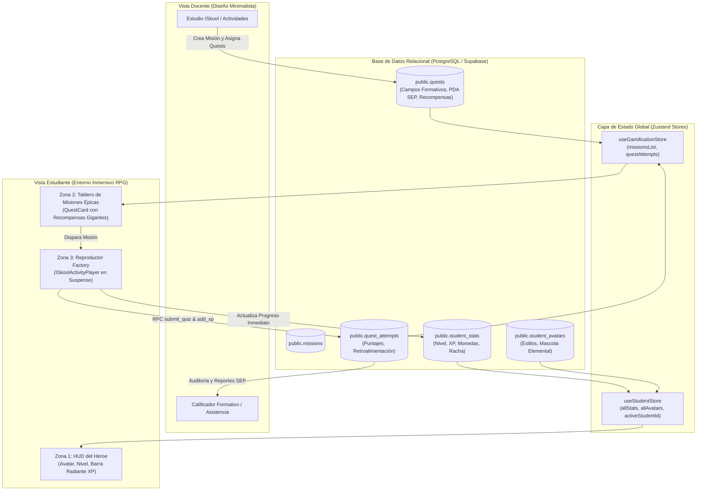

# Arquitectura UX del Entorno Inmersivo Estudiantil (Student Immersive UX)

> **Clasificación del Documento:** Especificación Técnica de Frontend & Gamificación Pedagógica  
> **Sistema:** ISkool LMS Gamificado  
> **Principio Clave:** Cero Marcas Comerciales Externas | Arquitectura Bifronte (Dual UX)  
> **Ecosistema de Datos:** Bóveda Central de Conocimiento & Motor de Estado Zustand  

---

## 1. Resumen Ejecutivo y Filosofía del Entorno Inmersivo

La arquitectura de ISkool implementa un modelo **Bifronte (Dual UX)** que responde a las necesidades cognitivas diferenciadas de cada actor de la comunidad educativa:
1. **Hub Docente / Coordinador:** Aplica un **Diseño Minimalista** (espacios en blanco, tipografía limpia, sistema Bento, libre de saturación) enfocado en la eficiencia operativa, planificación NEM y evaluación formativa.
2. **Dashboard del Estudiante:** Opera como un **Entorno Inmersivo RPG**, transformando los contenidos curriculares oficiales de la SEP en una travesía de rol donde cada tarea escolar es un contrato de misión, cada examen es un desafío épico y cada avance académico fortalece al avatar y a su compañero elemental.

---

## 2. Consumo de la Misma Base de Datos sin Duplicidad de Lógica

Uno de los pilares de ingeniería más estrictos de ISkool es la **unicidad del modelo relacional**. El Entorno Inmersivo **no duplica tablas, colecciones ni reglas de validación**; consume exactamente el mismo esquema de datos que el panel administrativo y docente mediante selectores desacoplados y estados reactivos en Zustand.



### Detalle de Mapeo Relacional

| Entidad / Tabla | Propósito Pedagógico (Docente) | Interpretación Gamificada (Estudiante) |
| :--- | :--- | :--- |
| `public.missions` | Unidad de Aprendizaje / Proyecto NEM | Campaña o Saga del Reino Académico |
| `public.quests` | Actividad, Tarea o Ejercicio Formativo con PDA | Tarjeta de Misión (`QuestCard`) con Recompensa Prometida |
| `public.quest_attempts` | Registro de Entrega y Calificación Cuantitativa (0 - 100%) | Estado de Conquista de la Misión (Activa, Superada, Reintento) |
| `public.student_stats` | Métricas de Compromiso y Rendimiento Escolar | Nivel del Héroe, XP acumulada, Monedas de Oro y Racha de Fuego |
| `public.student_avatars` | Ficha de Perfil del Alumno | Personalización de Ropa, Clase RPG y Compañero Místico |

---

## 3. Arquitectura de Componentes del Dashboard Estudiantil

### Zona 1: HUD del Héroe (Hero HUD)
- **Localización:** `src/app/student/page.tsx` (Sección Superior) y layout persistente `StudentHUD.tsx`.
- **Datos Consumidos:** `useCurrentStudentStats()`, `useCurrentStudentAvatar()`, `useCurrentStudentAcademicLevel()`.
- **Componentes Visuales:**
  - **Retrato del Avatar y Compañero:** Renderizado SVG dinámico con contornos de neón y animaciones de compañía viva (`LivingCompanionEngine`).
  - **Insignia de Nivel y Clase:** Indicador de jerarquía (`Nivel X • MAGO / CABALLERO`).
  - **Barra de Progreso de XP Radiante:** Gradiente multicapa (`from-amber-400 via-yellow-400 to-emerald-400`), resplandor ambiental `shadow-[0_0_20px_rgba(245,158,11,0.6)]` y cálculo en tiempo real de XP restante para el siguiente rango.
  - **Contadores de Aventura:** Racha de días activos (`🔥`), Monedas mágicas (`🪙`) y misiones superadas (`⚔️`).

### Zona 2: Quest Log / Tablero de Misiones Épicas
- **Componente Central:** `src/components/QuestCard.tsx`.
- **Principio de Revelación Progresiva:**
  - El alumno no se ve abrumado por listas interminables de pendientes escolares. Las tareas se agrupan en un tablón de contratos con filtros rápidos:
    - `Todas las Misiones`
    - `Por Conquistar (Activas)`
    - `Misiones Superadas`
  - Filtro contextual por **Campo Formativo NEM** (Lenguajes, Saberes y Pensamiento Científico, Ética, Naturaleza y Sociedades, De lo Humano y lo Comunitario).
- **Estética de Misión:**
  - **Recompensa Gigante Prometida:** Caja destacada en relieve con gradiente ámbar y oro que anuncia claramente:
    $$\text{🏆 } +X \text{ XP } \quad | \quad \text{🪙 } +Y \text{ Monedas}$$
  - **Badges de Contrato:** Identificación de dificultad, jefe de nivel o pergamino ancestral.
  - **Botón de Acción Inmersivo:** `Comenzar Misión ⚔️` o `Repasar Misión ↺` con microanimaciones al hover y active press.

### Zona 3: Integración con el Reproductor (Patrón Factory)
- **Componente:** `src/components/ISkoolActivityPlayer.tsx`.
- **Comportamiento:**
  - Al interactuar con cualquier `QuestCard`, la misión se transforma al vuelo en el formato agnóstico `CanvasActivityJSON`.
  - El reproductor orquesta la plantilla adecuada según el reto:
    - `escape_room`: Sala de escape textual con comprensión lectora y candados lógicos.
    - `trivia` / `quiz`: Duelo de reactivos de opción múltiple con retroalimentación formativa.
    - `memorama`: Emparejamiento visual de conceptos pedagógicos.
    - `logic_math`: Simulador interactivo de circuitos y acertijos algorítmicos.
  - **Límites de Suspense con Loader Lúdico:**
    ```tsx
    <Suspense fallback={
      <div className="flex flex-col items-center justify-center p-16 text-center min-h-[420px]">
        <div className="relative">
          <div className="w-20 h-20 border-4 border-amber-500/20 border-t-amber-400 rounded-full animate-spin" />
          <span className="absolute inset-0 flex items-center justify-center text-3xl">⚔️</span>
        </div>
        <h4 className="mt-5 text-xl font-black text-amber-300 animate-pulse tracking-wide">
          Preparando el desafío...
        </h4>
        <p className="text-xs text-slate-400 mt-1 max-w-sm">
          Afilando espadas y conjurando reactivos pedagógicos para tu Entorno Inmersivo.
        </p>
      </div>
    }>
      <ISkoolActivityPlayer ... />
    </Suspense>
    ```
  - **Cierre del Bucle:** Al concluir la actividad con puntaje aprobatorio ($\ge 60\%$), el sistema acredita automáticamente el XP y las monedas en Zustand y en el servidor remoto, desplegando una cinemática de victoria instantánea sin recargar la página.

---

## 4. Garantías Técnicas y Cumplimiento de Políticas

1. **Cero Marcas Comerciales:** Toda la nomenclatura respeta estrictamente los identificadores de marca blanca institucional (Entorno Inmersivo, Bóveda Central de Conocimiento, Estudio ISkool, Segundo Cerebro).
2. **Alineación NEM 2024:** Cada reto mantiene intacta la trazabilidad de los Procesos de Desarrollo de Aprendizaje (PDA) oficiales sin alterar la pedagogía por efecto de la gamificación.
3. **Rendimiento de Carga:** El código utiliza carga diferida mediante `next/dynamic` y divisiones de código con React `<Suspense>`, asegurando tiempos de respuesta rápidos y fluidos en dispositivos escolares (Chromebooks, tablets y laptops).
