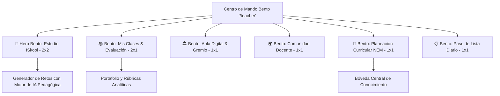

# Rediseño UX/UI: Transición al "Sistema Bento" y Tablas de Datos Minimalistas (`UX_Teacher_Minimalist.md`)

## 1. Contexto y Evolución de la Experiencia B2B Enterprise
La interfaz original de administración docente requería múltiples clics y presentaba tablas densas con bordes gruesos que saturaban visualmente al usuario.

Para docentes y directivos escolares con agendas de alta intensidad, se adoptó la arquitectura de **"Sistema Bento"** combinada con **"Diseño Minimalista"**, priorizando:
- **Reducción de clics:** Acceso directo a los flujos críticos en 1 solo toque.
- **Espacio en blanco y legibilidad:** Tablas ligeras sin cuadrículas invasivas.
- **Optimización de rendimiento:** Búsquedas con técnica de *Debounce* para proteger el servidor institucional y evitar recálculos innecesarios.

---

## 2. Paradigma del "Sistema Bento" (Cuadrícula Asimétrica)

El **Hub Central del Profesor** (`/teacher`) organiza los módulos en una cuadrícula CSS Grid asimétrica de alto impacto visual mediante el componente polimórfico [BentoCard.tsx](file:///c:/Users/kami-/.gemini/antigravity-ide/scratch/ISkool/src/components/ui/BentoCard.tsx):



### Especificaciones de las Tarjetas Bento ([src/components/TeacherHubCards.tsx](file:///c:/Users/kami-/.gemini/antigravity-ide/scratch/ISkool/src/components/TeacherHubCards.tsx))

| Tarjeta Bento | Grid Span | Estética & Gradientes | Propósito & Reducción de Clics |
| :--- | :--- | :--- | :--- |
| **🎨 Estudio ISkool** *(Hero)* | `col-span-2 row-span-2` | Gradiente profundo pizarra-índigo-esmeralda, borde brillante, micro-resplandor. | Acceso inmediato al creador de actividades con **Motor de IA Pedagógica** (NEM 2024, Trilingüe ES/EN/FR). |
| **📚 Mis Clases & Evaluación** | `col-span-2 row-span-1` | Superficie blanca/zinc con acentos zafiro y cian, insignia de gestión oficial. | Seguimiento de portafolio, revisión de evidencias y rúbricas analíticas. |
| **🏛️ Aula Digital & Gremio** | `col-span-1 row-span-1` | Acento índigo, badge "En Vivo". | Modo proyector, ruleta de participación y termómetro socioemocional. |
| **🌍 Comunidad Docente** | `col-span-1 row-span-1` | Acento esmeralda-menta, badge "Red Global". | Exploración y clonación de plantillas creadas por colegas en 1 clic. |
| **📑 Planeación Curricular NEM** | `col-span-1 row-span-1` | Acento violeta-púrpura, badge "Bóveda Curricular". | Consulta de secuencias didácticas directamente en la **Bóveda Central**. |
| **📋 Pase de Lista Rápido** | `col-span-1 row-span-1` | Acento celeste-azul, badge "1 Clic". | Registro rápido de asistencia escolar diaria por grupo. |

---

## 3. Tablas de Datos Minimalistas y Menú Contextual de Tres Puntos

Para los listados de estudiantes, docentes y calificaciones en `/teacher` y `/admin`, se eliminaron los bordes internos pesados y los botones múltiples amontonados, reemplazándolos por:

1. **Estructura Flotante:** Contenedor `rounded-3xl` con borde sutil `border-slate-200/80` y sombra relajada.
2. **Espacio en Blanco Generoso:** Relleno de celdas `py-4 px-6` (en lugar del tradicional apretado `p-2`), permitiendo un escaneo visual ágil.
3. **Tipografía Jerarquizada:** Encabezados en mayúsculas pequeñas de bajo contraste (`text-[10px] font-bold text-slate-400 uppercase tracking-wider`) y contenido de fila de alto contraste.
4. **Menú Contextual `RowActionMenu` ([src/components/ui/RowActionMenu.tsx](file:///c:/Users/kami-/.gemini/antigravity-ide/scratch/ISkool/src/components/ui/RowActionMenu.tsx)):**
   - Botón discreto de tres puntos verticales (`MoreVertical`).
   - Popover flotante con efecto *glassmorphism* que despliega acciones como:
     - *Ver Expediente*
     - *Editar Datos*
     - *Cambiar Contraseña Directa*
     - *Bloquear / Desbloquear Acceso*
     - *Dar de Baja con Auditoría*

---

## 4. Optimización de Rendimiento con "Debounce"

Para evitar saturar la base de datos y prevenir bloqueos del hilo de renderizado de React al escribir en buscadores, se implementó el hook reutilizable [useDebounce.ts](file:///c:/Users/kami-/.gemini/antigravity-ide/scratch/ISkool/src/hooks/useDebounce.ts) con un retraso estándar de 300 ms:

```typescript
// Aplicación en Tablas de Administración y Docentes:
const [studentSearch, setStudentSearch] = useState('');
const debouncedStudentSearch = useDebounce(studentSearch, 300);

const filteredStudents = useMemo(() => {
  return schoolStudents.filter(s => 
    s.name.toLowerCase().includes(debouncedStudentSearch.toLowerCase())
  );
}, [schoolStudents, debouncedStudentSearch]);
```

### Búsquedas Optimizadas:
- Búsqueda de Alumnos en Panel de Administración (`debouncedStudentSearch`).
- Búsqueda de Docentes en Planteles (`debouncedTeacherSearch`).
- Búsqueda en Registro de Bajas y Auditoría (`debouncedDeletionSearch`).
- Búsqueda en Nóminas y Personal Administrativo (`debouncedStaffSearch`, `debouncedPayrollSearch`).
- Filtrado rápido en Pase de Lista y Tareas del Hub Docente (`debouncedAttendanceSearch`, `debouncedTaskSearch`).

---

## 5. Resultados Técnicos
- **0 Clics Desperdiciados:** Los docentes llegan a su herramienta de trabajo en su primer interacción.
- **Cero Fricción Cognitiva:** El Sistema Bento entrega jerarquía visual inmediata donde el módulo de Creación Pedagógica lidera la vista sin opacar la gestión administrativa.
- **Rendimiento Máximo:** Filtrado reactivo en memoria solo tras pausas de escritura, protegiendo tanto clientes móviles como servidores institucionales.
