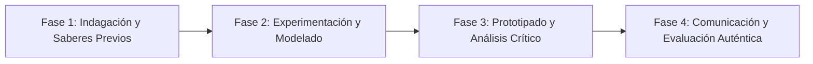

# Planeación Didáctica: Murales Comunitarios: Espacio, Tiempo, Ritmo y Simbolismo del Arte Popular

> [!INFO] Ficha Técnica y Curricular (NEM 2024 - Fase 6)
> - **Docente Titular:** [[Prof. Israel López Ángeles]] (`usr-teacher-1`)
> - **Nivel y Fase:** Educación Secundaria — [[Fase 6 (1º, 2º y 3º de Secundaria)]]
> - **Grado:** **1º de Secundaria**
> - **Campo Formativo:** [[Lenguajes]]
> - **Disciplina / Materia:** [[Artes]]
> - **Contenido Sintético Oficial SEP 2024:** *Diversidad de lenguajes artísticos en la riqueza pluricultural de México*
> - **MOC General:** [[00_Indice_Maestro_Secundaria_Fase6_NEM2024]]

---

## 🎯 Proceso de Desarrollo de Aprendizaje (PDA Oficial SEP 2024)
```text
Fase 6 (1º Secundaria) - Reconoce en manifestaciones artísticas de México y el mundo el uso del cuerpo, espacio y tiempo, para valorarlas como parte de la riqueza pluricultural, experimentando con técnicas visuales y escénicas.
```

---

## ❓ Preguntas Detonadoras e Indagación Crítica
- **¿Cómo el muralismo mexicano de Rivera, Siqueiros y Orozco transformó los muros públicos en libros de historia visual?**
- **¿De qué manera los colores, texturas y líneas en una pintura expresan el ritmo del tiempo y las emociones colectivas?**
- **¿Cómo representamos la identidad de nuestra comunidad en un boceto de mural colectivo?**
- **¿Por qué el arte es un derecho humano y un espacio de encuentro para todos?**

---

## 📋 Secuencia Didáctica Detallada (10 Sesiones de 50 Minutos)



### 🚀 Sesiones 1 y 2: Indagación, Diagnóstico y Recuperación de Saberes
- **Inicio (15 min):** Proyección de detalles de murales históricos mexicanos. Análisis de la composición espacial.
- **Desarrollo (30 min):** Planteamiento del reto integrador, conformación de equipos colaborativos y delimitación del alcance del proyecto.
- **Cierre (5 min):** Registro en la bitácora individual de metas de aprendizaje.

### 🔬 Sesiones 3 a 7: Desarrollo Metodológico, Trabajo Experimental y Producción
- **Inicio (10 min):** Reactivación de compromisos y revisión del cronograma de trabajo.
- **Desarrollo (35 min):** Taller de Bocetaje de Mural en Equipos: Diseñar la composición a escala de un mural escolar sobre la historia y biodiversidad local, aplicando teoría del color y equilibrio visual.
- **Cierre (5 min):** Coevaluación intermedia mediante lista de cotejo y retroalimentación entre pares.

### 🏁 Sesiones 8 a 10: Integración, Socialización Comunitaria y Evaluación
- **Inicio (10 min):** Ensayos de presentación y ajuste final de entregables.
- **Desarrollo (30 min):** Presentación de bocetos y selección comunitaria para el mural efímero del pasillo escolar.
- **Cierre (10 min):** Metacognición grupal, balance de impacto social y firma del acta de entrega de proyectos.

---

## 📊 Rúbrica Analítica de Evaluación Formativa y Auténtica

| Nivel de Desempeño | Criterios Curriculares y Evidencias Observables | Ponderación |
| :--- | :--- | :---: |
| **Excelente (10)** | Manejo de elementos de las artes visuales (línea, color, forma, espacio y textura) con fundamentación teórica sólida, rigurosa y aplicación práctica contextualizada. | 40% |
| **Satisfactorio (8-9)** | Pertinencia y profundidad en la representación de la identidad comunitaria de manera autónoma, estructurada y con calidad metodológica. | 35% |
| **En Proceso (6-7)** | Colaboración armónica y trabajo en equipo con apoyo docente y áreas de mejora identificadas. | 25% |

---

## 📦 Materiales, Recursos Didácticos y Entregable Final

- **Materiales y Recursos:** Papel kraft largo, acrílicos, pinceles, paletas de mezclas, cinta de pintor.
- **Entregable Principal:** `Boceto a Escala y Pintura Colectiva del Mural Escolar "Nuestra Tierra en Colores".`
- **Instrumentos de Evaluación:** Rúbrica analítica, bitácora de coevaluación entre pares, lista de verificación de entregables.

---

## 🔗 Enlaces Bidireccionales (Obsidian Knowledge Graph)
- [[00_Indice_Maestro_Secundaria_Fase6_NEM2024]]
- [[Lenguajes]]
- [[Artes]]
- [[Secundaria_1er_Grado]]
- [[Prof_Israel_Lopez_Angeles]]
