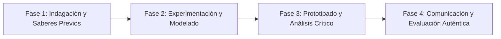

# Planeación Didáctica: Monumentos Vivos: Dibujo Arquitectónico, Perspectiva y Patrimonio Local

> [!INFO] Ficha Técnica y Curricular (NEM 2024 - Fase 6)
> - **Docente Titular:** [[Prof. Israel López Ángeles]] (`usr-teacher-1`)
> - **Nivel y Fase:** Educación Secundaria — [[Fase 6 (1º, 2º y 3º de Secundaria)]]
> - **Grado:** **1º de Secundaria**
> - **Campo Formativo:** [[Lenguajes]]
> - **Disciplina / Materia:** [[Artes]]
> - **Contenido Sintético Oficial SEP 2024:** *Patrimonio arquitectónico e identidad comunitaria en artes visuales*
> - **MOC General:** [[00_Indice_Maestro_Secundaria_Fase6_NEM2024]]

---

## 🎯 Proceso de Desarrollo de Aprendizaje (PDA Oficial SEP 2024)
```text
Fase 6 (1º Secundaria) - Interpreta manifestaciones del patrimonio arquitectónico e histórico de su comunidad mediante el dibujo en perspectiva de 1 y 2 puntos de fuga, fomentando su conservación.
```

---

## ❓ Preguntas Detonadoras e Indagación Crítica
- **¿Cómo cuentan los edificios antiguos, templos y quioscos la historia de nuestra ciudad?**
- **¿Cómo aplicamos la perspectiva cónica para dar profundidad tridimensional a un dibujo?**

---

## 📋 Secuencia Didáctica Detallada (10 Sesiones de 50 Minutos)



### 🚀 Sesiones 1 y 2: Indagación, Diagnóstico y Recuperación de Saberes
- **Inicio (15 min):** Demostración de trazo de horizonte y puntos de fuga en el pizarrón.
- **Desarrollo (30 min):** Planteamiento del reto integrador, conformación de equipos colaborativos y delimitación del alcance del proyecto.
- **Cierre (5 min):** Registro en la bitácora individual de metas de aprendizaje.

### 🔬 Sesiones 3 a 7: Desarrollo Metodológico, Trabajo Experimental y Producción
- **Inicio (10 min):** Reactivación de compromisos y revisión del cronograma de trabajo.
- **Desarrollo (35 min):** Taller de Dibujo Arquitectónico: Dibujar un edificio histórico local aplicando perspectiva a 2 puntos de fuga y técnica de claroscuro con grafito o tinta.
- **Cierre (5 min):** Coevaluación intermedia mediante lista de cotejo y retroalimentación entre pares.

### 🏁 Sesiones 8 a 10: Integración, Socialización Comunitaria y Evaluación
- **Inicio (10 min):** Ensayos de presentación y ajuste final de entregables.
- **Desarrollo (30 min):** Exposición "Rutas del Patrimonio Arquitectónico" en la biblioteca escolar.
- **Cierre (10 min):** Metacognición grupal, balance de impacto social y firma del acta de entrega de proyectos.

---

## 📊 Rúbrica Analítica de Evaluación Formativa y Auténtica

| Nivel de Desempeño | Criterios Curriculares y Evidencias Observables | Ponderación |
| :--- | :--- | :---: |
| **Excelente (10)** | Aplicación técnica correcta de la perspectiva y proporción arquitectónica con fundamentación teórica sólida, rigurosa y aplicación práctica contextualizada. | 40% |
| **Satisfactorio (8-9)** | Manejo del claroscuro, textura y valor tonal de manera autónoma, estructurada y con calidad metodológica. | 35% |
| **En Proceso (6-7)** | Investigación histórica del valor patrimonial del inmueble con apoyo docente y áreas de mejora identificadas. | 25% |

---

## 📦 Materiales, Recursos Didácticos y Entregable Final

- **Materiales y Recursos:** Hojas marquilla, reglas T, escuadras, lápices de grafito (2B, 4B, 6B).
- **Entregable Principal:** `Lámina de Dibujo en Perspectiva del Patrimonio Arquitectónico Comunitario.`
- **Instrumentos de Evaluación:** Rúbrica analítica, bitácora de coevaluación entre pares, lista de verificación de entregables.

---

## 🔗 Enlaces Bidireccionales (Obsidian Knowledge Graph)
- [[00_Indice_Maestro_Secundaria_Fase6_NEM2024]]
- [[Lenguajes]]
- [[Artes]]
- [[Secundaria_1er_Grado]]
- [[Prof_Israel_Lopez_Angeles]]
