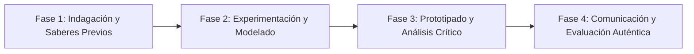

# Planeación Didáctica: Decisiones Conscientes: Métodos Anticonceptivos, Doble Protección y Proyecto de Vida

> [!INFO] Ficha Técnica y Curricular (NEM 2024 - Fase 6)
> - **Docente Titular:** [[Prof. Israel López Ángeles]] (`usr-teacher-1`)
> - **Nivel y Fase:** Educación Secundaria — [[Fase 6 (1º, 2º y 3º de Secundaria)]]
> - **Grado:** **1º de Secundaria**
> - **Campo Formativo:** [[Saberes y Pensamiento Científico]]
> - **Disciplina / Materia:** [[Biología]]
> - **Contenido Sintético Oficial SEP 2024:** *Salud sexual y reproductiva: prevención de ITS y métodos anticonceptivos*
> - **MOC General:** [[00_Indice_Maestro_Secundaria_Fase6_NEM2024]]

---

## 🎯 Proceso de Desarrollo de Aprendizaje (PDA Oficial SEP 2024)
```text
Fase 6 (1º Secundaria) - Compara la efectividad de los métodos anticonceptivos (de barrera, hormonales, intrauterinos y definitivos), valorando la doble protección del condón contra ITS y embarazo adolescente.
```

---

## ❓ Preguntas Detonadoras e Indagación Crítica
- **¿Qué significa la DOBLE PROTECCIÓN (prevenir simultáneamente un embarazo no planeado y una Infección de Transmisión Sexual)?**
- **¿Cómo operan los métodos anticonceptivos hormonales en el ciclo menstrual ovulatorio?**
- **¿Por qué la responsabilidad en la salud sexual debe ser compartida al 100% entre hombres y mujeres sin estereotipos?**

---

## 📋 Secuencia Didáctica Detallada (10 Sesiones de 50 Minutos)



### 🚀 Sesiones 1 y 2: Indagación, Diagnóstico y Recuperación de Saberes
- **Inicio (15 min):** Dinámica de Mitos y Realidades sobre la sexualidad y métodos anticonceptivos.
- **Desarrollo (30 min):** Planteamiento del reto integrador, conformación de equipos colaborativos y delimitación del alcance del proyecto.
- **Cierre (5 min):** Registro en la bitácora individual de metas de aprendizaje.

### 🔬 Sesiones 3 a 7: Desarrollo Metodológico, Trabajo Experimental y Producción
- **Inicio (10 min):** Reactivación de compromisos y revisión del cronograma de trabajo.
- **Desarrollo (35 min):** Taller de Clasificación de Métodos Anticonceptivos: Analizar fichas técnicas de efectividad (Índice de Pearl) de métodos de barrera, hormonales, DIU y de emergencia, practicando la colocación correcta del condón masculino y femenino en simuladores.
- **Cierre (5 min):** Coevaluación intermedia mediante lista de cotejo y retroalimentación entre pares.

### 🏁 Sesiones 8 a 10: Integración, Socialización Comunitaria y Evaluación
- **Inicio (10 min):** Ensayos de presentación y ajuste final de entregables.
- **Desarrollo (30 min):** Elaboración de una Guía de Servicios Amigables de Salud Sexual para adolescentes.
- **Cierre (10 min):** Metacognición grupal, balance de impacto social y firma del acta de entrega de proyectos.

---

## 📊 Rúbrica Analítica de Evaluación Formativa y Auténtica

| Nivel de Desempeño | Criterios Curriculares y Evidencias Observables | Ponderación |
| :--- | :--- | :---: |
| **Excelente (10)** | Comparación científica de mecanismos de acción y efectividad de anticonceptivos con fundamentación teórica sólida, rigurosa y aplicación práctica contextualizada. | 40% |
| **Satisfactorio (8-9)** | Reconocimiento del condón como único método de prevención de ITS (VIH, VPH) de manera autónoma, estructurada y con calidad metodológica. | 35% |
| **En Proceso (6-7)** | Enfoque de derechos sexuales, consentimiento informado y equidad de género con apoyo docente y áreas de mejora identificadas. | 25% |

---

## 📦 Materiales, Recursos Didácticos y Entregable Final

- **Materiales y Recursos:** Muestrario didáctico de métodos anticonceptivos, simuladores anatómicos, rotafolios.
- **Entregable Principal:** `Guía Visual de Anticoncepción y Doble Protección "Mi Proyecto, Mi Decisión Informada".`
- **Instrumentos de Evaluación:** Rúbrica analítica, bitácora de coevaluación entre pares, lista de verificación de entregables.

---

## 🔗 Enlaces Bidireccionales (Obsidian Knowledge Graph)
- [[00_Indice_Maestro_Secundaria_Fase6_NEM2024]]
- [[Saberes y Pensamiento Científico]]
- [[Biología]]
- [[Secundaria_1er_Grado]]
- [[Prof_Israel_Lopez_Angeles]]
