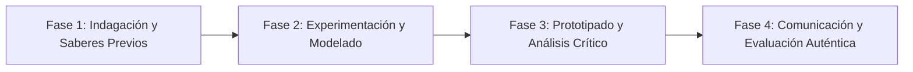

# Planeación Didáctica: El Viaje del Beagle: Selección Natural, Darwin, Wallace y Adaptaciones Evolutivas

> [!INFO] Ficha Técnica y Curricular (NEM 2024 - Fase 6)
> - **Docente Titular:** [[Prof. Israel López Ángeles]] (`usr-teacher-1`)
> - **Nivel y Fase:** Educación Secundaria — [[Fase 6 (1º, 2º y 3º de Secundaria)]]
> - **Grado:** **1º de Secundaria**
> - **Campo Formativo:** [[Saberes y Pensamiento Científico]]
> - **Disciplina / Materia:** [[Biología]]
> - **Contenido Sintético Oficial SEP 2024:** *La biodiversidad como expresión del cambio de los seres vivos en el tiempo (Evolución)*
> - **MOC General:** [[00_Indice_Maestro_Secundaria_Fase6_NEM2024]]

---

## 🎯 Proceso de Desarrollo de Aprendizaje (PDA Oficial SEP 2024)
```text
Fase 6 (1º Secundaria) - Indaga las principales aportaciones de Darwin y Wallace sobre la selección natural, analiza el registro fósil y explica adaptaciones morfológicas, fisiológicas y etológicas.
```

---

## ❓ Preguntas Detonadoras e Indagación Crítica
- **¿Cómo la variación genética y la presión ambiental hacen que los individuos mejor adaptados sobrevivan y dejen más descendencia?**
- **¿Qué nos enseñan los pinzones de las Islas Galápagos sobre la radiación adaptativa?**
- **¿Cómo demuestran los fósiles y la homología anatómica el ancestro común de los seres vivos?**

---

## 📋 Secuencia Didáctica Detallada (10 Sesiones de 50 Minutos)



### 🚀 Sesiones 1 y 2: Indagación, Diagnóstico y Recuperación de Saberes
- **Inicio (15 min):** Juego de simulación de picos de aves: Recolectar diferentes semillas usando pinzas, cucharas y palillos.
- **Desarrollo (30 min):** Planteamiento del reto integrador, conformación de equipos colaborativos y delimitación del alcance del proyecto.
- **Cierre (5 min):** Registro en la bitácora individual de metas de aprendizaje.

### 🔬 Sesiones 3 a 7: Desarrollo Metodológico, Trabajo Experimental y Producción
- **Inicio (10 min):** Reactivación de compromisos y revisión del cronograma de trabajo.
- **Desarrollo (35 min):** Taller de Evidencias Evolutivas: Comparar esqueletos homólogos de extremidades de mamíferos (humano, ballena, murciélago), analizar estratos fósiles y formular hipótesis sobre especiación.
- **Cierre (5 min):** Coevaluación intermedia mediante lista de cotejo y retroalimentación entre pares.

### 🏁 Sesiones 8 a 10: Integración, Socialización Comunitaria y Evaluación
- **Inicio (10 min):** Ensayos de presentación y ajuste final de entregables.
- **Desarrollo (30 min):** Línea del tiempo del pensamiento evolutivo desde Lamarck hasta la Síntesis Moderna.
- **Cierre (10 min):** Metacognición grupal, balance de impacto social y firma del acta de entrega de proyectos.

---

## 📊 Rúbrica Analítica de Evaluación Formativa y Auténtica

| Nivel de Desempeño | Criterios Curriculares y Evidencias Observables | Ponderación |
| :--- | :--- | :---: |
| **Excelente (10)** | Comprensión del mecanismo de selección natural y adaptación al medio con fundamentación teórica sólida, rigurosa y aplicación práctica contextualizada. | 40% |
| **Satisfactorio (8-9)** | Identificación de evidencias evolutivas (fósiles, anatomía comparada, biogeografía) de manera autónoma, estructurada y con calidad metodológica. | 35% |
| **En Proceso (6-7)** | Reconocimiento de la ciencia como una construcción colectiva en constante cambio con apoyo docente y áreas de mejora identificadas. | 25% |

---

## 📦 Materiales, Recursos Didácticos y Entregable Final

- **Materiales y Recursos:** Réplicas de fósiles o imágenes, pinzas de cocina, semillas variadas, esquemas anatómicos.
- **Entregable Principal:** `Infografía Científica "El Árbol de la Vida: Selección Natural y Evidencias de la Evolución".`
- **Instrumentos de Evaluación:** Rúbrica analítica, bitácora de coevaluación entre pares, lista de verificación de entregables.

---

## 🔗 Enlaces Bidireccionales (Obsidian Knowledge Graph)
- [[00_Indice_Maestro_Secundaria_Fase6_NEM2024]]
- [[Saberes y Pensamiento Científico]]
- [[Biología]]
- [[Secundaria_1er_Grado]]
- [[Prof_Israel_Lopez_Angeles]]
