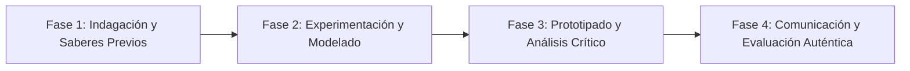

# Planeación Didáctica: La Red de la Vida: Productores, Consumidores, Descomponedores y la Regla del 10%

> [!INFO] Ficha Técnica y Curricular (NEM 2024 - Fase 6)
> - **Docente Titular:** [[Prof. Israel López Ángeles]] (`usr-teacher-1`)
> - **Nivel y Fase:** Educación Secundaria — [[Fase 6 (1º, 2º y 3º de Secundaria)]]
> - **Grado:** **1º de Secundaria**
> - **Campo Formativo:** [[Saberes y Pensamiento Científico]]
> - **Disciplina / Materia:** [[Biología]]
> - **Contenido Sintético Oficial SEP 2024:** *Redes tróficas, pirámides de biomasa y fotosíntesis*
> - **MOC General:** [[00_Indice_Maestro_Secundaria_Fase6_NEM2024]]

---

## 🎯 Proceso de Desarrollo de Aprendizaje (PDA Oficial SEP 2024)
```text
Fase 6 (1º Secundaria) - Representa la transferencia de materia y energía en redes tróficas y pirámides ecológicas, explicando la fotosíntesis ($6\text{CO}_2 + 6\text{H}_2\text{O} \rightarrow \text{C}_6\text{H}_{12}\text{O}_6 + 6\text{O}_2$) y la pérdida de energía en cada eslabón.
```

---

## ❓ Preguntas Detonadoras e Indagación Crítica
- **¿Por qué la energía disponible disminuye un 90% en cada nivel trófico (Regla del 10%)?**
- **¿Qué ocurriría en un ecosistema si desaparecen los descomponedores (hongos y bacterias)?**

---

## 📋 Secuencia Didáctica Detallada (10 Sesiones de 50 Minutos)



### 🚀 Sesiones 1 y 2: Indagación, Diagnóstico y Recuperación de Saberes
- **Inicio (15 min):** Dinámica de la Red Alimentaria con estambres entre estudiantes representando especies.
- **Desarrollo (30 min):** Planteamiento del reto integrador, conformación de equipos colaborativos y delimitación del alcance del proyecto.
- **Cierre (5 min):** Registro en la bitácora individual de metas de aprendizaje.

### 🔬 Sesiones 3 a 7: Desarrollo Metodológico, Trabajo Experimental y Producción
- **Inicio (10 min):** Reactivación de compromisos y revisión del cronograma de trabajo.
- **Desarrollo (35 min):** Laboratorio de Fotosíntesis: Comprobar la producción de oxígeno en la planta acuática Elodea expuesta a la luz solar y diseñar una pirámide trófica cuantitativa.
- **Cierre (5 min):** Coevaluación intermedia mediante lista de cotejo y retroalimentación entre pares.

### 🏁 Sesiones 8 a 10: Integración, Socialización Comunitaria y Evaluación
- **Inicio (10 min):** Ensayos de presentación y ajuste final de entregables.
- **Desarrollo (30 min):** Modelación de escenarios de extinción de un depredador tope.
- **Cierre (10 min):** Metacognición grupal, balance de impacto social y firma del acta de entrega de proyectos.

---

## 📊 Rúbrica Analítica de Evaluación Formativa y Auténtica

| Nivel de Desempeño | Criterios Curriculares y Evidencias Observables | Ponderación |
| :--- | :--- | :---: |
| **Excelente (10)** | Explicación bioquímica básica de la fotosíntesis con fundamentación teórica sólida, rigurosa y aplicación práctica contextualizada. | 40% |
| **Satisfactorio (8-9)** | Construcción y análisis de redes tróficas y pirámides de energía de manera autónoma, estructurada y con calidad metodológica. | 35% |
| **En Proceso (6-7)** | Comprensión de la interdependencia ecológica con apoyo docente y áreas de mejora identificadas. | 25% |

---

## 📦 Materiales, Recursos Didácticos y Entregable Final

- **Materiales y Recursos:** Plantas Elodea, bicarbonato, lámparas, tubos de ensayo, estambres.
- **Entregable Principal:** `Modelo Tridimensional de Pirámide Trófica y Reporte de Fotosíntesis.`
- **Instrumentos de Evaluación:** Rúbrica analítica, bitácora de coevaluación entre pares, lista de verificación de entregables.

---

## 🔗 Enlaces Bidireccionales (Obsidian Knowledge Graph)
- [[00_Indice_Maestro_Secundaria_Fase6_NEM2024]]
- [[Saberes y Pensamiento Científico]]
- [[Biología]]
- [[Secundaria_1er_Grado]]
- [[Prof_Israel_Lopez_Angeles]]
