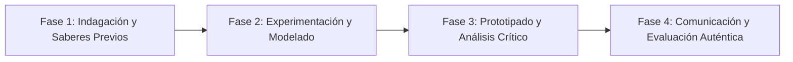

# Planeación Didáctica: El Código Hereditario: Leyes de Mendel, Cuadros de Punnett y la Molécula de ADN

> [!INFO] Ficha Técnica y Curricular (NEM 2024 - Fase 6)
> - **Docente Titular:** [[Prof. Israel López Ángeles]] (`usr-teacher-1`)
> - **Nivel y Fase:** Educación Secundaria — [[Fase 6 (1º, 2º y 3º de Secundaria)]]
> - **Grado:** **1º de Secundaria**
> - **Campo Formativo:** [[Saberes y Pensamiento Científico]]
> - **Disciplina / Materia:** [[Biología]]
> - **Contenido Sintético Oficial SEP 2024:** *Genética mendeliana, ADN y biotecnología moderna*
> - **MOC General:** [[00_Indice_Maestro_Secundaria_Fase6_NEM2024]]

---

## 🎯 Proceso de Desarrollo de Aprendizaje (PDA Oficial SEP 2024)
```text
Fase 6 (1º Secundaria) - Modela la estructura del ADN en doble hélice, resuelve problemas de herencia genética con cuadros de Punnett aplicando las Leyes de Mendel y debate dilemas éticos de la ingeniería genética.
```

---

## ❓ Preguntas Detonadoras e Indagación Crítica
- **¿Por qué los hijos heredan rasgos de ambos padres pero pueden expresar características de los abuelos?**
- **¿Cómo se aparean las bases nitrogenadas Adenina-Timina y Guanina-Citosina en el ADN?**

---

## 📋 Secuencia Didáctica Detallada (10 Sesiones de 50 Minutos)



### 🚀 Sesiones 1 y 2: Indagación, Diagnóstico y Recuperación de Saberes
- **Inicio (15 min):** Extracción casera de ADN de fresa con detergente y alcohol frío.
- **Desarrollo (30 min):** Planteamiento del reto integrador, conformación de equipos colaborativos y delimitación del alcance del proyecto.
- **Cierre (5 min):** Registro en la bitácora individual de metas de aprendizaje.

### 🔬 Sesiones 3 a 7: Desarrollo Metodológico, Trabajo Experimental y Producción
- **Inicio (10 min):** Reactivación de compromisos y revisión del cronograma de trabajo.
- **Desarrollo (35 min):** Taller de Genética: Construir un modelo tridimensional de la doble hélice con gomitas y palillos, resolver cruzas monohíbridas con cuadros de Punnett y calcular porcentajes fenotípicos y genotípicos.
- **Cierre (5 min):** Coevaluación intermedia mediante lista de cotejo y retroalimentación entre pares.

### 🏁 Sesiones 8 a 10: Integración, Socialización Comunitaria y Evaluación
- **Inicio (10 min):** Ensayos de presentación y ajuste final de entregables.
- **Desarrollo (30 min):** Mesa redonda sobre transgénicos y terapia génica.
- **Cierre (10 min):** Metacognición grupal, balance de impacto social y firma del acta de entrega de proyectos.

---

## 📊 Rúbrica Analítica de Evaluación Formativa y Auténtica

| Nivel de Desempeño | Criterios Curriculares y Evidencias Observables | Ponderación |
| :--- | :--- | :---: |
| **Excelente (10)** | Extracción y modelado correcto de la molécula de ADN con fundamentación teórica sólida, rigurosa y aplicación práctica contextualizada. | 40% |
| **Satisfactorio (8-9)** | Resolución precisa de cuadros de Punnett y leyes mendelianas de manera autónoma, estructurada y con calidad metodológica. | 35% |
| **En Proceso (6-7)** | Postura bioética fundamentada sobre edición genética con apoyo docente y áreas de mejora identificadas. | 25% |

---

## 📦 Materiales, Recursos Didácticos y Entregable Final

- **Materiales y Recursos:** Fresas, alcohol isopropílico, gomitas de colores, palillos, cuadros de Punnett.
- **Entregable Principal:** `Modelo 3D de Doble Hélice de ADN y Problemario de Cruzas Genéticas.`
- **Instrumentos de Evaluación:** Rúbrica analítica, bitácora de coevaluación entre pares, lista de verificación de entregables.

---

## 🔗 Enlaces Bidireccionales (Obsidian Knowledge Graph)
- [[00_Indice_Maestro_Secundaria_Fase6_NEM2024]]
- [[Saberes y Pensamiento Científico]]
- [[Biología]]
- [[Secundaria_1er_Grado]]
- [[Prof_Israel_Lopez_Angeles]]
