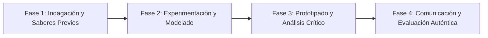

# Planeación Didáctica: El Escuadrón Inmune: Linfocitos, Anticuerpos, Vacunas y Salud Pública

> [!INFO] Ficha Técnica y Curricular (NEM 2024 - Fase 6)
> - **Docente Titular:** [[Prof. Israel López Ángeles]] (`usr-teacher-1`)
> - **Nivel y Fase:** Educación Secundaria — [[Fase 6 (1º, 2º y 3º de Secundaria)]]
> - **Grado:** **1º de Secundaria**
> - **Campo Formativo:** [[Saberes y Pensamiento Científico]]
> - **Disciplina / Materia:** [[Biología]]
> - **Contenido Sintético Oficial SEP 2024:** *Vacunas, sistema inmunológico y prevención de epidemias*
> - **MOC General:** [[00_Indice_Maestro_Secundaria_Fase6_NEM2024]]

---

## 🎯 Proceso de Desarrollo de Aprendizaje (PDA Oficial SEP 2024)
```text
Fase 6 (1º Secundaria) - Valora la importancia del sistema inmunológico y el uso de vacunas para la prevención y erradicación de enfermedades infecciosas, contrastando evidencias científicas con mitos antivacunas.
```

---

## ❓ Preguntas Detonadoras e Indagación Crítica
- **¿Cómo "entrenan" las vacunas a los linfocitos T y B para producir anticuerpos de memoria sin enfermarnos gravemente?**
- **¿Qué es la inmunidad de rebaño y por qué vacunarse es un acto de solidaridad social?**

---

## 📋 Secuencia Didáctica Detallada (10 Sesiones de 50 Minutos)



### 🚀 Sesiones 1 y 2: Indagación, Diagnóstico y Recuperación de Saberes
- **Inicio (15 min):** Línea del tiempo histórica: De la viruela y Edward Jenner a las vacunas de ARNm.
- **Desarrollo (30 min):** Planteamiento del reto integrador, conformación de equipos colaborativos y delimitación del alcance del proyecto.
- **Cierre (5 min):** Registro en la bitácora individual de metas de aprendizaje.

### 🔬 Sesiones 3 a 7: Desarrollo Metodológico, Trabajo Experimental y Producción
- **Inicio (10 min):** Reactivación de compromisos y revisión del cronograma de trabajo.
- **Desarrollo (35 min):** Simulación Epidemiológica: Modelar con fichas la propagación de un virus en una población con 0%, 50% y 90% de vacunados, analizando la curva de contagios y redactar una infografía médica.
- **Cierre (5 min):** Coevaluación intermedia mediante lista de cotejo y retroalimentación entre pares.

### 🏁 Sesiones 8 a 10: Integración, Socialización Comunitaria y Evaluación
- **Inicio (10 min):** Ensayos de presentación y ajuste final de entregables.
- **Desarrollo (30 min):** Revisión de la Cartilla Nacional de Vacunación.
- **Cierre (10 min):** Metacognición grupal, balance de impacto social y firma del acta de entrega de proyectos.

---

## 📊 Rúbrica Analítica de Evaluación Formativa y Auténtica

| Nivel de Desempeño | Criterios Curriculares y Evidencias Observables | Ponderación |
| :--- | :--- | :---: |
| **Excelente (10)** | Explicación de la respuesta inmunológica primaria y secundaria con fundamentación teórica sólida, rigurosa y aplicación práctica contextualizada. | 40% |
| **Satisfactorio (8-9)** | Comprobación matemática del impacto de la inmunidad colectiva de manera autónoma, estructurada y con calidad metodológica. | 35% |
| **En Proceso (6-7)** | Argumentación científica frente a noticias falsas sobre vacunas con apoyo docente y áreas de mejora identificadas. | 25% |

---

## 📦 Materiales, Recursos Didácticos y Entregable Final

- **Materiales y Recursos:** Fichas de colores para simulación de contagios, cartillas de vacunación modelo.
- **Entregable Principal:** `Infografía Médica Ilustrada "Cómo Funcionan las Vacunas en Nuestro Sistema Inmune".`
- **Instrumentos de Evaluación:** Rúbrica analítica, bitácora de coevaluación entre pares, lista de verificación de entregables.

---

## 🔗 Enlaces Bidireccionales (Obsidian Knowledge Graph)
- [[00_Indice_Maestro_Secundaria_Fase6_NEM2024]]
- [[Saberes y Pensamiento Científico]]
- [[Biología]]
- [[Secundaria_1er_Grado]]
- [[Prof_Israel_Lopez_Angeles]]
