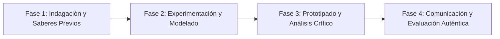

# Planeación Didáctica: Desconéctate y Muévete: Plan de 60 Minutos Diarios de Actividad Física y Salud Cardiovascular

> [!INFO] Ficha Técnica y Curricular (NEM 2024 - Fase 6)
> - **Docente Titular:** [[Prof. Israel López Ángeles]] (`usr-teacher-1`)
> - **Nivel y Fase:** Educación Secundaria — [[Fase 6 (1º, 2º y 3º de Secundaria)]]
> - **Grado:** **1º de Secundaria**
> - **Campo Formativo:** [[De lo Humano y lo Comunitario]]
> - **Disciplina / Materia:** [[Educación Física]]
> - **Contenido Sintético Oficial SEP 2024:** *Estilos de vida activos y combate al sedentarismo y uso excesivo de pantallas*
> - **MOC General:** [[00_Indice_Maestro_Secundaria_Fase6_NEM2024]]

---

## 🎯 Proceso de Desarrollo de Aprendizaje (PDA Oficial SEP 2024)
```text
Fase 6 (1º Secundaria) - Implementa acciones para mantenerse físicamente activo en diferentes momentos del día (pausas activas, caminatas, deportes), combatiendo el sedentarismo tecnológico y la obesidad.
```

---

## ❓ Preguntas Detonadoras e Indagación Crítica
- **¿Cuántas horas al día pasamos sentados frente a pantallas de celular, televisión o videojuegos?**
- **¿Cómo deteriora el sedentarismo crónico la densidad ósea, la postura y la salud mental en adolescentes?**
- **¿Cómo integramos pausas activas de 5 minutos entre clases para reactivar el flujo sanguíneo cerebral?**

---

## 📋 Secuencia Didáctica Detallada (10 Sesiones de 50 Minutos)



### 🚀 Sesiones 1 y 2: Indagación, Diagnóstico y Recuperación de Saberes
- **Inicio (15 min):** Cálculo del gasto calórico diario y tiempo promedio de sedentarismo con una encuesta rápida.
- **Desarrollo (30 min):** Planteamiento del reto integrador, conformación de equipos colaborativos y delimitación del alcance del proyecto.
- **Cierre (5 min):** Registro en la bitácora individual de metas de aprendizaje.

### 🔬 Sesiones 3 a 7: Desarrollo Metodológico, Trabajo Experimental y Producción
- **Inicio (10 min):** Reactivación de compromisos y revisión del cronograma de trabajo.
- **Desarrollo (35 min):** Taller de Pausas Activas y Rutina HIIT Escolar: Diseñar una rutina de ejercicios de alta intensidad por intervalos (HIIT) de 15 minutos (saltos de tijera, sentadillas, escaladores, planchas) que se pueda realizar en casa sin aparatos.
- **Cierre (5 min):** Coevaluación intermedia mediante lista de cotejo y retroalimentación entre pares.

### 🏁 Sesiones 8 a 10: Integración, Socialización Comunitaria y Evaluación
- **Inicio (10 min):** Ensayos de presentación y ajuste final de entregables.
- **Desarrollo (30 min):** Registro de frecuencia cardíaca post-ejercicio y entrega del Reto de 21 Días Activos.
- **Cierre (10 min):** Metacognición grupal, balance de impacto social y firma del acta de entrega de proyectos.

---

## 📊 Rúbrica Analítica de Evaluación Formativa y Auténtica

| Nivel de Desempeño | Criterios Curriculares y Evidencias Observables | Ponderación |
| :--- | :--- | :---: |
| **Excelente (10)** | Diseño y ejecución técnica de la rutina de ejercicios funcionales HIIT con fundamentación teórica sólida, rigurosa y aplicación práctica contextualizada. | 40% |
| **Satisfactorio (8-9)** | Monitoreo y comprensión de la respuesta cardíaca al esfuerzo físico de manera autónoma, estructurada y con calidad metodológica. | 35% |
| **En Proceso (6-7)** | Compromiso con la reducción del tiempo de pantalla sedentario con apoyo docente y áreas de mejora identificadas. | 25% |

---

## 📦 Materiales, Recursos Didácticos y Entregable Final

- **Materiales y Recursos:** Cronómetros, música motivacional para entrenamiento, hojas de reto de 21 días.
- **Entregable Principal:** `Rutina Ilustrada de Ejercicios Funcionales y Bitácora del Reto de 21 Días Activos.`
- **Instrumentos de Evaluación:** Rúbrica analítica, bitácora de coevaluación entre pares, lista de verificación de entregables.

---

## 🔗 Enlaces Bidireccionales (Obsidian Knowledge Graph)
- [[00_Indice_Maestro_Secundaria_Fase6_NEM2024]]
- [[De lo Humano y lo Comunitario]]
- [[Educación Física]]
- [[Secundaria_1er_Grado]]
- [[Prof_Israel_Lopez_Angeles]]
