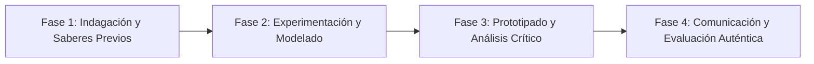

# Planeación Didáctica: Más Rápido, Más Alto, Más Fuerte: Atletismo Escolar, Relevos y Saltos Técnicos

> [!INFO] Ficha Técnica y Curricular (NEM 2024 - Fase 6)
> - **Docente Titular:** [[Prof. Israel López Ángeles]] (`usr-teacher-1`)
> - **Nivel y Fase:** Educación Secundaria — [[Fase 6 (1º, 2º y 3º de Secundaria)]]
> - **Grado:** **1º de Secundaria**
> - **Campo Formativo:** [[De lo Humano y lo Comunitario]]
> - **Disciplina / Materia:** [[Educación Física]]
> - **Contenido Sintético Oficial SEP 2024:** *Iniciación deportiva al atletismo: pruebas de pista y campo*
> - **MOC General:** [[00_Indice_Maestro_Secundaria_Fase6_NEM2024]]

---

## 🎯 Proceso de Desarrollo de Aprendizaje (PDA Oficial SEP 2024)
```text
Fase 6 (1º Secundaria) - Integra habilidades motrices complejas en pruebas atléticas de pista (velocidad, relevos $4 \times 50\text{m}$, vallas adaptadas) y campo (salto de longitud, lanzamiento de pelota), perfeccionando la técnica corporal.
```

---

## ❓ Preguntas Detonadoras e Indagación Crítica
- **¿Cómo optimizamos la entrega del estafeta o testigo en la zona de transferencia de una carrera de relevos sin perder velocidad?**
- **¿Cómo influye el ángulo de batida ($45^{\circ}$) en la distancia del salto de longitud?**

---

## 📋 Secuencia Didáctica Detallada (10 Sesiones de 50 Minutos)



### 🚀 Sesiones 1 y 2: Indagación, Diagnóstico y Recuperación de Saberes
- **Inicio (15 min):** Calentamiento dinámico con técnica de carrera (skipping, talones a glúteos, zancada amplia).
- **Desarrollo (30 min):** Planteamiento del reto integrador, conformación de equipos colaborativos y delimitación del alcance del proyecto.
- **Cierre (5 min):** Registro en la bitácora individual de metas de aprendizaje.

### 🔬 Sesiones 3 a 7: Desarrollo Metodológico, Trabajo Experimental y Producción
- **Inicio (10 min):** Reactivación de compromisos y revisión del cronograma de trabajo.
- **Desarrollo (35 min):** Circuito de Pistas y Saltos: Estación 1: Salida baja de tacos con reacción al estímulo sonoro; Estación 2: Pase de estafeta a ciegas en zona de cambio; Estación 3: Salto de longitud en fosa de arena cuidando la fase aérea y caída amortiguada.
- **Cierre (5 min):** Coevaluación intermedia mediante lista de cotejo y retroalimentación entre pares.

### 🏁 Sesiones 8 a 10: Integración, Socialización Comunitaria y Evaluación
- **Inicio (10 min):** Ensayos de presentación y ajuste final de entregables.
- **Desarrollo (30 min):** Minitorneo de relevos mixtos y vuelta a la calma con hidratación.
- **Cierre (10 min):** Metacognición grupal, balance de impacto social y firma del acta de entrega de proyectos.

---

## 📊 Rúbrica Analítica de Evaluación Formativa y Auténtica

| Nivel de Desempeño | Criterios Curriculares y Evidencias Observables | Ponderación |
| :--- | :--- | :---: |
| **Excelente (10)** | Ejecución técnica de la salida baja y pase del testigo con fundamentación teórica sólida, rigurosa y aplicación práctica contextualizada. | 40% |
| **Satisfactorio (8-9)** | Coordinación y potencia en la carrera y batida de salto de manera autónoma, estructurada y con calidad metodológica. | 35% |
| **En Proceso (6-7)** | Compañerismo y esfuerzo solidario en el equipo de relevos con apoyo docente y áreas de mejora identificadas. | 25% |

---

## 📦 Materiales, Recursos Didácticos y Entregable Final

- **Materiales y Recursos:** Testigos de relevos, fosa de salto o colchonetas, cronómetros, conos.
- **Entregable Principal:** `Registro Técnico de Marcas Atléticas y Ficha de Técnica de Carrera.`
- **Instrumentos de Evaluación:** Rúbrica analítica, bitácora de coevaluación entre pares, lista de verificación de entregables.

---

## 🔗 Enlaces Bidireccionales (Obsidian Knowledge Graph)
- [[00_Indice_Maestro_Secundaria_Fase6_NEM2024]]
- [[De lo Humano y lo Comunitario]]
- [[Educación Física]]
- [[Secundaria_1er_Grado]]
- [[Prof_Israel_Lopez_Angeles]]
