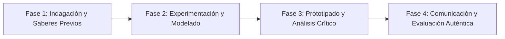

# Planeación Didáctica: Pirámides Humanas: Acrosport, Equilibrio Colectivo, Seguridad y Confianza

> [!INFO] Ficha Técnica y Curricular (NEM 2024 - Fase 6)
> - **Docente Titular:** [[Prof. Israel López Ángeles]] (`usr-teacher-1`)
> - **Nivel y Fase:** Educación Secundaria — [[Fase 6 (1º, 2º y 3º de Secundaria)]]
> - **Grado:** **1º de Secundaria**
> - **Campo Formativo:** [[De lo Humano y lo Comunitario]]
> - **Disciplina / Materia:** [[Educación Física]]
> - **Contenido Sintético Oficial SEP 2024:** *Gimnasia rítmica y acrosport: figuras acrobáticas y confianza mutua*
> - **MOC General:** [[00_Indice_Maestro_Secundaria_Fase6_NEM2024]]

---

## 🎯 Proceso de Desarrollo de Aprendizaje (PDA Oficial SEP 2024)
```text
Fase 6 (1º Secundaria) - Construye composiciones gimnásticas y pirámides humanas colectivas (Acrosport) integrando roles de portor (base), ágil (cúspide) y ayudantes, cuidando la seguridad postural.
```

---

## ❓ Preguntas Detonadoras e Indagación Crítica
- **¿Por qué la confianza ciega y la comunicación son indispensables para que una pirámide humana se sostenga sin caer?**
- **¿Cómo distribuimos el peso sobre las zonas de apoyo óseas del portor (espalda y caderas) sin lastimar la columna?**

---

## 📋 Secuencia Didáctica Detallada (10 Sesiones de 50 Minutos)



### 🚀 Sesiones 1 y 2: Indagación, Diagnóstico y Recuperación de Saberes
- **Inicio (15 min):** Ejercicios de estiramiento y calentamiento de muñecas, hombros y tronco en colchonetas.
- **Desarrollo (30 min):** Planteamiento del reto integrador, conformación de equipos colaborativos y delimitación del alcance del proyecto.
- **Cierre (5 min):** Registro en la bitácora individual de metas de aprendizaje.

### 🔬 Sesiones 3 a 7: Desarrollo Metodológico, Trabajo Experimental y Producción
- **Inicio (10 min):** Reactivación de compromisos y revisión del cronograma de trabajo.
- **Desarrollo (35 min):** Taller de Acrosport en Equipos de 4 y 6: Ensayar figuras estáticas de 2, 3 y 4 niveles con enlaces de danza y transiciones fluidas, respetando los apoyos seguros.
- **Cierre (5 min):** Coevaluación intermedia mediante lista de cotejo y retroalimentación entre pares.

### 🏁 Sesiones 8 a 10: Integración, Socialización Comunitaria y Evaluación
- **Inicio (10 min):** Ensayos de presentación y ajuste final de entregables.
- **Desarrollo (30 min):** Presentación coreográfica de Acrosport con música rítmica.
- **Cierre (10 min):** Metacognición grupal, balance de impacto social y firma del acta de entrega de proyectos.

---

## 📊 Rúbrica Analítica de Evaluación Formativa y Auténtica

| Nivel de Desempeño | Criterios Curriculares y Evidencias Observables | Ponderación |
| :--- | :--- | :---: |
| **Excelente (10)** | Ejecución técnica y segura de las posiciones de portor y ágil con fundamentación teórica sólida, rigurosa y aplicación práctica contextualizada. | 40% |
| **Satisfactorio (8-9)** | Equilibrio estático y coordinación coreográfica con música de manera autónoma, estructurada y con calidad metodológica. | 35% |
| **En Proceso (6-7)** | Trabajo en equipo, confianza mutua y cuidado de la integridad del compañero con apoyo docente y áreas de mejora identificadas. | 25% |

---

## 📦 Materiales, Recursos Didácticos y Entregable Final

- **Materiales y Recursos:** Colchonetas de gimnasia, equipo de sonido, fichas de figuras de acrosport.
- **Entregable Principal:** `Partitura Coreográfica de Acrosport y Montaje Gimnástico Colectivo en Video/Fotos.`
- **Instrumentos de Evaluación:** Rúbrica analítica, bitácora de coevaluación entre pares, lista de verificación de entregables.

---

## 🔗 Enlaces Bidireccionales (Obsidian Knowledge Graph)
- [[00_Indice_Maestro_Secundaria_Fase6_NEM2024]]
- [[De lo Humano y lo Comunitario]]
- [[Educación Física]]
- [[Secundaria_1er_Grado]]
- [[Prof_Israel_Lopez_Angeles]]
