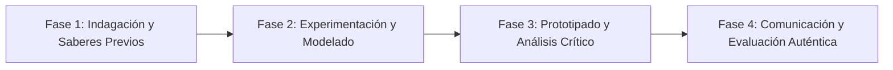

# Planeación Didáctica: Balón al Aire: Fundamentos Técnicos del Voleibol, Golpe Bajo, Voleo y Trabajo en Equipo

> [!INFO] Ficha Técnica y Curricular (NEM 2024 - Fase 6)
> - **Docente Titular:** [[Prof. Israel López Ángeles]] (`usr-teacher-1`)
> - **Nivel y Fase:** Educación Secundaria — [[Fase 6 (1º, 2º y 3º de Secundaria)]]
> - **Grado:** **1º de Secundaria**
> - **Campo Formativo:** [[De lo Humano y lo Comunitario]]
> - **Disciplina / Materia:** [[Educación Física]]
> - **Contenido Sintético Oficial SEP 2024:** *Iniciación al Voleibol: saque, voleo, golpe bajo y rotaciones*
> - **MOC General:** [[00_Indice_Maestro_Secundaria_Fase6_NEM2024]]

---

## 🎯 Proceso de Desarrollo de Aprendizaje (PDA Oficial SEP 2024)
```text
Fase 6 (1º Secundaria) - Domina los fundamentos técnicos individuales (saque por abajo, voleo de dedos, golpe bajo o recepción) y colectivos (rotación en sentido horario y 3 toques reglamentarios) en el voleibol escolar.
```

---

## ❓ Preguntas Detonadoras e Indagación Crítica
- **¿Cómo colocamos los antebrazos juntos y flexionamos las rodillas para dirigir un pase suave y preciso en el golpe bajo?**
- **¿Por qué el voleibol es uno de los deportes más cooperativos donde nadie puede retener el balón ni tocarlo dos veces seguidas?**

---

## 📋 Secuencia Didáctica Detallada (10 Sesiones de 50 Minutos)



### 🚀 Sesiones 1 y 2: Indagación, Diagnóstico y Recuperación de Saberes
- **Inicio (15 min):** Calentamiento de hombros y dedos con balón medicinal ligero y ejercicios de coordinación ojo-mano.
- **Desarrollo (30 min):** Planteamiento del reto integrador, conformación de equipos colaborativos y delimitación del alcance del proyecto.
- **Cierre (5 min):** Registro en la bitácora individual de metas de aprendizaje.

### 🔬 Sesiones 3 a 7: Desarrollo Metodológico, Trabajo Experimental y Producción
- **Inicio (10 min):** Reactivación de compromisos y revisión del cronograma de trabajo.
- **Desarrollo (35 min):** Circuito Técnico de Voleibol: Estación 1: Voleo de control contra pared a $2.5\text{ m}$; Estación 2: Recepción de golpe bajo en parejas; Estación 3: Saque de seguridad por debajo de la red; Estación 4: Mini-partidos $3 \times 3$ con 3 toques obligatorios.
- **Cierre (5 min):** Coevaluación intermedia mediante lista de cotejo y retroalimentación entre pares.

### 🏁 Sesiones 8 a 10: Integración, Socialización Comunitaria y Evaluación
- **Inicio (10 min):** Ensayos de presentación y ajuste final de entregables.
- **Desarrollo (30 min):** Enfriamiento con estiramientos de tren superior y registro de pases logrados.
- **Cierre (10 min):** Metacognición grupal, balance de impacto social y firma del acta de entrega de proyectos.

---

## 📊 Rúbrica Analítica de Evaluación Formativa y Auténtica

| Nivel de Desempeño | Criterios Curriculares y Evidencias Observables | Ponderación |
| :--- | :--- | :---: |
| **Excelente (10)** | Ejecución técnica correcta del voleo, golpe bajo y saque con fundamentación teórica sólida, rigurosa y aplicación práctica contextualizada. | 40% |
| **Satisfactorio (8-9)** | Aplicación de la regla de los tres toques y rotación de posiciones de manera autónoma, estructurada y con calidad metodológica. | 35% |
| **En Proceso (6-7)** | Actitud de ánimo constante y apoyo a los compañeros de sexteto con apoyo docente y áreas de mejora identificadas. | 25% |

---

## 📦 Materiales, Recursos Didácticos y Entregable Final

- **Materiales y Recursos:** Balones de voleibol de tacto suave, red de voleibol o cuerda con listones, conos.
- **Entregable Principal:** `Registro de Desempeño Técnico en Voleibol y Ficha de Jugadas Colectivas.`
- **Instrumentos de Evaluación:** Rúbrica analítica, bitácora de coevaluación entre pares, lista de verificación de entregables.

---

## 🔗 Enlaces Bidireccionales (Obsidian Knowledge Graph)
- [[00_Indice_Maestro_Secundaria_Fase6_NEM2024]]
- [[De lo Humano y lo Comunitario]]
- [[Educación Física]]
- [[Secundaria_1er_Grado]]
- [[Prof_Israel_Lopez_Angeles]]
