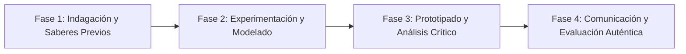

# Planeación Didáctica: Voces de Nuestra Tierra: Cartografía y Memoria de la Diversidad Lingüística

> [!INFO] Ficha Técnica y Curricular (NEM 2024 - Fase 6)
> - **Docente Titular:** [[Prof. Israel López Ángeles]] (`usr-teacher-1`)
> - **Nivel y Fase:** Educación Secundaria — [[Fase 6 (1º, 2º y 3º de Secundaria)]]
> - **Grado:** **1º de Secundaria**
> - **Campo Formativo:** [[Lenguajes]]
> - **Disciplina / Materia:** [[Español]]
> - **Contenido Sintético Oficial SEP 2024:** *La diversidad de lenguas y su uso en la comunicación familiar y comunitaria*
> - **MOC General:** [[00_Indice_Maestro_Secundaria_Fase6_NEM2024]]

---

## 🎯 Proceso de Desarrollo de Aprendizaje (PDA Oficial SEP 2024)
```text
Fase 6 (1º Secundaria) - Reconoce la riqueza lingüística de México y el mundo, a partir de obras literarias procedentes de distintas culturas, valorando la preservación de las lenguas originarias.
```

---

## ❓ Preguntas Detonadoras e Indagación Crítica
- **¿Por qué México cuenta con 68 lenguas indígenas nacionales y qué sabiduría ancestral encierran?**
- **¿Cómo el contacto entre el español y las lenguas originarias enriqueció nuestro vocabulario cotidiano?**
- **¿Qué factores provocan el desplazamiento y pérdida de una lengua materna?**
- **¿Cómo podemos promover el respeto hacia los hablantes de lenguas indígenas en nuestra escuela?**

---

## 📋 Secuencia Didáctica Detallada (10 Sesiones de 50 Minutos)



### 🚀 Sesiones 1 y 2: Indagación, Diagnóstico y Recuperación de Saberes
- **Inicio (15 min):** Audición de poemas en náhuatl y zapoteco con traducción simultánea. Análisis del concepto de plurilingüismo.
- **Desarrollo (30 min):** Planteamiento del reto integrador, conformación de equipos colaborativos y delimitación del alcance del proyecto.
- **Cierre (5 min):** Registro en la bitácora individual de metas de aprendizaje.

### 🔬 Sesiones 3 a 7: Desarrollo Metodológico, Trabajo Experimental y Producción
- **Inicio (10 min):** Reactivación de compromisos y revisión del cronograma de trabajo.
- **Desarrollo (35 min):** Mapeo Lingüístico: Elaborar en equipos un mapa sonoro y visual de las familias lingüísticas de México, investigando indigenismos de uso diario (chayote, tianguis, mecate).
- **Cierre (5 min):** Coevaluación intermedia mediante lista de cotejo y retroalimentación entre pares.

### 🏁 Sesiones 8 a 10: Integración, Socialización Comunitaria y Evaluación
- **Inicio (10 min):** Ensayos de presentación y ajuste final de entregables.
- **Desarrollo (30 min):** Exposición de mapas sonoros en el aula y reflexión sobre el orgullo lingüístico nacional.
- **Cierre (10 min):** Metacognición grupal, balance de impacto social y firma del acta de entrega de proyectos.

---

## 📊 Rúbrica Analítica de Evaluación Formativa y Auténtica

| Nivel de Desempeño | Criterios Curriculares y Evidencias Observables | Ponderación |
| :--- | :--- | :---: |
| **Excelente (10)** | Reconocimiento y valoración de la diversidad lingüística de México con fundamentación teórica sólida, rigurosa y aplicación práctica contextualizada. | 40% |
| **Satisfactorio (8-9)** | Investigación etimológica de préstamos lingüísticos originarios de manera autónoma, estructurada y con calidad metodológica. | 35% |
| **En Proceso (6-7)** | Actitud de respeto y empatía hacia los hablantes de lenguas indígenas con apoyo docente y áreas de mejora identificadas. | 25% |

---

## 📦 Materiales, Recursos Didácticos y Entregable Final

- **Materiales y Recursos:** Mapas de México del INPI, grabaciones de audio, cartulinas y plumones.
- **Entregable Principal:** `Mapa Mural Ilustrado "Las 68 Lenguas Vivas de México: Riqueza y Resistencia".`
- **Instrumentos de Evaluación:** Rúbrica analítica, bitácora de coevaluación entre pares, lista de verificación de entregables.

---

## 🔗 Enlaces Bidireccionales (Obsidian Knowledge Graph)
- [[00_Indice_Maestro_Secundaria_Fase6_NEM2024]]
- [[Lenguajes]]
- [[Español]]
- [[Secundaria_1er_Grado]]
- [[Prof_Israel_Lopez_Angeles]]
