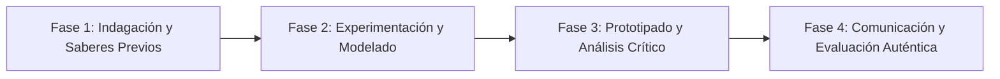

# Planeación Didáctica: Leyes del Salón: Verbos Modales, Derechos y Obligaciones Democráticas

> [!INFO] Ficha Técnica y Curricular (NEM 2024 - Fase 6)
> - **Docente Titular:** [[Prof. Israel López Ángeles]] (`usr-teacher-1`)
> - **Nivel y Fase:** Educación Secundaria — [[Fase 6 (1º, 2º y 3º de Secundaria)]]
> - **Grado:** **1º de Secundaria**
> - **Campo Formativo:** [[Lenguajes]]
> - **Disciplina / Materia:** [[Español]]
> - **Contenido Sintético Oficial SEP 2024:** *Reglamentos escolares y normas de convivencia democrática*
> - **MOC General:** [[00_Indice_Maestro_Secundaria_Fase6_NEM2024]]

---

## 🎯 Proceso de Desarrollo de Aprendizaje (PDA Oficial SEP 2024)
```text
Fase 6 (1º Secundaria) - Participa en la redacción colectiva de un reglamento escolar, analizando la función de verbos en imperativo, futuro e infinitivo para garantizar derechos y obligaciones.
```

---

## ❓ Preguntas Detonadoras e Indagación Crítica
- **¿Por qué un reglamento debe redactarse en positivo y proteger los derechos de todos?**
- **¿Cómo cambia el sentido normativo entre "Se prohíbe" vs "Los alumnos tienen derecho a"?**

---

## 📋 Secuencia Didáctica Detallada (10 Sesiones de 50 Minutos)



### 🚀 Sesiones 1 y 2: Indagación, Diagnóstico y Recuperación de Saberes
- **Inicio (15 min):** Análisis comparativo de reglamentos de tránsito, deportivos y escolares.
- **Desarrollo (30 min):** Planteamiento del reto integrador, conformación de equipos colaborativos y delimitación del alcance del proyecto.
- **Cierre (5 min):** Registro en la bitácora individual de metas de aprendizaje.

### 🔬 Sesiones 3 a 7: Desarrollo Metodológico, Trabajo Experimental y Producción
- **Inicio (10 min):** Reactivación de compromisos y revisión del cronograma de trabajo.
- **Desarrollo (35 min):** Taller Legislativo del Aula: En comisiones, redactar los 5 capítulos del reglamento (Derechos, Obligaciones, Uso de Espacios, Convivencia y Sanciones Formativas) usando numerales y modos verbales.
- **Cierre (5 min):** Coevaluación intermedia mediante lista de cotejo y retroalimentación entre pares.

### 🏁 Sesiones 8 a 10: Integración, Socialización Comunitaria y Evaluación
- **Inicio (10 min):** Ensayos de presentación y ajuste final de entregables.
- **Desarrollo (30 min):** Promulgación formal del Reglamento del Salón con firmas de todos.
- **Cierre (10 min):** Metacognición grupal, balance de impacto social y firma del acta de entrega de proyectos.

---

## 📊 Rúbrica Analítica de Evaluación Formativa y Auténtica

| Nivel de Desempeño | Criterios Curriculares y Evidencias Observables | Ponderación |
| :--- | :--- | :---: |
| **Excelente (10)** | Uso correcto de modos verbales normativos (infinitivo, futuro de mandato) con fundamentación teórica sólida, rigurosa y aplicación práctica contextualizada. | 40% |
| **Satisfactorio (8-9)** | Estructura organizada en capítulos, artículos e incisos de manera autónoma, estructurada y con calidad metodológica. | 35% |
| **En Proceso (6-7)** | Enfoque de derechos humanos y justicia restaurativa con apoyo docente y áreas de mejora identificadas. | 25% |

---

## 📦 Materiales, Recursos Didácticos y Entregable Final

- **Materiales y Recursos:** Pliegos de papel bond, marcadores, formatos legales didácticos.
- **Entregable Principal:** `Reglamento Escolar Democrático y Guía de Convivencia Restaurativa.`
- **Instrumentos de Evaluación:** Rúbrica analítica, bitácora de coevaluación entre pares, lista de verificación de entregables.

---

## 🔗 Enlaces Bidireccionales (Obsidian Knowledge Graph)
- [[00_Indice_Maestro_Secundaria_Fase6_NEM2024]]
- [[Lenguajes]]
- [[Español]]
- [[Secundaria_1er_Grado]]
- [[Prof_Israel_Lopez_Angeles]]
