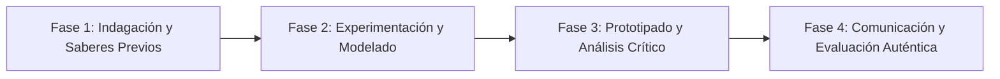

# Planeación Didáctica: Mosaico Joven: Identidades Juveniles, Culturas Urbanas y Respeto a la Diversidad

> [!INFO] Ficha Técnica y Curricular (NEM 2024 - Fase 6)
> - **Docente Titular:** [[Prof. Israel López Ángeles]] (`usr-teacher-1`)
> - **Nivel y Fase:** Educación Secundaria — [[Fase 6 (1º, 2º y 3º de Secundaria)]]
> - **Grado:** **1º de Secundaria**
> - **Campo Formativo:** [[Ética, Naturaleza y Sociedades]]
> - **Disciplina / Materia:** [[Formación Cívica y Ética]]
> - **Contenido Sintético Oficial SEP 2024:** *Tribus urbanas, identidades juveniles y libertad de expresión*
> - **MOC General:** [[00_Indice_Maestro_Secundaria_Fase6_NEM2024]]

---

## 🎯 Proceso de Desarrollo de Aprendizaje (PDA Oficial SEP 2024)
```text
Fase 6 (1º Secundaria) - Valora la diversidad de grupos e identidades juveniles (skaters, gamers, otakus, colectivos artísticos) en la escuela y fortalece el respeto a formas de ser, vestir y pensar.
```

---

## ❓ Preguntas Detonadoras e Indagación Crítica
- **¿Por qué los jóvenes buscan pertenecer a colectivos con gustos compartidos?**
- **¿Cómo combatimos los prejuicios y la discriminación hacia la estética juvenil?**

---

## 📋 Secuencia Didáctica Detallada (10 Sesiones de 50 Minutos)



### 🚀 Sesiones 1 y 2: Indagación, Diagnóstico y Recuperación de Saberes
- **Inicio (15 min):** Exhibición de fotografías y música de distintas culturas urbanas juveniles.
- **Desarrollo (30 min):** Planteamiento del reto integrador, conformación de equipos colaborativos y delimitación del alcance del proyecto.
- **Cierre (5 min):** Registro en la bitácora individual de metas de aprendizaje.

### 🔬 Sesiones 3 a 7: Desarrollo Metodológico, Trabajo Experimental y Producción
- **Inicio (10 min):** Reactivación de compromisos y revisión del cronograma de trabajo.
- **Desarrollo (35 min):** Taller de Identidades Juveniles: Realizar entrevistas a compañeros de distintos grados sobre sus pasiones, gustos musicales y artísticos, armando un collage de la diversidad del plantel.
- **Cierre (5 min):** Coevaluación intermedia mediante lista de cotejo y retroalimentación entre pares.

### 🏁 Sesiones 8 a 10: Integración, Socialización Comunitaria y Evaluación
- **Inicio (10 min):** Ensayos de presentación y ajuste final de entregables.
- **Desarrollo (30 min):** Firma del Pacto Escolar de Cero Discriminación por Apariencia o Gustos.
- **Cierre (10 min):** Metacognición grupal, balance de impacto social y firma del acta de entrega de proyectos.

---

## 📊 Rúbrica Analítica de Evaluación Formativa y Auténtica

| Nivel de Desempeño | Criterios Curriculares y Evidencias Observables | Ponderación |
| :--- | :--- | :---: |
| **Excelente (10)** | Reconocimiento del derecho a la libre expresión de la personalidad con fundamentación teórica sólida, rigurosa y aplicación práctica contextualizada. | 40% |
| **Satisfactorio (8-9)** | Desmontaje de estereotipos y estigmas hacia grupos juveniles de manera autónoma, estructurada y con calidad metodológica. | 35% |
| **En Proceso (6-7)** | Actitud de empatía, inclusión y escucha activa con apoyo docente y áreas de mejora identificadas. | 25% |

---

## 📦 Materiales, Recursos Didácticos y Entregable Final

- **Materiales y Recursos:** Revistas, fotografías, cartulinas, música variada, marcadores.
- **Entregable Principal:** `Collage Mural "Nuestras Voces, Nuestras Identidades: Juventudes sin Etiquetas".`
- **Instrumentos de Evaluación:** Rúbrica analítica, bitácora de coevaluación entre pares, lista de verificación de entregables.

---

## 🔗 Enlaces Bidireccionales (Obsidian Knowledge Graph)
- [[00_Indice_Maestro_Secundaria_Fase6_NEM2024]]
- [[Ética, Naturaleza y Sociedades]]
- [[Formación Cívica y Ética]]
- [[Secundaria_1er_Grado]]
- [[Prof_Israel_Lopez_Angeles]]
