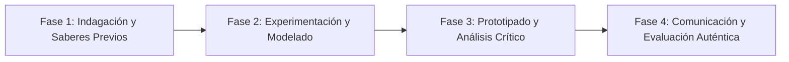

# Planeación Didáctica: Territorios Vivos: El Espacio Geográfico y el Patrimonio Biocultural de México

> [!INFO] Ficha Técnica y Curricular (NEM 2024 - Fase 6)
> - **Docente Titular:** [[Prof. Israel López Ángeles]] (`usr-teacher-1`)
> - **Nivel y Fase:** Educación Secundaria — [[Fase 6 (1º, 2º y 3º de Secundaria)]]
> - **Grado:** **1º de Secundaria**
> - **Campo Formativo:** [[Ética, Naturaleza y Sociedades]]
> - **Disciplina / Materia:** [[Geografía]]
> - **Contenido Sintético Oficial SEP 2024:** *El espacio geográfico como una construcción social y patrimonio biocultural*
> - **MOC General:** [[00_Indice_Maestro_Secundaria_Fase6_NEM2024]]

---

## 🎯 Proceso de Desarrollo de Aprendizaje (PDA Oficial SEP 2024)
```text
Fase 6 (1º Secundaria) - Comprende que el espacio geográfico se conforma de interrelaciones sociedad-naturaleza y reconoce que el patrimonio biocultural es resultado de la cosmovisión, economía y biodiversidad en el tiempo.
```

---

## ❓ Preguntas Detonadoras e Indagación Crítica
- **¿Por qué el espacio geográfico no es solo un mapa físico inanimado sino el resultado vivo de las relaciones humanas y la naturaleza?**
- **¿Qué es el patrimonio biocultural y cómo lo custodian los pueblos indígenas y campesinos?**
- **¿Cómo ha transformado la urbanización acelerada el paisaje natural de nuestra región?**

---

## 📋 Secuencia Didáctica Detallada (10 Sesiones de 50 Minutos)



### 🚀 Sesiones 1 y 2: Indagación, Diagnóstico y Recuperación de Saberes
- **Inicio (15 min):** Comparación de fotografías aéreas históricas de la localidad con imágenes satelitales actuales de Google Earth.
- **Desarrollo (30 min):** Planteamiento del reto integrador, conformación de equipos colaborativos y delimitación del alcance del proyecto.
- **Cierre (5 min):** Registro en la bitácora individual de metas de aprendizaje.

### 🔬 Sesiones 3 a 7: Desarrollo Metodológico, Trabajo Experimental y Producción
- **Inicio (10 min):** Reactivación de compromisos y revisión del cronograma de trabajo.
- **Desarrollo (35 min):** Taller de Cartografía Biocultural: Mapear en capas transparentes componentes físicos (ríos, montañas), biológicos (flora, fauna) y sociales (comunidades, cultivos, sitios sagrados).
- **Cierre (5 min):** Coevaluación intermedia mediante lista de cotejo y retroalimentación entre pares.

### 🏁 Sesiones 8 a 10: Integración, Socialización Comunitaria y Evaluación
- **Inicio (10 min):** Ensayos de presentación y ajuste final de entregables.
- **Desarrollo (30 min):** Exposición de mapas bioculturales y redacción de compromisos de custodia territorial.
- **Cierre (10 min):** Metacognición grupal, balance de impacto social y firma del acta de entrega de proyectos.

---

## 📊 Rúbrica Analítica de Evaluación Formativa y Auténtica

| Nivel de Desempeño | Criterios Curriculares y Evidencias Observables | Ponderación |
| :--- | :--- | :---: |
| **Excelente (10)** | Identificación de los 5 componentes del espacio geográfico (natural, social, cultural, económico y político) con fundamentación teórica sólida, rigurosa y aplicación práctica contextualizada. | 40% |
| **Satisfactorio (8-9)** | Valoración del patrimonio biocultural y saberes locales de manera autónoma, estructurada y con calidad metodológica. | 35% |
| **En Proceso (6-7)** | Elaboración cartográfica con simbología y coordenadas con apoyo docente y áreas de mejora identificadas. | 25% |

---

## 📦 Materiales, Recursos Didácticos y Entregable Final

- **Materiales y Recursos:** Imágenes satelitales impresas, acetatos, plumones indelebles, mapas base.
- **Entregable Principal:** `Mapa Multicapa del Patrimonio Biocultural Local con Memoria Geográfica.`
- **Instrumentos de Evaluación:** Rúbrica analítica, bitácora de coevaluación entre pares, lista de verificación de entregables.

---

## 🔗 Enlaces Bidireccionales (Obsidian Knowledge Graph)
- [[00_Indice_Maestro_Secundaria_Fase6_NEM2024]]
- [[Ética, Naturaleza y Sociedades]]
- [[Geografía]]
- [[Secundaria_1er_Grado]]
- [[Prof_Israel_Lopez_Angeles]]
