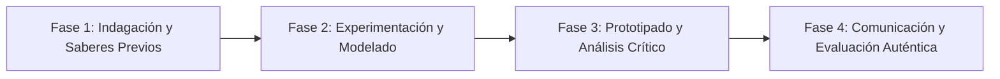

# Planeación Didáctica: Tierra en Movimiento: Tectónica de Placas, Vulcanismo y Cultura Sísmica en México

> [!INFO] Ficha Técnica y Curricular (NEM 2024 - Fase 6)
> - **Docente Titular:** [[Prof. Israel López Ángeles]] (`usr-teacher-1`)
> - **Nivel y Fase:** Educación Secundaria — [[Fase 6 (1º, 2º y 3º de Secundaria)]]
> - **Grado:** **1º de Secundaria**
> - **Campo Formativo:** [[Ética, Naturaleza y Sociedades]]
> - **Disciplina / Materia:** [[Geografía]]
> - **Contenido Sintético Oficial SEP 2024:** *Placas tectónicas, sismicidad y vulcanismo en el Cinturón de Fuego*
> - **MOC General:** [[00_Indice_Maestro_Secundaria_Fase6_NEM2024]]

---

## 🎯 Proceso de Desarrollo de Aprendizaje (PDA Oficial SEP 2024)
```text
Fase 6 (1º Secundaria) - Argumenta la relación entre la dinámica de las placas tectónicas (convergencia, divergencia y transformación) con el Cinturón de Fuego del Pacífico, fallas geológicas y sismicidad en México.
```

---

## ❓ Preguntas Detonadoras e Indagación Crítica
- **¿Por qué México es uno de los países con mayor actividad sísmica y volcánica del planeta (interacción de 5 placas)?**
- **¿Cómo se genera la subducción de la Placa de Cocos bajo la Placa Norteamericana?**
- **¿Cómo opera la red del Sistema de Alerta Sísmica Mexicano (SASMEX) y qué protocolos salvan vidas?**

---

## 📋 Secuencia Didáctica Detallada (10 Sesiones de 50 Minutos)



### 🚀 Sesiones 1 y 2: Indagación, Diagnóstico y Recuperación de Saberes
- **Inicio (15 min):** Simulación de fallas y bordes de placa con galletas de chocolate y crema.
- **Desarrollo (30 min):** Planteamiento del reto integrador, conformación de equipos colaborativos y delimitación del alcance del proyecto.
- **Cierre (5 min):** Registro en la bitácora individual de metas de aprendizaje.

### 🔬 Sesiones 3 a 7: Desarrollo Metodológico, Trabajo Experimental y Producción
- **Inicio (10 min):** Reactivación de compromisos y revisión del cronograma de trabajo.
- **Desarrollo (35 min):** Laboratorio de Geofísica Escolar: Construir un sismógrafo casero con péndulo y marcador, mapear el Eje Neovolcánico Transversal (Popocatépetl, Colima, Pico de Orizaba) y diseñar el plan de repliegue sísmico.
- **Cierre (5 min):** Coevaluación intermedia mediante lista de cotejo y retroalimentación entre pares.

### 🏁 Sesiones 8 a 10: Integración, Socialización Comunitaria y Evaluación
- **Inicio (10 min):** Ensayos de presentación y ajuste final de entregables.
- **Desarrollo (30 min):** Simulacro de evacuación evaluado con cronómetro y lista de cotejo de protección civil.
- **Cierre (10 min):** Metacognición grupal, balance de impacto social y firma del acta de entrega de proyectos.

---

## 📊 Rúbrica Analítica de Evaluación Formativa y Auténtica

| Nivel de Desempeño | Criterios Curriculares y Evidencias Observables | Ponderación |
| :--- | :--- | :---: |
| **Excelente (10)** | Explicación geodinámica de los tipos de límites de placas tectónicas con fundamentación teórica sólida, rigurosa y aplicación práctica contextualizada. | 40% |
| **Satisfactorio (8-9)** | Mapeo de zonas de alta sismicidad y volcanes activos en México de manera autónoma, estructurada y con calidad metodológica. | 35% |
| **En Proceso (6-7)** | Diseño y ejecución rigurosa de protocolos de protección civil ante sismos con apoyo docente y áreas de mejora identificadas. | 25% |

---

## 📦 Materiales, Recursos Didácticos y Entregable Final

- **Materiales y Recursos:** Cajas de zapatos, canicas, plumones, mapas geomorfológicos, cronómetro.
- **Entregable Principal:** `Sismógrafo Casero Construido y Plan Maestro de Evacuación Escolar y Familiar.`
- **Instrumentos de Evaluación:** Rúbrica analítica, bitácora de coevaluación entre pares, lista de verificación de entregables.

---

## 🔗 Enlaces Bidireccionales (Obsidian Knowledge Graph)
- [[00_Indice_Maestro_Secundaria_Fase6_NEM2024]]
- [[Ética, Naturaleza y Sociedades]]
- [[Geografía]]
- [[Secundaria_1er_Grado]]
- [[Prof_Israel_Lopez_Angeles]]
