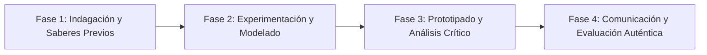

# Planeación Didáctica: El Mapa de la Equidad: IDH, Coeficiente de Gini y Calidad de Vida en el Mundo

> [!INFO] Ficha Técnica y Curricular (NEM 2024 - Fase 6)
> - **Docente Titular:** [[Prof. Israel López Ángeles]] (`usr-teacher-1`)
> - **Nivel y Fase:** Educación Secundaria — [[Fase 6 (1º, 2º y 3º de Secundaria)]]
> - **Grado:** **1º de Secundaria**
> - **Campo Formativo:** [[Ética, Naturaleza y Sociedades]]
> - **Disciplina / Materia:** [[Geografía]]
> - **Contenido Sintético Oficial SEP 2024:** *Desigualdades socioeconómicas y el Índice de Desarrollo Humano (IDH)*
> - **MOC General:** [[00_Indice_Maestro_Secundaria_Fase6_NEM2024]]

---

## 🎯 Proceso de Desarrollo de Aprendizaje (PDA Oficial SEP 2024)
```text
Fase 6 (1º Secundaria) - Argumenta las desigualdades socioeconómicas en México y el mundo mediante la interpretación del Índice de Desarrollo Humano (salud, educación e ingreso) del PNUD.
```

---

## ❓ Preguntas Detonadoras e Indagación Crítica
- **¿Por qué un país con alto Producto Interno Bruto (PIB) puede tener altos niveles de pobreza si la riqueza está concentrada?**
- **¿Qué mide el IDH (esperanza de vida, escolaridad e ingreso per cápita)?**

---

## 📋 Secuencia Didáctica Detallada (10 Sesiones de 50 Minutos)



### 🚀 Sesiones 1 y 2: Indagación, Diagnóstico y Recuperación de Saberes
- **Inicio (15 min):** Análisis de la pirámide de distribución del ingreso en México y América Latina.
- **Desarrollo (30 min):** Planteamiento del reto integrador, conformación de equipos colaborativos y delimitación del alcance del proyecto.
- **Cierre (5 min):** Registro en la bitácora individual de metas de aprendizaje.

### 🔬 Sesiones 3 a 7: Desarrollo Metodológico, Trabajo Experimental y Producción
- **Inicio (10 min):** Reactivación de compromisos y revisión del cronograma de trabajo.
- **Desarrollo (35 min):** Taller de Geografía Económica: Comparar en mapas temáticos los municipios con mayor IDH (Benito Juárez, CDMX) vs menor IDH (Cochoapa el Grande, Guerrero), proponiendo políticas de justicia redistributiva.
- **Cierre (5 min):** Coevaluación intermedia mediante lista de cotejo y retroalimentación entre pares.

### 🏁 Sesiones 8 a 10: Integración, Socialización Comunitaria y Evaluación
- **Inicio (10 min):** Ensayos de presentación y ajuste final de entregables.
- **Desarrollo (30 min):** Debate sobre los Objetivos de Desarrollo Sostenible (ODS 1: Fin de la Pobreza, ODS 10: Reducción de Desigualdades).
- **Cierre (10 min):** Metacognición grupal, balance de impacto social y firma del acta de entrega de proyectos.

---

## 📊 Rúbrica Analítica de Evaluación Formativa y Auténtica

| Nivel de Desempeño | Criterios Curriculares y Evidencias Observables | Ponderación |
| :--- | :--- | :---: |
| **Excelente (10)** | Interpretación estadística y cartográfica del IDH y Coeficiente de Gini con fundamentación teórica sólida, rigurosa y aplicación práctica contextualizada. | 40% |
| **Satisfactorio (8-9)** | Identificación de causas estructurales de la desigualdad regional de manera autónoma, estructurada y con calidad metodológica. | 35% |
| **En Proceso (6-7)** | Propuestas fundadas en derechos humanos y justicia social con apoyo docente y áreas de mejora identificadas. | 25% |

---

## 📦 Materiales, Recursos Didácticos y Entregable Final

- **Materiales y Recursos:** Informes del PNUD e INEGI, mapas temáticos de México y el mundo.
- **Entregable Principal:** `Informe Geoeconómico "Radiografía del Desarrollo Humano en México y el Mundo".`
- **Instrumentos de Evaluación:** Rúbrica analítica, bitácora de coevaluación entre pares, lista de verificación de entregables.

---

## 🔗 Enlaces Bidireccionales (Obsidian Knowledge Graph)
- [[00_Indice_Maestro_Secundaria_Fase6_NEM2024]]
- [[Ética, Naturaleza y Sociedades]]
- [[Geografía]]
- [[Secundaria_1er_Grado]]
- [[Prof_Israel_Lopez_Angeles]]
