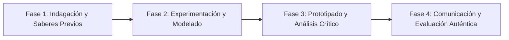

# Planeación Didáctica: La Cuna de la Polis y la República: Democracia Ateniense, Derecho Romano y Esclavitud

> [!INFO] Ficha Técnica y Curricular (NEM 2024 - Fase 6)
> - **Docente Titular:** [[Prof. Israel López Ángeles]] (`usr-teacher-1`)
> - **Nivel y Fase:** Educación Secundaria — [[Fase 6 (1º, 2º y 3º de Secundaria)]]
> - **Grado:** **1º de Secundaria**
> - **Campo Formativo:** [[Ética, Naturaleza y Sociedades]]
> - **Disciplina / Materia:** [[Historia]]
> - **Contenido Sintético Oficial SEP 2024:** *Grecia clásica, Roma y el espacio ecúmene mediterráneo*
> - **MOC General:** [[00_Indice_Maestro_Secundaria_Fase6_NEM2024]]

---

## 🎯 Proceso de Desarrollo de Aprendizaje (PDA Oficial SEP 2024)
```text
Fase 6 (1º Secundaria) - Indaga a partir de la noción de espacio ecúmene aplicada a los pueblos del Mediterráneo (fenicios, griegos, romanos), contrastando la democracia ateniense con la república romana y el trabajo esclavo.
```

---

## ❓ Preguntas Detonadoras e Indagación Crítica
- **¿Quiénes participaban en la asamblea democrática de Atenas y quiénes estaban totalmente excluidos (mujeres, esclavos, extranjeros)?**
- **¿Cómo estructuró el Derecho Romano las bases del sistema legal moderno?**

---

## 📋 Secuencia Didáctica Detallada (10 Sesiones de 50 Minutos)



### 🚀 Sesiones 1 y 2: Indagación, Diagnóstico y Recuperación de Saberes
- **Inicio (15 min):** Recreación de un debate en el Ágora de Atenas sobre la justicia y el ostracismo.
- **Desarrollo (30 min):** Planteamiento del reto integrador, conformación de equipos colaborativos y delimitación del alcance del proyecto.
- **Cierre (5 min):** Registro en la bitácora individual de metas de aprendizaje.

### 🔬 Sesiones 3 a 7: Desarrollo Metodológico, Trabajo Experimental y Producción
- **Inicio (10 min):** Reactivación de compromisos y revisión del cronograma de trabajo.
- **Desarrollo (35 min):** Laboratorio de Historia Comparada: Construir un cuadro sinóptico contrastando la democracia directa de Atenas vs la República romana y redactar un juicio crítico sobre el sistema esclavista imperial.
- **Cierre (5 min):** Coevaluación intermedia mediante lista de cotejo y retroalimentación entre pares.

### 🏁 Sesiones 8 a 10: Integración, Socialización Comunitaria y Evaluación
- **Inicio (10 min):** Ensayos de presentación y ajuste final de entregables.
- **Desarrollo (30 min):** Discusión sobre los límites de la democracia antigua frente a la ciudadanía universal moderna.
- **Cierre (10 min):** Metacognición grupal, balance de impacto social y firma del acta de entrega de proyectos.

---

## 📊 Rúbrica Analítica de Evaluación Formativa y Auténtica

| Nivel de Desempeño | Criterios Curriculares y Evidencias Observables | Ponderación |
| :--- | :--- | :---: |
| **Excelente (10)** | Diferenciación conceptual entre sistemas políticos del Mediterráneo con fundamentación teórica sólida, rigurosa y aplicación práctica contextualizada. | 40% |
| **Satisfactorio (8-9)** | Análisis del rol del comercio marítimo fenicio y griego de manera autónoma, estructurada y con calidad metodológica. | 35% |
| **En Proceso (6-7)** | Crítica ética al modelo económico sustentado en la esclavitud con apoyo docente y áreas de mejora identificadas. | 25% |

---

## 📦 Materiales, Recursos Didácticos y Entregable Final

- **Materiales y Recursos:** Mapas de la Cuenca del Mediterráneo, textos de Tucídides y Cicerón.
- **Entregable Principal:** `Cuadro Comparativo de Sistemas Políticos Clásicos y Ensayo sobre el Derecho Romano.`
- **Instrumentos de Evaluación:** Rúbrica analítica, bitácora de coevaluación entre pares, lista de verificación de entregables.

---

## 🔗 Enlaces Bidireccionales (Obsidian Knowledge Graph)
- [[00_Indice_Maestro_Secundaria_Fase6_NEM2024]]
- [[Ética, Naturaleza y Sociedades]]
- [[Historia]]
- [[Secundaria_1er_Grado]]
- [[Prof_Israel_Lopez_Angeles]]
