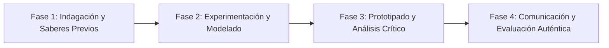

# Planeación Didáctica: El Quinto Sol: Mitos Fundacionales, Dioses del Maíz y la Filosofía Náhuatl

> [!INFO] Ficha Técnica y Curricular (NEM 2024 - Fase 6)
> - **Docente Titular:** [[Prof. Israel López Ángeles]] (`usr-teacher-1`)
> - **Nivel y Fase:** Educación Secundaria — [[Fase 6 (1º, 2º y 3º de Secundaria)]]
> - **Grado:** **1º de Secundaria**
> - **Campo Formativo:** [[Ética, Naturaleza y Sociedades]]
> - **Disciplina / Materia:** [[Historia]]
> - **Contenido Sintético Oficial SEP 2024:** *Mito y cosmovisión en las culturas prehispánicas de México*
> - **MOC General:** [[00_Indice_Maestro_Secundaria_Fase6_NEM2024]]

---

## 🎯 Proceso de Desarrollo de Aprendizaje (PDA Oficial SEP 2024)
```text
Fase 6 (1º Secundaria) - Compara y encuentra lo común y lo diverso entre mitos fundacionales de pueblos mesoamericanos (La Leyenda de los Soles, el Popol Vuh maya) y su concepción sagrada del cosmos.
```

---

## ❓ Preguntas Detonadoras e Indagación Crítica
- **¿Cómo explicaban los antiguos mayas en el Popol Vuh la creación del hombre a partir del maíz blanco y amarillo?**
- **¿Qué significaba para los mexicas vivir en la era del Quinto Sol (Nahui Ollin: Sol de Movimiento)?**

---

## 📋 Secuencia Didáctica Detallada (10 Sesiones de 50 Minutos)



### 🚀 Sesiones 1 y 2: Indagación, Diagnóstico y Recuperación de Saberes
- **Inicio (15 min):** Lectura dramatizada de fragmentos del Popol Vuh.
- **Desarrollo (30 min):** Planteamiento del reto integrador, conformación de equipos colaborativos y delimitación del alcance del proyecto.
- **Cierre (5 min):** Registro en la bitácora individual de metas de aprendizaje.

### 🔬 Sesiones 3 a 7: Desarrollo Metodológico, Trabajo Experimental y Producción
- **Inicio (10 min):** Reactivación de compromisos y revisión del cronograma de trabajo.
- **Desarrollo (35 min):** Taller de Códices y Filosofía Náhuatl: Recrear en papel amate artesanal un códice con la Piedra del Sol y las 4 eras cósmicas previas, analizando conceptos de dualidad (Ometéotl) y respeto a la naturaleza.
- **Cierre (5 min):** Coevaluación intermedia mediante lista de cotejo y retroalimentación entre pares.

### 🏁 Sesiones 8 a 10: Integración, Socialización Comunitaria y Evaluación
- **Inicio (10 min):** Ensayos de presentación y ajuste final de entregables.
- **Desarrollo (30 min):** Exhibición de códices en el aula con declamación de poemas de Nezahualcóyotl.
- **Cierre (10 min):** Metacognición grupal, balance de impacto social y firma del acta de entrega de proyectos.

---

## 📊 Rúbrica Analítica de Evaluación Formativa y Auténtica

| Nivel de Desempeño | Criterios Curriculares y Evidencias Observables | Ponderación |
| :--- | :--- | :---: |
| **Excelente (10)** | Interpretación profunda de la cosmovisión mesoamericana con fundamentación teórica sólida, rigurosa y aplicación práctica contextualizada. | 40% |
| **Satisfactorio (8-9)** | Elaboración estética del códice con glifos y colores tradicionales de manera autónoma, estructurada y con calidad metodológica. | 35% |
| **En Proceso (6-7)** | Aprecio por la literatura y filosofía indígena con apoyo docente y áreas de mejora identificadas. | 25% |

---

## 📦 Materiales, Recursos Didácticos y Entregable Final

- **Materiales y Recursos:** Papel amate o papel estraza envejecido con café, tintas, pinceles, reproducciones de códices.
- **Entregable Principal:** `Códice Mesoamericano en Papel Amate "La Leyenda de los Cinco Soles y la Creación".`
- **Instrumentos de Evaluación:** Rúbrica analítica, bitácora de coevaluación entre pares, lista de verificación de entregables.

---

## 🔗 Enlaces Bidireccionales (Obsidian Knowledge Graph)
- [[00_Indice_Maestro_Secundaria_Fase6_NEM2024]]
- [[Ética, Naturaleza y Sociedades]]
- [[Historia]]
- [[Secundaria_1er_Grado]]
- [[Prof_Israel_Lopez_Angeles]]
