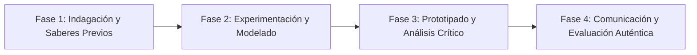

# Planeación Didáctica: El Muro Decimal: Fracciones Finitas, Periódicas Puras y Mixtas en el Comercio

> [!INFO] Ficha Técnica y Curricular (NEM 2024 - Fase 6)
> - **Docente Titular:** [[Prof. Israel López Ángeles]] (`usr-teacher-1`)
> - **Nivel y Fase:** Educación Secundaria — [[Fase 6 (1º, 2º y 3º de Secundaria)]]
> - **Grado:** **1º de Secundaria**
> - **Campo Formativo:** [[Saberes y Pensamiento Científico]]
> - **Disciplina / Materia:** [[Matemáticas]]
> - **Contenido Sintético Oficial SEP 2024:** *Expresión de fracciones como decimales y de decimales como fracciones*
> - **MOC General:** [[00_Indice_Maestro_Secundaria_Fase6_NEM2024]]

---

## 🎯 Proceso de Desarrollo de Aprendizaje (PDA Oficial SEP 2024)
```text
Fase 6 (1º Secundaria) - Usa diversas estrategias al convertir números fraccionarios a decimales y viceversa, distinguiendo decimales finitos, periódicos puros y periódicos mixtos mediante algoritmos algebraicos.
```

---

## ❓ Preguntas Detonadoras e Indagación Crítica
- **¿Por qué al dividir $1 \div 3$ obtenemos $0.333...$ infinito mientras que $1 \div 4$ da $0.25$ exacto?**
- **¿Cómo transformamos un número decimal periódico como $0.\overline{7}$ o $1.2\overline{45}$ en su fracción irreducible exacta usando ecuaciones?**
- **¿Cómo ayuda el redondeo y truncamiento en las transacciones comerciales diarias?**

---

## 📋 Secuencia Didáctica Detallada (10 Sesiones de 50 Minutos)



### 🚀 Sesiones 1 y 2: Indagación, Diagnóstico y Recuperación de Saberes
- **Inicio (15 min):** Desafío de la calculadora: Dividir fracciones unitarias y clasificar los patrones de sus cifras decimales.
- **Desarrollo (30 min):** Planteamiento del reto integrador, conformación de equipos colaborativos y delimitación del alcance del proyecto.
- **Cierre (5 min):** Registro en la bitácora individual de metas de aprendizaje.

### 🔬 Sesiones 3 a 7: Desarrollo Metodológico, Trabajo Experimental y Producción
- **Inicio (10 min):** Reactivación de compromisos y revisión del cronograma de trabajo.
- **Desarrollo (35 min):** Taller de Algoritmos de Conversión: Resolver conversiones algebraicas multiplicando por potencias de 10 para eliminar periodos decimales y simplificar fracciones por MCD.
- **Cierre (5 min):** Coevaluación intermedia mediante lista de cotejo y retroalimentación entre pares.

### 🏁 Sesiones 8 a 10: Integración, Socialización Comunitaria y Evaluación
- **Inicio (10 min):** Ensayos de presentación y ajuste final de entregables.
- **Desarrollo (30 min):** Rally de velocidad mental y resolución de problemas financieros reales.
- **Cierre (10 min):** Metacognición grupal, balance de impacto social y firma del acta de entrega de proyectos.

---

## 📊 Rúbrica Analítica de Evaluación Formativa y Auténtica

| Nivel de Desempeño | Criterios Curriculares y Evidencias Observables | Ponderación |
| :--- | :--- | :---: |
| **Excelente (10)** | Conversión precisa de fracciones a decimales finitos y periódicos con fundamentación teórica sólida, rigurosa y aplicación práctica contextualizada. | 40% |
| **Satisfactorio (8-9)** | Aplicación del método algebraico para convertir decimales periódicos a fracciones de manera autónoma, estructurada y con calidad metodológica. | 35% |
| **En Proceso (6-7)** | Simplificación de fracciones a su forma irreducible con apoyo docente y áreas de mejora identificadas. | 25% |

---

## 📦 Materiales, Recursos Didácticos y Entregable Final

- **Materiales y Recursos:** Calculadoras científicas, hojas cuadriculadas, fichas de dominó fraccionario.
- **Entregable Principal:** `Problemario Resuelto y Fichero Técnico "Del Decimal Periódico a la Fracción Exacta".`
- **Instrumentos de Evaluación:** Rúbrica analítica, bitácora de coevaluación entre pares, lista de verificación de entregables.

---

## 🔗 Enlaces Bidireccionales (Obsidian Knowledge Graph)
- [[00_Indice_Maestro_Secundaria_Fase6_NEM2024]]
- [[Saberes y Pensamiento Científico]]
- [[Matemáticas]]
- [[Secundaria_1er_Grado]]
- [[Prof_Israel_Lopez_Angeles]]
