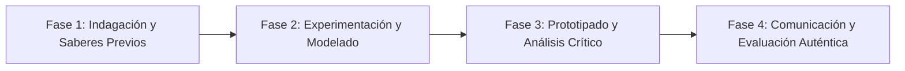

# Planeación Didáctica: Bajo Cero y en las Alturas: Números con Signo, Valor Absoluto y Densidad Numérica

> [!INFO] Ficha Técnica y Curricular (NEM 2024 - Fase 6)
> - **Docente Titular:** [[Prof. Israel López Ángeles]] (`usr-teacher-1`)
> - **Nivel y Fase:** Educación Secundaria — [[Fase 6 (1º, 2º y 3º de Secundaria)]]
> - **Grado:** **1º de Secundaria**
> - **Campo Formativo:** [[Saberes y Pensamiento Científico]]
> - **Disciplina / Materia:** [[Matemáticas]]
> - **Contenido Sintético Oficial SEP 2024:** *Extensión de los números a positivos y negativos y su orden en la recta*
> - **MOC General:** [[00_Indice_Maestro_Secundaria_Fase6_NEM2024]]

---

## 🎯 Proceso de Desarrollo de Aprendizaje (PDA Oficial SEP 2024)
```text
Fase 6 (1º Secundaria) - Reconoce la necesidad de los números negativos a partir de situaciones con el cero como referencia (temperaturas, finanzas, profundidades) y analiza la propiedad de densidad.
```

---

## ❓ Preguntas Detonadoras e Indagación Crítica
- **¿Por qué $-15^{\circ}\text{C}$ es más frío que $-3^{\circ}\text{C}$ a pesar de que $15 > 3$?**
- **¿Qué significa el valor absoluto $|x|$ como distancia al origen sin importar la dirección?**
- **¿Por qué entre dos números racionales cualesquiera siempre existe una infinidad de números (densidad)?**

---

## 📋 Secuencia Didáctica Detallada (10 Sesiones de 50 Minutos)



### 🚀 Sesiones 1 y 2: Indagación, Diagnóstico y Recuperación de Saberes
- **Inicio (15 min):** Simulación de ascensor en rascacielos con sótanos y altitudes marinas.
- **Desarrollo (30 min):** Planteamiento del reto integrador, conformación de equipos colaborativos y delimitación del alcance del proyecto.
- **Cierre (5 min):** Registro en la bitácora individual de metas de aprendizaje.

### 🔬 Sesiones 3 a 7: Desarrollo Metodológico, Trabajo Experimental y Producción
- **Inicio (10 min):** Reactivación de compromisos y revisión del cronograma de trabajo.
- **Desarrollo (35 min):** Laboratorio de la Recta Numérica: Ubicar números fraccionarios y decimales con signo, calcular valores absolutos y encontrar puntos medios fraccionarios.
- **Cierre (5 min):** Coevaluación intermedia mediante lista de cotejo y retroalimentación entre pares.

### 🏁 Sesiones 8 a 10: Integración, Socialización Comunitaria y Evaluación
- **Inicio (10 min):** Ensayos de presentación y ajuste final de entregables.
- **Desarrollo (30 min):** Juego de mesa "Desafío Polar": Avanzar y retroceder con dados de enteros con signo.
- **Cierre (10 min):** Metacognición grupal, balance de impacto social y firma del acta de entrega de proyectos.

---

## 📊 Rúbrica Analítica de Evaluación Formativa y Auténtica

| Nivel de Desempeño | Criterios Curriculares y Evidencias Observables | Ponderación |
| :--- | :--- | :---: |
| **Excelente (10)** | Ubicación y ordenamiento riguroso de números con signo en la recta con fundamentación teórica sólida, rigurosa y aplicación práctica contextualizada. | 40% |
| **Satisfactorio (8-9)** | Comprensión del valor absoluto y opuesto de un número de manera autónoma, estructurada y con calidad metodológica. | 35% |
| **En Proceso (6-7)** | Demostración de la propiedad de densidad numérica entre dos racionales con apoyo docente y áreas de mejora identificadas. | 25% |

---

## 📦 Materiales, Recursos Didácticos y Entregable Final

- **Materiales y Recursos:** Cintas métricas graduadas, dados bicolores, tarjetas numéricas.
- **Entregable Principal:** `Bitácora Gráfica de la Recta Numérica y Resolución de Casos Financieros y Térmicos.`
- **Instrumentos de Evaluación:** Rúbrica analítica, bitácora de coevaluación entre pares, lista de verificación de entregables.

---

## 🔗 Enlaces Bidireccionales (Obsidian Knowledge Graph)
- [[00_Indice_Maestro_Secundaria_Fase6_NEM2024]]
- [[Saberes y Pensamiento Científico]]
- [[Matemáticas]]
- [[Secundaria_1er_Grado]]
- [[Prof_Israel_Lopez_Angeles]]
