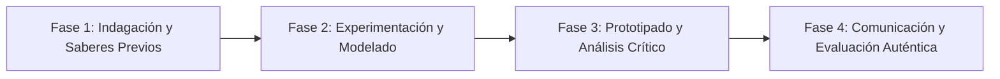

# Planeación Didáctica: La Brújula Interior: Autoconocimiento, Fortalezas de Carácter y Autoestima

> [!INFO] Ficha Técnica y Curricular (NEM 2024 - Fase 6)
> - **Docente Titular:** [[Prof. Israel López Ángeles]] (`usr-teacher-1`)
> - **Nivel y Fase:** Educación Secundaria — [[Fase 6 (1º, 2º y 3º de Secundaria)]]
> - **Grado:** **1º de Secundaria**
> - **Campo Formativo:** [[De lo Humano y lo Comunitario]]
> - **Disciplina / Materia:** [[Tutoría / Educación Socioemocional]]
> - **Contenido Sintético Oficial SEP 2024:** *Formas de ser, pensar, actuar y autoconocimiento en la adolescencia*
> - **MOC General:** [[00_Indice_Maestro_Secundaria_Fase6_NEM2024]]

---

## 🎯 Proceso de Desarrollo de Aprendizaje (PDA Oficial SEP 2024)
```text
Fase 6 (1º Secundaria) - Reconoce ideas, gustos, necesidades, posibilidades e intereses personales para favorecer el autoconocimiento, descubriendo nuevas potencialidades y enfrentando la transición a la secundaria con seguridad.
```

---

## ❓ Preguntas Detonadoras e Indagación Crítica
- **¿Qué cambios físicos, emocionales y sociales estás experimentando en esta nueva etapa de secundaria?**
- **¿Cuáles son tus 3 mayores fortalezas de carácter (creatividad, perseverancia, amabilidad, valentía)?**
- **¿Cómo construimos un autoconcepto positivo sin depender de la aprobación superficial en redes sociales?**

---

## 📋 Secuencia Didáctica Detallada (10 Sesiones de 50 Minutos)



### 🚀 Sesiones 1 y 2: Indagación, Diagnóstico y Recuperación de Saberes
- **Inicio (15 min):** Dinámica de la "Cápsula de Identidad": Escribir una carta a mi "yo" del futuro sobre quién soy hoy.
- **Desarrollo (30 min):** Planteamiento del reto integrador, conformación de equipos colaborativos y delimitación del alcance del proyecto.
- **Cierre (5 min):** Registro en la bitácora individual de metas de aprendizaje.

### 🔬 Sesiones 3 a 7: Desarrollo Metodológico, Trabajo Experimental y Producción
- **Inicio (10 min):** Reactivación de compromisos y revisión del cronograma de trabajo.
- **Desarrollo (35 min):** Taller de Autoconocimiento: Construir el "Mapa de Mis Fortalezas y Talentos" mediante la rueda de la vida (académico, familiar, amigos, salud, hobbies) identificando áreas de orgullo y metas de crecimiento.
- **Cierre (5 min):** Coevaluación intermedia mediante lista de cotejo y retroalimentación entre pares.

### 🏁 Sesiones 8 a 10: Integración, Socialización Comunitaria y Evaluación
- **Inicio (10 min):** Ensayos de presentación y ajuste final de entregables.
- **Desarrollo (30 min):** Círculo de Aprecio Mutuo: Expresar cualidades positivas sinceras entre compañeros.
- **Cierre (10 min):** Metacognición grupal, balance de impacto social y firma del acta de entrega de proyectos.

---

## 📊 Rúbrica Analítica de Evaluación Formativa y Auténtica

| Nivel de Desempeño | Criterios Curriculares y Evidencias Observables | Ponderación |
| :--- | :--- | :---: |
| **Excelente (10)** | Identificación consciente de emociones, fortalezas y áreas de oportunidad con fundamentación teórica sólida, rigurosa y aplicación práctica contextualizada. | 40% |
| **Satisfactorio (8-9)** | Reflexión sobre el proceso de transición e identidad en la adolescencia de manera autónoma, estructurada y con calidad metodológica. | 35% |
| **En Proceso (6-7)** | Construcción de un autoconcepto positivo y realista con apoyo docente y áreas de mejora identificadas. | 25% |

---

## 📦 Materiales, Recursos Didácticos y Entregable Final

- **Materiales y Recursos:** Plantillas de la Rueda de la Vida, formatos de carta personal, notas de aprecio.
- **Entregable Principal:** `Bitácora de Autoconocimiento "El Mapa de Mi Identidad y Mis Talentos".`
- **Instrumentos de Evaluación:** Rúbrica analítica, bitácora de coevaluación entre pares, lista de verificación de entregables.

---

## 🔗 Enlaces Bidireccionales (Obsidian Knowledge Graph)
- [[00_Indice_Maestro_Secundaria_Fase6_NEM2024]]
- [[De lo Humano y lo Comunitario]]
- [[Tutoría / Educación Socioemocional]]
- [[Secundaria_1er_Grado]]
- [[Prof_Israel_Lopez_Angeles]]
