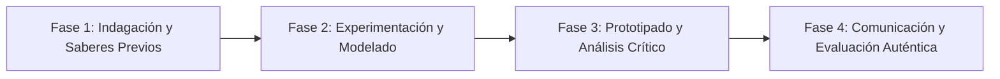

# Planeación Didáctica: El Océano Emocional: Emociones Primarias, Estados de Ánimo y Sentimientos Duraderos

> [!INFO] Ficha Técnica y Curricular (NEM 2024 - Fase 6)
> - **Docente Titular:** [[Prof. Israel López Ángeles]] (`usr-teacher-1`)
> - **Nivel y Fase:** Educación Secundaria — [[Fase 6 (1º, 2º y 3º de Secundaria)]]
> - **Grado:** **1º de Secundaria**
> - **Campo Formativo:** [[De lo Humano y lo Comunitario]]
> - **Disciplina / Materia:** [[Tutoría / Educación Socioemocional]]
> - **Contenido Sintético Oficial SEP 2024:** *Diferencia entre emociones, estados de ánimo y sentimientos*
> - **MOC General:** [[00_Indice_Maestro_Secundaria_Fase6_NEM2024]]

---

## 🎯 Proceso de Desarrollo de Aprendizaje (PDA Oficial SEP 2024)
```text
Fase 6 (1º Secundaria) - Distingue entre emociones (reacciones psicofisiológicas inmediatas), estados de ánimo (tonalidad afectiva prolongada) y sentimientos (construcciones conscientes duraderas) para la toma de decisiones asertivas.
```

---

## ❓ Preguntas Detonadoras e Indagación Crítica
- **¿Por qué una emoción como el susto o la ira dura apenas segundos, pero un sentimiento como el rencor o el amor puede durar años?**
- **¿Cómo influye nuestro estado de ánimo al despertar en la forma en que interpretamos lo que nos dicen los demás?**
- **¿Cómo pasamos de una emoción impulsiva a una respuesta reflexiva?**

---

## 📋 Secuencia Didáctica Detallada (10 Sesiones de 50 Minutos)



### 🚀 Sesiones 1 y 2: Indagación, Diagnóstico y Recuperación de Saberes
- **Inicio (15 min):** Proyección de escenas de la película "Intensamente" analizando el cuartel general de las emociones.
- **Desarrollo (30 min):** Planteamiento del reto integrador, conformación de equipos colaborativos y delimitación del alcance del proyecto.
- **Cierre (5 min):** Registro en la bitácora individual de metas de aprendizaje.

### 🔬 Sesiones 3 a 7: Desarrollo Metodológico, Trabajo Experimental y Producción
- **Inicio (10 min):** Reactivación de compromisos y revisión del cronograma de trabajo.
- **Desarrollo (35 min):** Laboratorio de Consciencia Afectiva: Clasificar 20 términos emocionales en el "Termómetro Afectivo" (Emoción vs Estado de Ánimo vs Sentimiento) y practicar técnicas de respiración diafragmática (4-7-8) para regular picos emocionales.
- **Cierre (5 min):** Coevaluación intermedia mediante lista de cotejo y retroalimentación entre pares.

### 🏁 Sesiones 8 a 10: Integración, Socialización Comunitaria y Evaluación
- **Inicio (10 min):** Ensayos de presentación y ajuste final de entregables.
- **Desarrollo (30 min):** Creación del "Botiquín Emocional del Aula" con recursos de calma y escucha.
- **Cierre (10 min):** Metacognición grupal, balance de impacto social y firma del acta de entrega de proyectos.

---

## 📊 Rúbrica Analítica de Evaluación Formativa y Auténtica

| Nivel de Desempeño | Criterios Curriculares y Evidencias Observables | Ponderación |
| :--- | :--- | :---: |
| **Excelente (10)** | Diferenciación conceptual precisa de emoción, estado de ánimo y sentimiento con fundamentación teórica sólida, rigurosa y aplicación práctica contextualizada. | 40% |
| **Satisfactorio (8-9)** | Reconocimiento de las señales corporales asociadas a cada estado afectivo de manera autónoma, estructurada y con calidad metodológica. | 35% |
| **En Proceso (6-7)** | Aplicación de técnicas prácticas de autorregulación emocional con apoyo docente y áreas de mejora identificadas. | 25% |

---

## 📦 Materiales, Recursos Didácticos y Entregable Final

- **Materiales y Recursos:** Cartas del vocabulario emocional de Plutchik, formatos del termómetro afectivo.
- **Entregable Principal:** `Cuadro Comparativo del Océano Emocional y Guía Personal de Autorregulación.`
- **Instrumentos de Evaluación:** Rúbrica analítica, bitácora de coevaluación entre pares, lista de verificación de entregables.

---

## 🔗 Enlaces Bidireccionales (Obsidian Knowledge Graph)
- [[00_Indice_Maestro_Secundaria_Fase6_NEM2024]]
- [[De lo Humano y lo Comunitario]]
- [[Tutoría / Educación Socioemocional]]
- [[Secundaria_1er_Grado]]
- [[Prof_Israel_Lopez_Angeles]]
