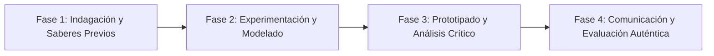

# Planeación Didáctica: El Arte de Comunicarnos: Asertividad, Lenguaje "Yo" y Acuerdos sin Gritos

> [!INFO] Ficha Técnica y Curricular (NEM 2024 - Fase 6)
> - **Docente Titular:** [[Prof. Israel López Ángeles]] (`usr-teacher-1`)
> - **Nivel y Fase:** Educación Secundaria — [[Fase 6 (1º, 2º y 3º de Secundaria)]]
> - **Grado:** **1º de Secundaria**
> - **Campo Formativo:** [[De lo Humano y lo Comunitario]]
> - **Disciplina / Materia:** [[Tutoría / Educación Socioemocional]]
> - **Contenido Sintético Oficial SEP 2024:** *Comunicación asertiva, escucha activa y resolución de desacuerdos entre pares*
> - **MOC General:** [[00_Indice_Maestro_Secundaria_Fase6_NEM2024]]

---

## 🎯 Proceso de Desarrollo de Aprendizaje (PDA Oficial SEP 2024)
```text
Fase 6 (1º Secundaria) - Desarrolla habilidades de comunicación asertiva y escucha activa, distinguiendo estilos pasivo, agresivo y asertivo para expresar desacuerdos con dignidad y respeto.
```

---

## ❓ Preguntas Detonadoras e Indagación Crítica
- **¿Qué diferencia a quien calla por miedo (pasivo), quien ofende para imponerse (agresivo) y quien expresa lo que piensa con firmeza y calma (asertivo)?**
- **¿Cómo usamos mensajes en primera persona: "Yo me siento molesto cuando..."?**

---

## 📋 Secuencia Didáctica Detallada (10 Sesiones de 50 Minutos)



### 🚀 Sesiones 1 y 2: Indagación, Diagnóstico y Recuperación de Saberes
- **Inicio (15 min):** Dramatización de 3 formas distintas de reaccionar ante un empujón accidental.
- **Desarrollo (30 min):** Planteamiento del reto integrador, conformación de equipos colaborativos y delimitación del alcance del proyecto.
- **Cierre (5 min):** Registro en la bitácora individual de metas de aprendizaje.

### 🔬 Sesiones 3 a 7: Desarrollo Metodológico, Trabajo Experimental y Producción
- **Inicio (10 min):** Reactivación de compromisos y revisión del cronograma de trabajo.
- **Desarrollo (35 min):** Taller de Mensajes Asertivos: Analizar 5 situaciones conflictivas típicas de secundaria y redactar respuestas asertivas aplicando la fórmula: Hecho + Emoción + Necesidad + Petición concreta.
- **Cierre (5 min):** Coevaluación intermedia mediante lista de cotejo y retroalimentación entre pares.

### 🏁 Sesiones 8 a 10: Integración, Socialización Comunitaria y Evaluación
- **Inicio (10 min):** Ensayos de presentación y ajuste final de entregables.
- **Desarrollo (30 min):** Práctica de roleplay en parejas y entrega de carnets de asertividad.
- **Cierre (10 min):** Metacognición grupal, balance de impacto social y firma del acta de entrega de proyectos.

---

## 📊 Rúbrica Analítica de Evaluación Formativa y Auténtica

| Nivel de Desempeño | Criterios Curriculares y Evidencias Observables | Ponderación |
| :--- | :--- | :---: |
| **Excelente (10)** | Diferenciación conceptual de los 3 estilos de comunicación con fundamentación teórica sólida, rigurosa y aplicación práctica contextualizada. | 40% |
| **Satisfactorio (8-9)** | Estructuración correcta de mensajes asertivos en primera persona de manera autónoma, estructurada y con calidad metodológica. | 35% |
| **En Proceso (6-7)** | Demostración de escucha activa y empatía en las dinámicas con apoyo docente y áreas de mejora identificadas. | 25% |

---

## 📦 Materiales, Recursos Didácticos y Entregable Final

- **Materiales y Recursos:** Tarjetas de situaciones de conflicto, hojas de trabajo, carnets de asertividad.
- **Entregable Principal:** `Guía de Bolsillo de Comunicación Asertiva y Bitácora de Negociación Pacífica.`
- **Instrumentos de Evaluación:** Rúbrica analítica, bitácora de coevaluación entre pares, lista de verificación de entregables.

---

## 🔗 Enlaces Bidireccionales (Obsidian Knowledge Graph)
- [[00_Indice_Maestro_Secundaria_Fase6_NEM2024]]
- [[De lo Humano y lo Comunitario]]
- [[Tutoría / Educación Socioemocional]]
- [[Secundaria_1er_Grado]]
- [[Prof_Israel_Lopez_Angeles]]
