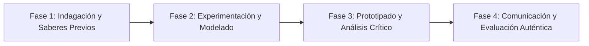

# Planeación Didáctica: Abrazar la Ausencia: Comprensión del Duelo, Expresión de Emociones y Redes de Cariño

> [!INFO] Ficha Técnica y Curricular (NEM 2024 - Fase 6)
> - **Docente Titular:** [[Prof. Israel López Ángeles]] (`usr-teacher-1`)
> - **Nivel y Fase:** Educación Secundaria — [[Fase 6 (1º, 2º y 3º de Secundaria)]]
> - **Grado:** **1º de Secundaria**
> - **Campo Formativo:** [[De lo Humano y lo Comunitario]]
> - **Disciplina / Materia:** [[Tutoría / Educación Socioemocional]]
> - **Contenido Sintético Oficial SEP 2024:** *Manejo del duelo, pérdidas afectivas y resiliencia emocional*
> - **MOC General:** [[00_Indice_Maestro_Secundaria_Fase6_NEM2024]]

---

## 🎯 Proceso de Desarrollo de Aprendizaje (PDA Oficial SEP 2024)
```text
Fase 6 (1º Secundaria) - Reconoce las 5 etapas del duelo (Kübler-Ross: negación, ira, negociación, tristeza y aceptación) ante pérdidas familiares, de mascotas o cambios vitales, validando sus emociones y buscando apoyo.
```

---

## ❓ Preguntas Detonadoras e Indagación Crítica
- **¿Por qué llorar y expresar tristeza cuando perdemos a un ser querido es un proceso natural y saludable para sanar el corazón?**
- **¿Cómo acompañamos con respeto a un compañero que está viviendo un duelo sin decirle frases clichés que invaliden su dolor?**

---

## 📋 Secuencia Didáctica Detallada (10 Sesiones de 50 Minutos)



### 🚀 Sesiones 1 y 2: Indagación, Diagnóstico y Recuperación de Saberes
- **Inicio (15 min):** Lectura del cuento "El Árbol de los Recuerdos" de Britta Teckentrup.
- **Desarrollo (30 min):** Planteamiento del reto integrador, conformación de equipos colaborativos y delimitación del alcance del proyecto.
- **Cierre (5 min):** Registro en la bitácora individual de metas de aprendizaje.

### 🔬 Sesiones 3 a 7: Desarrollo Metodológico, Trabajo Experimental y Producción
- **Inicio (10 min):** Reactivación de compromisos y revisión del cronograma de trabajo.
- **Desarrollo (35 min):** Taller del Cofre de la Memoria: Elaborar un objeto conmemorativo con cartas de agradecimiento y recuerdos positivos hacia seres queridos ausentes, identificando personas de confianza para desahogarse.
- **Cierre (5 min):** Coevaluación intermedia mediante lista de cotejo y retroalimentación entre pares.

### 🏁 Sesiones 8 a 10: Integración, Socialización Comunitaria y Evaluación
- **Inicio (10 min):** Ensayos de presentación y ajuste final de entregables.
- **Desarrollo (30 min):** Círculo de escucha respetuosa y colocación de notas en el Árbol de la Gratitud.
- **Cierre (10 min):** Metacognición grupal, balance de impacto social y firma del acta de entrega de proyectos.

---

## 📊 Rúbrica Analítica de Evaluación Formativa y Auténtica

| Nivel de Desempeño | Criterios Curriculares y Evidencias Observables | Ponderación |
| :--- | :--- | :---: |
| **Excelente (10)** | Comprensión de las etapas y normalización del proceso de duelo con fundamentación teórica sólida, rigurosa y aplicación práctica contextualizada. | 40% |
| **Satisfactorio (8-9)** | Expresión afectiva y artística de vivencias y recuerdos significativos de manera autónoma, estructurada y con calidad metodológica. | 35% |
| **En Proceso (6-7)** | Demostración de empatía y solidaridad activa ante el dolor ajeno con apoyo docente y áreas de mejora identificadas. | 25% |

---

## 📦 Materiales, Recursos Didácticos y Entregable Final

- **Materiales y Recursos:** Cajas pequeñas para decorar, hojas de papel artesanal, notas adhesivas.
- **Entregable Principal:** `Cofre de los Recuerdos y Cartas de Gratitud y Sanación Emocional.`
- **Instrumentos de Evaluación:** Rúbrica analítica, bitácora de coevaluación entre pares, lista de verificación de entregables.

---

## 🔗 Enlaces Bidireccionales (Obsidian Knowledge Graph)
- [[00_Indice_Maestro_Secundaria_Fase6_NEM2024]]
- [[De lo Humano y lo Comunitario]]
- [[Tutoría / Educación Socioemocional]]
- [[Secundaria_1er_Grado]]
- [[Prof_Israel_Lopez_Angeles]]
