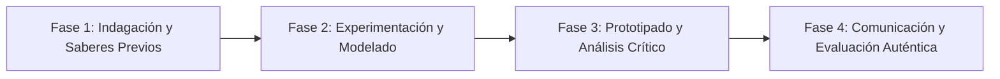

# Planeación Didáctica: Instalaciones Efímeras: Escultura, Urbanismo Táctico y Arte Crítico

> [!INFO] Ficha Técnica y Curricular (NEM 2024 - Fase 6)
> - **Docente Titular:** [[Prof. Israel López Ángeles]] (`usr-teacher-1`)
> - **Nivel y Fase:** Educación Secundaria — [[Fase 6 (1º, 2º y 3º de Secundaria)]]
> - **Grado:** **2º de Secundaria**
> - **Campo Formativo:** [[Lenguajes]]
> - **Disciplina / Materia:** [[Artes]]
> - **Contenido Sintético Oficial SEP 2024:** *Los lenguajes artísticos en la expresión de problemas de la comunidad*
> - **MOC General:** [[00_Indice_Maestro_Secundaria_Fase6_NEM2024]]

---

## 🎯 Proceso de Desarrollo de Aprendizaje (PDA Oficial SEP 2024)
```text
Fase 6 (2º Secundaria) - Investiga propuestas artísticas colectivas de entornos rurales y urbanos a favor de la inclusión y la sustentabilidad, para presentar una postura crítica sobre un problema de la comunidad mediante una instalación artística.
```

---

## ❓ Preguntas Detonadoras e Indagación Crítica
- **¿Qué es una INSTALACIÓN ARTÍSTICA que transforma un espacio cotidiano para provocar una reflexión profunda?**
- **¿Cómo convertimos desechos plásticos, cartón y metales en esculturas con mensaje ecológico?**
- **¿Qué impacto emocional genera el arte contemporáneo en los transeúntes de la escuela?**
- **¿Cómo evaluamos la fuerza crítica y estética de una obra tridimensional?**

---

## 📋 Secuencia Didáctica Detallada (10 Sesiones de 50 Minutos)



### 🚀 Sesiones 1 y 2: Indagación, Diagnóstico y Recuperación de Saberes
- **Inicio (15 min):** Recorrido virtual por obras de arte conceptual y land-art de artistas contemporáneos.
- **Desarrollo (30 min):** Planteamiento del reto integrador, conformación de equipos colaborativos y delimitación del alcance del proyecto.
- **Cierre (5 min):** Registro en la bitácora individual de metas de aprendizaje.

### 🔬 Sesiones 3 a 7: Desarrollo Metodológico, Trabajo Experimental y Producción
- **Inicio (10 min):** Reactivación de compromisos y revisión del cronograma de trabajo.
- **Desarrollo (35 min):** Taller de Escultura e Instalación Efímera: En equipos de 5, recolectar botellas y tapas de plástico para montar una instalación escultórica en el patio escolar que visibilice el consumo de plásticos de un solo uso.
- **Cierre (5 min):** Coevaluación intermedia mediante lista de cotejo y retroalimentación entre pares.

### 🏁 Sesiones 8 a 10: Integración, Socialización Comunitaria y Evaluación
- **Inicio (10 min):** Ensayos de presentación y ajuste final de entregables.
- **Desarrollo (30 min):** Inauguración de la Instalación con cédula curatorial y debate con la comunidad escolar.
- **Cierre (10 min):** Metacognición grupal, balance de impacto social y firma del acta de entrega de proyectos.

---

## 📊 Rúbrica Analítica de Evaluación Formativa y Auténtica

| Nivel de Desempeño | Criterios Curriculares y Evidencias Observables | Ponderación |
| :--- | :--- | :---: |
| **Excelente (10)** | Conceptualización crítica y pertinencia social de la instalación artística con fundamentación teórica sólida, rigurosa y aplicación práctica contextualizada. | 40% |
| **Satisfactorio (8-9)** | Uso innovador y estético de materiales reciclados en la composición 3D de manera autónoma, estructurada y con calidad metodológica. | 35% |
| **En Proceso (6-7)** | Redacción rigurosa de la cédula curatorial explicativa con apoyo docente y áreas de mejora identificadas. | 25% |

---

## 📦 Materiales, Recursos Didácticos y Entregable Final

- **Materiales y Recursos:** Plásticos reciclados limpios, alambres, cartón, pintura, cédulas en cartón.
- **Entregable Principal:** `Instalación Artística Tridimensional en el Patio Escolar y Cédula Curatorial Crítica.`
- **Instrumentos de Evaluación:** Rúbrica analítica, bitácora de coevaluación entre pares, lista de verificación de entregables.

---

## 🔗 Enlaces Bidireccionales (Obsidian Knowledge Graph)
- [[00_Indice_Maestro_Secundaria_Fase6_NEM2024]]
- [[Lenguajes]]
- [[Artes]]
- [[Secundaria_2do_Grado]]
- [[Prof_Israel_Lopez_Angeles]]
