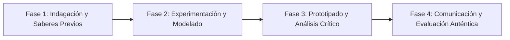

# Planeación Didáctica: El Son de la Memoria: Rescate de Cantos Tradicionales, Zapateado y Ritmos Regionales

> [!INFO] Ficha Técnica y Curricular (NEM 2024 - Fase 6)
> - **Docente Titular:** [[Prof. Israel López Ángeles]] (`usr-teacher-1`)
> - **Nivel y Fase:** Educación Secundaria — [[Fase 6 (1º, 2º y 3º de Secundaria)]]
> - **Grado:** **2º de Secundaria**
> - **Campo Formativo:** [[Lenguajes]]
> - **Disciplina / Materia:** [[Artes / Español]]
> - **Contenido Sintético Oficial SEP 2024:** *Memoria colectiva representada por medios artísticos (Música, Danza y Tradición)*
> - **MOC General:** [[00_Indice_Maestro_Secundaria_Fase6_NEM2024]]

---

## 🎯 Proceso de Desarrollo de Aprendizaje (PDA Oficial SEP 2024)
```text
Fase 6 (2º Secundaria) - Reinterpreta, mediante características de géneros artísticos (danza folclórica, son tradicional, música de cuerdas), acontecimientos y memorias significativas de la comunidad para fortalecer el sentido de pertenencia.
```

---

## ❓ Preguntas Detonadoras e Indagación Crítica
- **¿Cómo cuentan los sones y danzas tradicionales las batallas, amores y faenas del pueblo?**
- **¿Qué relación matemática y corporal existe entre el compás musical de $6/8$ y el zapateado de tarima?**
- **¿Cómo construimos instrumentos de percusión caseros (quijadas, cajones, panderos) con materiales locales?**
- **¿Por qué la música tradicional mexicana es considerada Patrimonio Cultural de la Humanidad?**

---

## 📋 Secuencia Didáctica Detallada (10 Sesiones de 50 Minutos)



### 🚀 Sesiones 1 y 2: Indagación, Diagnóstico y Recuperación de Saberes
- **Inicio (15 min):** Audición guiada de sones jarochos, huastecos y calentanos. Identificación de la tarima como instrumento.
- **Desarrollo (30 min):** Planteamiento del reto integrador, conformación de equipos colaborativos y delimitación del alcance del proyecto.
- **Cierre (5 min):** Registro en la bitácora individual de metas de aprendizaje.

### 🔬 Sesiones 3 a 7: Desarrollo Metodológico, Trabajo Experimental y Producción
- **Inicio (10 min):** Reactivación de compromisos y revisión del cronograma de trabajo.
- **Desarrollo (35 min):** Taller de Ritmo y Zapateado: Aprender el paso básico de tres tiempos, coordinar palmadas polirrítmicas y componer coplas colectivas sobre la historia escolar.
- **Cierre (5 min):** Coevaluación intermedia mediante lista de cotejo y retroalimentación entre pares.

### 🏁 Sesiones 8 a 10: Integración, Socialización Comunitaria y Evaluación
- **Inicio (10 min):** Ensayos de presentación y ajuste final de entregables.
- **Desarrollo (30 min):** Fandango Escolar en el patio con tarima central y versada colectiva improvisada.
- **Cierre (10 min):** Metacognición grupal, balance de impacto social y firma del acta de entrega de proyectos.

---

## 📊 Rúbrica Analítica de Evaluación Formativa y Auténtica

| Nivel de Desempeño | Criterios Curriculares y Evidencias Observables | Ponderación |
| :--- | :--- | :---: |
| **Excelente (10)** | Coordinación rítmica y corporal en el zapateado y percusiones con fundamentación teórica sólida, rigurosa y aplicación práctica contextualizada. | 40% |
| **Satisfactorio (8-9)** | Composición lírica de versos tradicionales con métrica y rima de manera autónoma, estructurada y con calidad metodológica. | 35% |
| **En Proceso (6-7)** | Aprecio por el patrimonio inmaterial y participación en el fandango con apoyo docente y áreas de mejora identificadas. | 25% |

---

## 📦 Materiales, Recursos Didácticos y Entregable Final

- **Materiales y Recursos:** Tarima de madera, jaranas o guitarras, percusiones menores, hojas de versos.
- **Entregable Principal:** `Montaje Coreográfico y Cancionero de Décimas "El Fandango de Nuestra Escuela".`
- **Instrumentos de Evaluación:** Rúbrica analítica, bitácora de coevaluación entre pares, lista de verificación de entregables.

---

## 🔗 Enlaces Bidireccionales (Obsidian Knowledge Graph)
- [[00_Indice_Maestro_Secundaria_Fase6_NEM2024]]
- [[Lenguajes]]
- [[Artes / Español]]
- [[Secundaria_2do_Grado]]
- [[Prof_Israel_Lopez_Angeles]]
