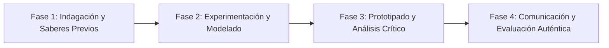

# Planeación Didáctica: Encestando con Técnica: Drible, Pases, Tiro en Suspensión y Táctica Básica en Baloncesto

> [!INFO] Ficha Técnica y Curricular (NEM 2024 - Fase 6)
> - **Docente Titular:** [[Prof. Israel López Ángeles]] (`usr-teacher-1`)
> - **Nivel y Fase:** Educación Secundaria — [[Fase 6 (1º, 2º y 3º de Secundaria)]]
> - **Grado:** **2º de Secundaria**
> - **Campo Formativo:** [[De lo Humano y lo Comunitario]]
> - **Disciplina / Materia:** [[Educación Física]]
> - **Contenido Sintético Oficial SEP 2024:** *Iniciación al Baloncesto: drible, pase de pecho, tiro en suspensión y defensa*
> - **MOC General:** [[00_Indice_Maestro_Secundaria_Fase6_NEM2024]]

---

## 🎯 Proceso de Desarrollo de Aprendizaje (PDA Oficial SEP 2024)
```text
Fase 6 (2º Secundaria) - Aplica fundamentos del baloncesto (drible con ambas manos con cambio de ritmo, pase de pecho/picado, tiro en suspensión con parábola y entrada a la canasta con doble paso) en situaciones de juego reducido $3 \times 3$.
```

---

## ❓ Preguntas Detonadoras e Indagación Crítica
- **¿Cómo protegemos el balón botando con la mano más alejada del defensor (drible de protección)?**
- **¿Cuál es la mecánica correcta del tiro: Flexión de piernas, codo a $90^{\circ}$, extensión y quiebre de muñeca ("mano de cisne")?**

---

## 📋 Secuencia Didáctica Detallada (10 Sesiones de 50 Minutos)



### 🚀 Sesiones 1 y 2: Indagación, Diagnóstico y Recuperación de Saberes
- **Inicio (15 min):** Carrera continua botando balones alternando mano izquierda y derecha con conos de zigzag.
- **Desarrollo (30 min):** Planteamiento del reto integrador, conformación de equipos colaborativos y delimitación del alcance del proyecto.
- **Cierre (5 min):** Registro en la bitácora individual de metas de aprendizaje.

### 🔬 Sesiones 3 a 7: Desarrollo Metodológico, Trabajo Experimental y Producción
- **Inicio (10 min):** Reactivación de compromisos y revisión del cronograma de trabajo.
- **Desarrollo (35 min):** Estaciones de Habilidades de Baloncesto: Estación 1: Doble paso entrando por derecha e izquierda; Estación 2: Pase de pecho y picado en parejas a velocidad; Estación 3: Torneo de tiros libres; Estación 4: Torneo de tercias $3 \times 3$ en media cancha.
- **Cierre (5 min):** Coevaluación intermedia mediante lista de cotejo y retroalimentación entre pares.

### 🏁 Sesiones 8 a 10: Integración, Socialización Comunitaria y Evaluación
- **Inicio (10 min):** Ensayos de presentación y ajuste final de entregables.
- **Desarrollo (30 min):** Torneo relámpago de tiros de 3 puntos y vuelta a la calma.
- **Cierre (10 min):** Metacognición grupal, balance de impacto social y firma del acta de entrega de proyectos.

---

## 📊 Rúbrica Analítica de Evaluación Formativa y Auténtica

| Nivel de Desempeño | Criterios Curriculares y Evidencias Observables | Ponderación |
| :--- | :--- | :---: |
| **Excelente (10)** | Dominio del bote con ambas manos sin mirar fijamente el balón con fundamentación teórica sólida, rigurosa y aplicación práctica contextualizada. | 40% |
| **Satisfactorio (8-9)** | Mecánica fluida en el tiro a canasta y entrada en doble paso de manera autónoma, estructurada y con calidad metodológica. | 35% |
| **En Proceso (6-7)** | Juego colectivo con pases rápidos y desmarques activos con apoyo docente y áreas de mejora identificadas. | 25% |

---

## 📦 Materiales, Recursos Didácticos y Entregable Final

- **Materiales y Recursos:** Balones de baloncesto, canchas escolares con aros, conos, cronómetro.
- **Entregable Principal:** `Evaluación Técnica de Baloncesto y Bitácora del Torneo de Tercias $3 \times 3$.`
- **Instrumentos de Evaluación:** Rúbrica analítica, bitácora de coevaluación entre pares, lista de verificación de entregables.

---

## 🔗 Enlaces Bidireccionales (Obsidian Knowledge Graph)
- [[00_Indice_Maestro_Secundaria_Fase6_NEM2024]]
- [[De lo Humano y lo Comunitario]]
- [[Educación Física]]
- [[Secundaria_2do_Grado]]
- [[Prof_Israel_Lopez_Angeles]]
