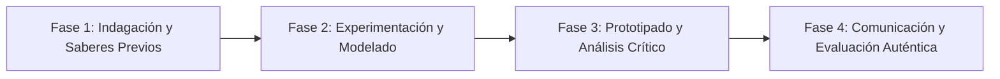

# Planeación Didáctica: Narrativas de Identidad: Relatos Autobiográficos y Variantes Regionales del Español

> [!INFO] Ficha Técnica y Curricular (NEM 2024 - Fase 6)
> - **Docente Titular:** [[Prof. Israel López Ángeles]] (`usr-teacher-1`)
> - **Nivel y Fase:** Educación Secundaria — [[Fase 6 (1º, 2º y 3º de Secundaria)]]
> - **Grado:** **2º de Secundaria**
> - **Campo Formativo:** [[Lenguajes]]
> - **Disciplina / Materia:** [[Español]]
> - **Contenido Sintético Oficial SEP 2024:** *Las lenguas como manifestación de la identidad y del sentido de pertenencia*
> - **MOC General:** [[00_Indice_Maestro_Secundaria_Fase6_NEM2024]]

---

## 🎯 Proceso de Desarrollo de Aprendizaje (PDA Oficial SEP 2024)
```text
Fase 6 (2º Secundaria) - Comprende y redacta textos narrativos sobre la construcción de la identidad y el sentido de pertenencia, a partir del análisis de variantes del español en México y el mundo.
```

---

## ❓ Preguntas Detonadoras e Indagación Crítica
- **¿Cómo nuestra forma de hablar (entonación, modismos, vocabulario regional) refleja quiénes somos y de dónde venimos?**
- **¿Por qué ninguna variante del español es "mejor" o "peor" que otra?**
- **¿Cómo estructuramos un relato autobiográfico con descripciones sensoriales y reflexiones profundas?**
- **¿Qué anécdota familiar ilustra mejor el sentido de pertenencia a tu comunidad?**

---

## 📋 Secuencia Didáctica Detallada (10 Sesiones de 50 Minutos)



### 🚀 Sesiones 1 y 2: Indagación, Diagnóstico y Recuperación de Saberes
- **Inicio (15 min):** Muestrario de audios de variantes dialectales del español (norteño, yucateco, costeño, rioplatense, andaluz).
- **Desarrollo (30 min):** Planteamiento del reto integrador, conformación de equipos colaborativos y delimitación del alcance del proyecto.
- **Cierre (5 min):** Registro en la bitácora individual de metas de aprendizaje.

### 🔬 Sesiones 3 a 7: Desarrollo Metodológico, Trabajo Experimental y Producción
- **Inicio (10 min):** Reactivación de compromisos y revisión del cronograma de trabajo.
- **Desarrollo (35 min):** Taller de Narrativa Autobiográfica: Redactar un capítulo de memorias personales incorporando expresiones lingüísticas regionales y analizando su valor identitario.
- **Cierre (5 min):** Coevaluación intermedia mediante lista de cotejo y retroalimentación entre pares.

### 🏁 Sesiones 8 a 10: Integración, Socialización Comunitaria y Evaluación
- **Inicio (10 min):** Ensayos de presentación y ajuste final de entregables.
- **Desarrollo (30 min):** Lectura en atril de fragmentos autobiográficos en el Café Literario del salón.
- **Cierre (10 min):** Metacognición grupal, balance de impacto social y firma del acta de entrega de proyectos.

---

## 📊 Rúbrica Analítica de Evaluación Formativa y Auténtica

| Nivel de Desempeño | Criterios Curriculares y Evidencias Observables | Ponderación |
| :--- | :--- | :---: |
| **Excelente (10)** | Narración estructurada con voz propia y sentido de pertenencia con fundamentación teórica sólida, rigurosa y aplicación práctica contextualizada. | 40% |
| **Satisfactorio (8-9)** | Uso reflexivo de variantes dialectales y recursos expresivos de manera autónoma, estructurada y con calidad metodológica. | 35% |
| **En Proceso (6-7)** | Puntuación, coherencia y riqueza léxica en el relato con apoyo docente y áreas de mejora identificadas. | 25% |

---

## 📦 Materiales, Recursos Didácticos y Entregable Final

- **Materiales y Recursos:** Muestras de audios dialectales, formatos de autobiografía, colores.
- **Entregable Principal:** `Crónica Autobiográfica Ilustrada "El Acento de Mis Recuerdos y Mis Raíces".`
- **Instrumentos de Evaluación:** Rúbrica analítica, bitácora de coevaluación entre pares, lista de verificación de entregables.

---

## 🔗 Enlaces Bidireccionales (Obsidian Knowledge Graph)
- [[00_Indice_Maestro_Secundaria_Fase6_NEM2024]]
- [[Lenguajes]]
- [[Español]]
- [[Secundaria_2do_Grado]]
- [[Prof_Israel_Lopez_Angeles]]
