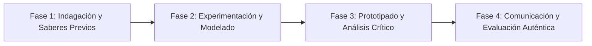

# Planeación Didáctica: El Español en Evolución: Cambios Temporales, Neologismos y Redes Sociales

> [!INFO] Ficha Técnica y Curricular (NEM 2024 - Fase 6)
> - **Docente Titular:** [[Prof. Israel López Ángeles]] (`usr-teacher-1`)
> - **Nivel y Fase:** Educación Secundaria — [[Fase 6 (1º, 2º y 3º de Secundaria)]]
> - **Grado:** **2º de Secundaria**
> - **Campo Formativo:** [[Lenguajes]]
> - **Disciplina / Materia:** [[Español]]
> - **Contenido Sintético Oficial SEP 2024:** *El dinamismo de las lenguas y su relevancia como patrimonio cultural*
> - **MOC General:** [[00_Indice_Maestro_Secundaria_Fase6_NEM2024]]

---

## 🎯 Proceso de Desarrollo de Aprendizaje (PDA Oficial SEP 2024)
```text
Fase 6 (2º Secundaria) - Reconoce cambios temporales y geográficos del español en la comunidad, el país o el mundo hispano, analizando neologismos, préstamos lingüísticos y transformaciones en la era digital.
```

---

## ❓ Preguntas Detonadoras e Indagación Crítica
- **¿Cómo cambia una lengua viva a lo largo de los siglos (del español medieval del Cantar de Mio Cid al español actual)?**
- **¿Qué nuevos términos digitales (chatear, viralizar, escanear) se han incorporado al diccionario de la RAE?**
- **¿Por qué las jergas juveniles son una prueba del dinamismo del idioma?**
- **¿Cómo equilibrar la creatividad lingüística con la norma gramatical?**

---

## 📋 Secuencia Didáctica Detallada (10 Sesiones de 50 Minutos)



### 🚀 Sesiones 1 y 2: Indagación, Diagnóstico y Recuperación de Saberes
- **Inicio (15 min):** Comparación de un texto del siglo XVI con un mensaje de texto actual. Identificación de arcaísmos y neologismos.
- **Desarrollo (30 min):** Planteamiento del reto integrador, conformación de equipos colaborativos y delimitación del alcance del proyecto.
- **Cierre (5 min):** Registro en la bitácora individual de metas de aprendizaje.

### 🔬 Sesiones 3 a 7: Desarrollo Metodológico, Trabajo Experimental y Producción
- **Inicio (10 min):** Reactivación de compromisos y revisión del cronograma de trabajo.
- **Desarrollo (35 min):** Elaboración del Diccionario Dinámico de Neologismos y Extranjerismos: Investigar el origen etimológico de 10 palabras modernas, su adaptación al español y ejemplos de uso.
- **Cierre (5 min):** Coevaluación intermedia mediante lista de cotejo y retroalimentación entre pares.

### 🏁 Sesiones 8 a 10: Integración, Socialización Comunitaria y Evaluación
- **Inicio (10 min):** Ensayos de presentación y ajuste final de entregables.
- **Desarrollo (30 min):** Debate sobre la evolución del idioma en redes sociales y entrega de fichas lexicográficas.
- **Cierre (10 min):** Metacognición grupal, balance de impacto social y firma del acta de entrega de proyectos.

---

## 📊 Rúbrica Analítica de Evaluación Formativa y Auténtica

| Nivel de Desempeño | Criterios Curriculares y Evidencias Observables | Ponderación |
| :--- | :--- | :---: |
| **Excelente (10)** | Comprensión del proceso histórico de evolución y dinamismo lingüístico con fundamentación teórica sólida, rigurosa y aplicación práctica contextualizada. | 40% |
| **Satisfactorio (8-9)** | Análisis morfológico y semántico de neologismos y préstamos de manera autónoma, estructurada y con calidad metodológica. | 35% |
| **En Proceso (6-7)** | Rigor en la redacción de definiciones lexicográficas con apoyo docente y áreas de mejora identificadas. | 25% |

---

## 📦 Materiales, Recursos Didácticos y Entregable Final

- **Materiales y Recursos:** Diccionarios históricos, textos coloniales, acceso a internet.
- **Entregable Principal:** `Diccionario Ilustrado de Neologismos y Transformaciones del Español.`
- **Instrumentos de Evaluación:** Rúbrica analítica, bitácora de coevaluación entre pares, lista de verificación de entregables.

---

## 🔗 Enlaces Bidireccionales (Obsidian Knowledge Graph)
- [[00_Indice_Maestro_Secundaria_Fase6_NEM2024]]
- [[Lenguajes]]
- [[Español]]
- [[Secundaria_2do_Grado]]
- [[Prof_Israel_Lopez_Angeles]]
