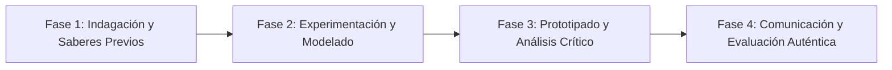

# Planeación Didáctica: Del Mito al Podcast: Adaptación de la Tradición Oral a Medios Digitales

> [!INFO] Ficha Técnica y Curricular (NEM 2024 - Fase 6)
> - **Docente Titular:** [[Prof. Israel López Ángeles]] (`usr-teacher-1`)
> - **Nivel y Fase:** Educación Secundaria — [[Fase 6 (1º, 2º y 3º de Secundaria)]]
> - **Grado:** **2º de Secundaria**
> - **Campo Formativo:** [[Lenguajes]]
> - **Disciplina / Materia:** [[Español]]
> - **Contenido Sintético Oficial SEP 2024:** *Creaciones literarias tradicionales y contemporáneas (mitos, leyendas, corridos)*
> - **MOC General:** [[00_Indice_Maestro_Secundaria_Fase6_NEM2024]]

---

## 🎯 Proceso de Desarrollo de Aprendizaje (PDA Oficial SEP 2024)
```text
Fase 6 (2º Secundaria) - Valora textos literarios tradicionales y contemporáneos (mitos, leyendas, corridos, décimas); los adapta a otros lenguajes (audiovisual, podcast, historieta) para sensibilizar a la comunidad.
```

---

## ❓ Preguntas Detonadoras e Indagación Crítica
- **¿Cómo se han transmitido los mitos y leyendas prehispánicas y coloniales a través de generaciones?**
- **¿Qué estructura poética y musical tiene el corrido tradicional mexicano como crónica popular?**
- **¿Cómo adaptamos un relato oral antiguo a un guion de radioteatro o podcast sonoro?**
- **¿Por qué rescatar la tradición oral fortalece nuestra memoria histórica?**

---

## 📋 Secuencia Didáctica Detallada (10 Sesiones de 50 Minutos)



### 🚀 Sesiones 1 y 2: Indagación, Diagnóstico y Recuperación de Saberes
- **Inicio (15 min):** Escucha de un corrido histórico de la Revolución Mexicana y una leyenda náhuatl.
- **Desarrollo (30 min):** Planteamiento del reto integrador, conformación de equipos colaborativos y delimitación del alcance del proyecto.
- **Cierre (5 min):** Registro en la bitácora individual de metas de aprendizaje.

### 🔬 Sesiones 3 a 7: Desarrollo Metodológico, Trabajo Experimental y Producción
- **Inicio (10 min):** Reactivación de compromisos y revisión del cronograma de trabajo.
- **Desarrollo (35 min):** Taller de Guion para Audio-Ficción: Investigar una leyenda local, redactar el guion sonoro con voces, música incidental y efectos sonoros Foley, y grabar el episodio piloto.
- **Cierre (5 min):** Coevaluación intermedia mediante lista de cotejo y retroalimentación entre pares.

### 🏁 Sesiones 8 a 10: Integración, Socialización Comunitaria y Evaluación
- **Inicio (10 min):** Ensayos de presentación y ajuste final de entregables.
- **Desarrollo (30 min):** Audición grupal de podcasts de leyendas mexicanas y coevaluación.
- **Cierre (10 min):** Metacognición grupal, balance de impacto social y firma del acta de entrega de proyectos.

---

## 📊 Rúbrica Analítica de Evaluación Formativa y Auténtica

| Nivel de Desempeño | Criterios Curriculares y Evidencias Observables | Ponderación |
| :--- | :--- | :---: |
| **Excelente (10)** | Investigación y respeto por las fuentes de la tradición oral con fundamentación teórica sólida, rigurosa y aplicación práctica contextualizada. | 40% |
| **Satisfactorio (8-9)** | Calidad en la adaptación al formato de guion radiofónico o podcast de manera autónoma, estructurada y con calidad metodológica. | 35% |
| **En Proceso (6-7)** | Creatividad en la ambientación sonora y modulación vocal con apoyo docente y áreas de mejora identificadas. | 25% |

---

## 📦 Materiales, Recursos Didácticos y Entregable Final

- **Materiales y Recursos:** Grabadoras de audio, celulares, textos de leyendas tradicionales, instrumentos caseros.
- **Entregable Principal:** `Episodio de Podcast / Audio-Cuento "Ecos de Leyenda: Tradición Oral en la Era Digital".`
- **Instrumentos de Evaluación:** Rúbrica analítica, bitácora de coevaluación entre pares, lista de verificación de entregables.

---

## 🔗 Enlaces Bidireccionales (Obsidian Knowledge Graph)
- [[00_Indice_Maestro_Secundaria_Fase6_NEM2024]]
- [[Lenguajes]]
- [[Español]]
- [[Secundaria_2do_Grado]]
- [[Prof_Israel_Lopez_Angeles]]
