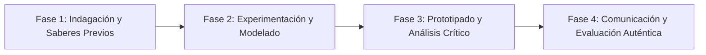

# Planeación Didáctica: Voces por la Igualdad: Debate, Argumentación y Protocolos de Prevención de Violencia

> [!INFO] Ficha Técnica y Curricular (NEM 2024 - Fase 6)
> - **Docente Titular:** [[Prof. Israel López Ángeles]] (`usr-teacher-1`)
> - **Nivel y Fase:** Educación Secundaria — [[Fase 6 (1º, 2º y 3º de Secundaria)]]
> - **Grado:** **2º de Secundaria**
> - **Campo Formativo:** [[Lenguajes]]
> - **Disciplina / Materia:** [[Español]]
> - **Contenido Sintético Oficial SEP 2024:** *Comunicación asertiva y dialógica para erradicar expresiones de violencia de género*
> - **MOC General:** [[00_Indice_Maestro_Secundaria_Fase6_NEM2024]]

---

## 🎯 Proceso de Desarrollo de Aprendizaje (PDA Oficial SEP 2024)
```text
Fase 6 (2º Secundaria) - Participa en un debate acerca de algunas expresiones de violencia -como la de género y la sexual- para argumentar una postura de rechazo, elaborando oficios e invitaciones formales.
```

---

## ❓ Preguntas Detonadoras e Indagación Crítica
- **¿Cómo se manifiestan los micromachismos y la violencia verbal en el noviazgo y en la escuela?**
- **¿Cómo argumentamos con firmeza y respeto en un debate formal sin caer en agresiones?**
- **¿Qué documentos formales (oficios, cartas de invitación) se requieren para convocar a especialistas a un foro escolar?**
- **¿Qué compromisos de cero tolerancia a la violencia asumimos en nuestro salón?**

---

## 📋 Secuencia Didáctica Detallada (10 Sesiones de 50 Minutos)



### 🚀 Sesiones 1 y 2: Indagación, Diagnóstico y Recuperación de Saberes
- **Inicio (15 min):** Proyección del violentómetro del IPN. Análisis de las escalas de agresión en la convivencia juvenil.
- **Desarrollo (30 min):** Planteamiento del reto integrador, conformación de equipos colaborativos y delimitación del alcance del proyecto.
- **Cierre (5 min):** Registro en la bitácora individual de metas de aprendizaje.

### 🔬 Sesiones 3 a 7: Desarrollo Metodológico, Trabajo Experimental y Producción
- **Inicio (10 min):** Reactivación de compromisos y revisión del cronograma de trabajo.
- **Desarrollo (35 min):** Taller de Debate y Gestión Institucional: Redactar oficios formales para invitar a psicólogos o personal de derechos humanos y estructurar argumentos lógicos con evidencia empírica para el debate.
- **Cierre (5 min):** Coevaluación intermedia mediante lista de cotejo y retroalimentación entre pares.

### 🏁 Sesiones 8 a 10: Integración, Socialización Comunitaria y Evaluación
- **Inicio (10 min):** Ensayos de presentación y ajuste final de entregables.
- **Desarrollo (30 min):** Realización del Debate Formal en el auditorio y firma del Manifiesto Escolar de Igualdad y No Violencia.
- **Cierre (10 min):** Metacognición grupal, balance de impacto social y firma del acta de entrega de proyectos.

---

## 📊 Rúbrica Analítica de Evaluación Formativa y Auténtica

| Nivel de Desempeño | Criterios Curriculares y Evidencias Observables | Ponderación |
| :--- | :--- | :---: |
| **Excelente (10)** | Argumentación lógica basada en derechos humanos y perspectiva de género con fundamentación teórica sólida, rigurosa y aplicación práctica contextualizada. | 40% |
| **Satisfactorio (8-9)** | Redacción de documentos formales de gestión con estructura protocolaria de manera autónoma, estructurada y con calidad metodológica. | 35% |
| **En Proceso (6-7)** | Uso de comunicación asertiva y escucha respetuosa durante el debate con apoyo docente y áreas de mejora identificadas. | 25% |

---

## 📦 Materiales, Recursos Didácticos y Entregable Final

- **Materiales y Recursos:** Formatos de oficios de gestión, copias del Violentómetro, tarjetas de debate.
- **Entregable Principal:** `Oficio de Gestión Formal y Memoria del Debate "Cero Violencia en la Escuela y el Noviazgo".`
- **Instrumentos de Evaluación:** Rúbrica analítica, bitácora de coevaluación entre pares, lista de verificación de entregables.

---

## 🔗 Enlaces Bidireccionales (Obsidian Knowledge Graph)
- [[00_Indice_Maestro_Secundaria_Fase6_NEM2024]]
- [[Lenguajes]]
- [[Español]]
- [[Secundaria_2do_Grado]]
- [[Prof_Israel_Lopez_Angeles]]
