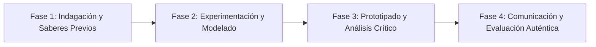

# Planeación Didáctica: Leyes del Cosmos: Inercia, Masa, Fuerza ($F=ma$) y Acción-Reacción en la Vida Cotidiana

> [!INFO] Ficha Técnica y Curricular (NEM 2024 - Fase 6)
> - **Docente Titular:** [[Prof. Israel López Ángeles]] (`usr-teacher-1`)
> - **Nivel y Fase:** Educación Secundaria — [[Fase 6 (1º, 2º y 3º de Secundaria)]]
> - **Grado:** **2º de Secundaria**
> - **Campo Formativo:** [[Saberes y Pensamiento Científico]]
> - **Disciplina / Materia:** [[Física]]
> - **Contenido Sintético Oficial SEP 2024:** *Interacciones en fenómenos relacionados con la fuerza y el movimiento (Leyes de Newton)*
> - **MOC General:** [[00_Indice_Maestro_Secundaria_Fase6_NEM2024]]

---

## 🎯 Proceso de Desarrollo de Aprendizaje (PDA Oficial SEP 2024)
```text
Fase 6 (2º Secundaria) - Experimenta e interpreta las interacciones de fuerza y movimiento mediante las Tres Leyes de Newton, identificando fuerzas en equilibrio, fricción y aceleración en actividades cotidianas.
```

---

## ❓ Preguntas Detonadoras e Indagación Crítica
- **¿Por qué los pasajeros de un autobús se van hacia adelante cuando el conductor frena bruscamente (Ley de Inercia)?**
- **¿Cómo se relacionan la fuerza neta, la masa y la aceleración ($F = m \cdot a$) en el despegue de un cohete?**
- **¿Por qué al empujar una pared sentimos una fuerza exactamente igual pero en sentido opuesto (Acción y Reacción)?**

---

## 📋 Secuencia Didáctica Detallada (10 Sesiones de 50 Minutos)



### 🚀 Sesiones 1 y 2: Indagación, Diagnóstico y Recuperación de Saberes
- **Inicio (15 min):** Experimento del mantel y la vajilla: Tirar rápidamente de un mantel sin mover los vasos (inercia).
- **Desarrollo (30 min):** Planteamiento del reto integrador, conformación de equipos colaborativos y delimitación del alcance del proyecto.
- **Cierre (5 min):** Registro en la bitácora individual de metas de aprendizaje.

### 🔬 Sesiones 3 a 7: Desarrollo Metodológico, Trabajo Experimental y Producción
- **Inicio (10 min):** Reactivación de compromisos y revisión del cronograma de trabajo.
- **Desarrollo (35 min):** Laboratorio Dinámico de Fuerzas: Utilizar dinamómetros, carritos de fricción y masas calibradas para medir la aceleración con respecto a fuerzas variables y comprobar la 2ª Ley de Newton.
- **Cierre (5 min):** Coevaluación intermedia mediante lista de cotejo y retroalimentación entre pares.

### 🏁 Sesiones 8 a 10: Integración, Socialización Comunitaria y Evaluación
- **Inicio (10 min):** Ensayos de presentación y ajuste final de entregables.
- **Desarrollo (30 min):** Construcción y lanzamiento de un cohete impulsado por agua y aire (3ª Ley de Newton).
- **Cierre (10 min):** Metacognición grupal, balance de impacto social y firma del acta de entrega de proyectos.

---

## 📊 Rúbrica Analítica de Evaluación Formativa y Auténtica

| Nivel de Desempeño | Criterios Curriculares y Evidencias Observables | Ponderación |
| :--- | :--- | :---: |
| **Excelente (10)** | Explicación y demostración experimental de las tres Leyes de Newton con fundamentación teórica sólida, rigurosa y aplicación práctica contextualizada. | 40% |
| **Satisfactorio (8-9)** | Cálculo algebraico correcto usando la fórmula $F=ma$ con unidades del SI (Newtons) de manera autónoma, estructurada y con calidad metodológica. | 35% |
| **En Proceso (6-7)** | Elaboración de diagramas de cuerpo libre con vectores de fuerza con apoyo docente y áreas de mejora identificadas. | 25% |

---

## 📦 Materiales, Recursos Didácticos y Entregable Final

- **Materiales y Recursos:** Dinamómetros, carritos de baja fricción, cronómetros, botellas de PET para cohetes.
- **Entregable Principal:** `Reporte Experimental de Dinámica Newtoniana con Diagramas de Vectores de Fuerza.`
- **Instrumentos de Evaluación:** Rúbrica analítica, bitácora de coevaluación entre pares, lista de verificación de entregables.

---

## 🔗 Enlaces Bidireccionales (Obsidian Knowledge Graph)
- [[00_Indice_Maestro_Secundaria_Fase6_NEM2024]]
- [[Saberes y Pensamiento Científico]]
- [[Física]]
- [[Secundaria_2do_Grado]]
- [[Prof_Israel_Lopez_Angeles]]
