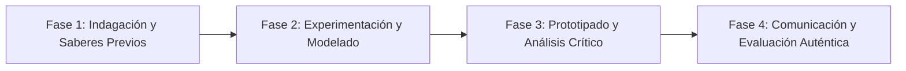

# Planeación Didáctica: La Montaña Rusa de la Energía: Energía Cinética ($E_c$), Potencial ($E_p$) y Termodinámica

> [!INFO] Ficha Técnica y Curricular (NEM 2024 - Fase 6)
> - **Docente Titular:** [[Prof. Israel López Ángeles]] (`usr-teacher-1`)
> - **Nivel y Fase:** Educación Secundaria — [[Fase 6 (1º, 2º y 3º de Secundaria)]]
> - **Grado:** **2º de Secundaria**
> - **Campo Formativo:** [[Saberes y Pensamiento Científico]]
> - **Disciplina / Materia:** [[Física]]
> - **Contenido Sintético Oficial SEP 2024:** *Conservación de la energía mecánica y fuentes renovables*
> - **MOC General:** [[00_Indice_Maestro_Secundaria_Fase6_NEM2024]]

---

## 🎯 Proceso de Desarrollo de Aprendizaje (PDA Oficial SEP 2024)
```text
Fase 6 (2º Secundaria) - Analiza las características de la energía cinética ($E_c = \frac{1}{2}mv^2$) y potencial ($E_p = mgh$), describe casos de conservación y diseña prototipos de energía solar y eólica.
```

---

## ❓ Preguntas Detonadoras e Indagación Crítica
- **¿Por qué en lo más alto de una montaña rusa la velocidad es mínima pero la energía potencial es máxima?**
- **¿Por qué la energía no se crea ni se destruye, solo se transforma (Ley de Conservación)?**
- **¿Cómo transformamos la radiación solar y la energía cinética del viento en electricidad limpia?**

---

## 📋 Secuencia Didáctica Detallada (10 Sesiones de 50 Minutos)



### 🚀 Sesiones 1 y 2: Indagación, Diagnóstico y Recuperación de Saberes
- **Inicio (15 min):** Simulación digital de pista de patinaje (PhET Interactive Simulations - Skate Park).
- **Desarrollo (30 min):** Planteamiento del reto integrador, conformación de equipos colaborativos y delimitación del alcance del proyecto.
- **Cierre (5 min):** Registro en la bitácora individual de metas de aprendizaje.

### 🔬 Sesiones 3 a 7: Desarrollo Metodológico, Trabajo Experimental y Producción
- **Inicio (10 min):** Reactivación de compromisos y revisión del cronograma de trabajo.
- **Desarrollo (35 min):** Diseño de Maqueta de Montaña Rusa y Horno Solar: Construir una pista de canicas calculando la velocidad teórica en cada valle y diseñar una caja térmica solar con papel aluminio y vidrio.
- **Cierre (5 min):** Coevaluación intermedia mediante lista de cotejo y retroalimentación entre pares.

### 🏁 Sesiones 8 a 10: Integración, Socialización Comunitaria y Evaluación
- **Inicio (10 min):** Ensayos de presentación y ajuste final de entregables.
- **Desarrollo (30 min):** Medición de temperatura alcanzada en el horno solar y cálculo de eficiencia térmica.
- **Cierre (10 min):** Metacognición grupal, balance de impacto social y firma del acta de entrega de proyectos.

---

## 📊 Rúbrica Analítica de Evaluación Formativa y Auténtica

| Nivel de Desempeño | Criterios Curriculares y Evidencias Observables | Ponderación |
| :--- | :--- | :---: |
| **Excelente (10)** | Cálculo algebraico de energía potencial, cinética y mecánica total con fundamentación teórica sólida, rigurosa y aplicación práctica contextualizada. | 40% |
| **Satisfactorio (8-9)** | Demostración de la conservación y degradación de la energía mecánica de manera autónoma, estructurada y con calidad metodológica. | 35% |
| **En Proceso (6-7)** | Diseño sustentable del prototipo de aprovechamiento de energía solar con apoyo docente y áreas de mejora identificadas. | 25% |

---

## 📦 Materiales, Recursos Didácticos y Entregable Final

- **Materiales y Recursos:** Mangueras transparentes, canicas, cajas de pizza, papel aluminio, termómetros.
- **Entregable Principal:** `Horno Solar Construido y Análisis Gráfico de Conservación de Energía Mecánica.`
- **Instrumentos de Evaluación:** Rúbrica analítica, bitácora de coevaluación entre pares, lista de verificación de entregables.

---

## 🔗 Enlaces Bidireccionales (Obsidian Knowledge Graph)
- [[00_Indice_Maestro_Secundaria_Fase6_NEM2024]]
- [[Saberes y Pensamiento Científico]]
- [[Física]]
- [[Secundaria_2do_Grado]]
- [[Prof_Israel_Lopez_Angeles]]
