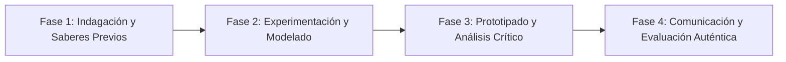

# Planeación Didáctica: Velocidad y Aceleración: Cinemática, Gráficas Posición-Tiempo y Seguridad Vial

> [!INFO] Ficha Técnica y Curricular (NEM 2024 - Fase 6)
> - **Docente Titular:** [[Prof. Israel López Ángeles]] (`usr-teacher-1`)
> - **Nivel y Fase:** Educación Secundaria — [[Fase 6 (1º, 2º y 3º de Secundaria)]]
> - **Grado:** **2º de Secundaria**
> - **Campo Formativo:** [[Saberes y Pensamiento Científico]]
> - **Disciplina / Materia:** [[Física]]
> - **Contenido Sintético Oficial SEP 2024:** *Movimiento rectilíneo uniforme (MRU) y acelerado (MRUA)*
> - **MOC General:** [[00_Indice_Maestro_Secundaria_Fase6_NEM2024]]

---

## 🎯 Proceso de Desarrollo de Aprendizaje (PDA Oficial SEP 2024)
```text
Fase 6 (2º Secundaria) - Identifica y calcula velocidad ($v = d/t$), aceleración ($a = \frac{v_f - v_0}{t}$) y distancia en movimientos rectilíneos, interpretando gráficas de posición-tiempo y velocidad-tiempo aplicadas a la seguridad vial.
```

---

## ❓ Preguntas Detonadoras e Indagación Crítica
- **¿Por qué la distancia de frenado de un auto se cuadruplica al duplicar la velocidad?**
- **¿Cómo se interpreta la pendiente de una gráfica posición-tiempo como la velocidad?**

---

## 📋 Secuencia Didáctica Detallada (10 Sesiones de 50 Minutos)



### 🚀 Sesiones 1 y 2: Indagación, Diagnóstico y Recuperación de Saberes
- **Inicio (15 min):** Experimento con carrito en plano inclinado midiendo tiempos con fotoceldas o cronómetros.
- **Desarrollo (30 min):** Planteamiento del reto integrador, conformación de equipos colaborativos y delimitación del alcance del proyecto.
- **Cierre (5 min):** Registro en la bitácora individual de metas de aprendizaje.

### 🔬 Sesiones 3 a 7: Desarrollo Metodológico, Trabajo Experimental y Producción
- **Inicio (10 min):** Reactivación de compromisos y revisión del cronograma de trabajo.
- **Desarrollo (35 min):** Laboratorio de Cinemática: Tabular datos de distancia y tiempo, graficar curvas en papel milimétrico, calcular aceleración y modelar zonas de frenado seguro en cruces peatonales.
- **Cierre (5 min):** Coevaluación intermedia mediante lista de cotejo y retroalimentación entre pares.

### 🏁 Sesiones 8 a 10: Integración, Socialización Comunitaria y Evaluación
- **Inicio (10 min):** Ensayos de presentación y ajuste final de entregables.
- **Desarrollo (30 min):** Campaña de seguridad vial escolar con datos de física.
- **Cierre (10 min):** Metacognición grupal, balance de impacto social y firma del acta de entrega de proyectos.

---

## 📊 Rúbrica Analítica de Evaluación Formativa y Auténtica

| Nivel de Desempeño | Criterios Curriculares y Evidencias Observables | Ponderación |
| :--- | :--- | :---: |
| **Excelente (10)** | Cálculo correcto de velocidad y aceleración en el SI ($\text{m/s}$, $\text{m/s}^2$) con fundamentación teórica sólida, rigurosa y aplicación práctica contextualizada. | 40% |
| **Satisfactorio (8-9)** | Interpretación rigurosa de pendientes en gráficas cinemáticas de manera autónoma, estructurada y con calidad metodológica. | 35% |
| **En Proceso (6-7)** | Aplicación de la física en la prevención de accidentes viales con apoyo docente y áreas de mejora identificadas. | 25% |

---

## 📦 Materiales, Recursos Didácticos y Entregable Final

- **Materiales y Recursos:** Planos inclinados, carritos, cronómetros, cinta métrica, papel milimétrico.
- **Entregable Principal:** `Reporte Experimental de Cinemática con Gráficas $x-t$, $v-t$ y Decálogo Vial.`
- **Instrumentos de Evaluación:** Rúbrica analítica, bitácora de coevaluación entre pares, lista de verificación de entregables.

---

## 🔗 Enlaces Bidireccionales (Obsidian Knowledge Graph)
- [[00_Indice_Maestro_Secundaria_Fase6_NEM2024]]
- [[Saberes y Pensamiento Científico]]
- [[Física]]
- [[Secundaria_2do_Grado]]
- [[Prof_Israel_Lopez_Angeles]]
