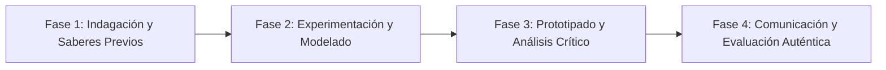

# Planeación Didáctica: La Danza de los Planetas: Ley de Gravitación Universal de Newton y Leyes de Kepler

> [!INFO] Ficha Técnica y Curricular (NEM 2024 - Fase 6)
> - **Docente Titular:** [[Prof. Israel López Ángeles]] (`usr-teacher-1`)
> - **Nivel y Fase:** Educación Secundaria — [[Fase 6 (1º, 2º y 3º de Secundaria)]]
> - **Grado:** **2º de Secundaria**
> - **Campo Formativo:** [[Saberes y Pensamiento Científico]]
> - **Disciplina / Materia:** [[Física]]
> - **Contenido Sintético Oficial SEP 2024:** *Gravitación universal y estructura del Sistema Solar*
> - **MOC General:** [[00_Indice_Maestro_Secundaria_Fase6_NEM2024]]

---

## 🎯 Proceso de Desarrollo de Aprendizaje (PDA Oficial SEP 2024)
```text
Fase 6 (2º Secundaria) - Relaciona la gravitación universal ($F = G\frac{m_1 m_2}{r^2}$) con el movimiento orbital de los planetas, las mareas terrestres y la exploración espacial.
```

---

## ❓ Preguntas Detonadoras e Indagación Crítica
- **¿Por qué la Luna no cae sobre la Tierra a pesar de la gravedad (velocidad orbital centrípeta)?**
- **¿Cómo describe la 1ª Ley de Kepler las órbitas elípticas con el Sol en uno de sus focos?**

---

## 📋 Secuencia Didáctica Detallada (10 Sesiones de 50 Minutos)



### 🚀 Sesiones 1 y 2: Indagación, Diagnóstico y Recuperación de Saberes
- **Inicio (15 min):** Demostración de tela elástica espacial con canicas pesadas deformando el espacio-tiempo.
- **Desarrollo (30 min):** Planteamiento del reto integrador, conformación de equipos colaborativos y delimitación del alcance del proyecto.
- **Cierre (5 min):** Registro en la bitácora individual de metas de aprendizaje.

### 🔬 Sesiones 3 a 7: Desarrollo Metodológico, Trabajo Experimental y Producción
- **Inicio (10 min):** Reactivación de compromisos y revisión del cronograma de trabajo.
- **Desarrollo (35 min):** Modelado Orbital a Escala: Trazar elipses orbitales con chinchetas y cordel demostrando las Leyes de Kepler y calcular el peso de un astronauta en Marte, Júpiter y la Luna.
- **Cierre (5 min):** Coevaluación intermedia mediante lista de cotejo y retroalimentación entre pares.

### 🏁 Sesiones 8 a 10: Integración, Socialización Comunitaria y Evaluación
- **Inicio (10 min):** Ensayos de presentación y ajuste final de entregables.
- **Desarrollo (30 min):** Simulación de trayectorias de satélites artificiales con software astronómico.
- **Cierre (10 min):** Metacognición grupal, balance de impacto social y firma del acta de entrega de proyectos.

---

## 📊 Rúbrica Analítica de Evaluación Formativa y Auténtica

| Nivel de Desempeño | Criterios Curriculares y Evidencias Observables | Ponderación |
| :--- | :--- | :---: |
| **Excelente (10)** | Comprensión de la fuerza gravitacional y su relación con la masa y distancia con fundamentación teórica sólida, rigurosa y aplicación práctica contextualizada. | 40% |
| **Satisfactorio (8-9)** | Trazo y fundamentación geométrica de las Leyes de Kepler de manera autónoma, estructurada y con calidad metodológica. | 35% |
| **En Proceso (6-7)** | Cálculo comparativo de peso y gravedad en distintos cuerpos celestes con apoyo docente y áreas de mejora identificadas. | 25% |

---

## 📦 Materiales, Recursos Didácticos y Entregable Final

- **Materiales y Recursos:** Tablas de corcho, chinchetas, cordel, cartulina, simulador digital del sistema solar.
- **Entregable Principal:** `Maqueta Orbital de Leyes de Kepler y Reporte de Gravitación Universal.`
- **Instrumentos de Evaluación:** Rúbrica analítica, bitácora de coevaluación entre pares, lista de verificación de entregables.

---

## 🔗 Enlaces Bidireccionales (Obsidian Knowledge Graph)
- [[00_Indice_Maestro_Secundaria_Fase6_NEM2024]]
- [[Saberes y Pensamiento Científico]]
- [[Física]]
- [[Secundaria_2do_Grado]]
- [[Prof_Israel_Lopez_Angeles]]
