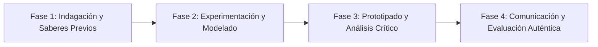

# Planeación Didáctica: Embajadores de Paz: El Círculo de Mediación Escolar y la Comunicación Asertiva

> [!INFO] Ficha Técnica y Curricular (NEM 2024 - Fase 6)
> - **Docente Titular:** [[Prof. Israel López Ángeles]] (`usr-teacher-1`)
> - **Nivel y Fase:** Educación Secundaria — [[Fase 6 (1º, 2º y 3º de Secundaria)]]
> - **Grado:** **2º de Secundaria**
> - **Campo Formativo:** [[Ética, Naturaleza y Sociedades]]
> - **Disciplina / Materia:** [[Formación Cívica y Ética]]
> - **Contenido Sintético Oficial SEP 2024:** *Cultura de paz, mediación escolar y resolución no violenta de conflictos*
> - **MOC General:** [[00_Indice_Maestro_Secundaria_Fase6_NEM2024]]

---

## 🎯 Proceso de Desarrollo de Aprendizaje (PDA Oficial SEP 2024)
```text
Fase 6 (2º Secundaria) - Propone y aplica técnicas de mediación escolar y negociación pacífica para resolver conflictos cotidianos, comprendiendo la estructura del conflicto (personas, proceso y problema).
```

---

## ❓ Preguntas Detonadoras e Indagación Crítica
- **¿Por qué el conflicto no es negativo en sí mismo, sino una oportunidad de crecimiento si se gestiona sin violencia?**
- **¿Cómo actúa un mediador escolar neutral aplicando la escucha activa sin tomar partido ni juzgar?**
- **¿Cómo transformamos una disputa de agresión en un acuerdo donde ambas partes ganen (Ganar-Ganar)?**

---

## 📋 Secuencia Didáctica Detallada (10 Sesiones de 50 Minutos)



### 🚀 Sesiones 1 y 2: Indagación, Diagnóstico y Recuperación de Saberes
- **Inicio (15 min):** Dinámica de roleplay: Dos alumnos disputan un recurso escaso; el grupo analiza las emociones en juego.
- **Desarrollo (30 min):** Planteamiento del reto integrador, conformación de equipos colaborativos y delimitación del alcance del proyecto.
- **Cierre (5 min):** Registro en la bitácora individual de metas de aprendizaje.

### 🔬 Sesiones 3 a 7: Desarrollo Metodológico, Trabajo Experimental y Producción
- **Inicio (10 min):** Reactivación de compromisos y revisión del cronograma de trabajo.
- **Desarrollo (35 min):** Entrenamiento de Mediadores Escolares: Aprender el protocolo de mediación en 5 pasos (1. Apertura, 2. Cuéntame, 3. Aclarar el problema, 4. Lluvia de soluciones, 5. Acuerdo firmado) y simular 3 casos reales.
- **Cierre (5 min):** Coevaluación intermedia mediante lista de cotejo y retroalimentación entre pares.

### 🏁 Sesiones 8 a 10: Integración, Socialización Comunitaria y Evaluación
- **Inicio (10 min):** Ensayos de presentación y ajuste final de entregables.
- **Desarrollo (30 min):** Instalación de la Mesa Permanente de Mediación de Conflictos de 2º Grado.
- **Cierre (10 min):** Metacognición grupal, balance de impacto social y firma del acta de entrega de proyectos.

---

## 📊 Rúbrica Analítica de Evaluación Formativa y Auténtica

| Nivel de Desempeño | Criterios Curriculares y Evidencias Observables | Ponderación |
| :--- | :--- | :---: |
| **Excelente (10)** | Desglose analítico de la estructura del conflicto (personas, proceso, problema) con fundamentación teórica sólida, rigurosa y aplicación práctica contextualizada. | 40% |
| **Satisfactorio (8-9)** | Aplicación rigurosa de los 5 pasos del protocolo de mediación pacífica de manera autónoma, estructurada y con calidad metodológica. | 35% |
| **En Proceso (6-7)** | Demostración de escucha activa, neutralidad y confidencialidad con apoyo docente y áreas de mejora identificadas. | 25% |

---

## 📦 Materiales, Recursos Didácticos y Entregable Final

- **Materiales y Recursos:** Manual de mediación escolar, formatos de actas de acuerdo pacífico, sillas en círculo.
- **Entregable Principal:** `Manual de Mediación Escolar del Aula y Actas de Compromiso de Cultura de Paz.`
- **Instrumentos de Evaluación:** Rúbrica analítica, bitácora de coevaluación entre pares, lista de verificación de entregables.

---

## 🔗 Enlaces Bidireccionales (Obsidian Knowledge Graph)
- [[00_Indice_Maestro_Secundaria_Fase6_NEM2024]]
- [[Ética, Naturaleza y Sociedades]]
- [[Formación Cívica y Ética]]
- [[Secundaria_2do_Grado]]
- [[Prof_Israel_Lopez_Angeles]]
