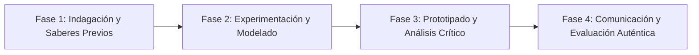

# Planeación Didáctica: Derechos de la Madre Tierra: Bioética, Ecosistemas y Desarrollo Sustentable

> [!INFO] Ficha Técnica y Curricular (NEM 2024 - Fase 6)
> - **Docente Titular:** [[Prof. Israel López Ángeles]] (`usr-teacher-1`)
> - **Nivel y Fase:** Educación Secundaria — [[Fase 6 (1º, 2º y 3º de Secundaria)]]
> - **Grado:** **2º de Secundaria**
> - **Campo Formativo:** [[Ética, Naturaleza y Sociedades]]
> - **Disciplina / Materia:** [[Formación Cívica y Ética]]
> - **Contenido Sintético Oficial SEP 2024:** *Cuidado del medio ambiente, bioética y derechos de la naturaleza*
> - **MOC General:** [[00_Indice_Maestro_Secundaria_Fase6_NEM2024]]

---

## 🎯 Proceso de Desarrollo de Aprendizaje (PDA Oficial SEP 2024)
```text
Fase 6 (2º Secundaria) - Evalúa la contribución de la bioética y los derechos de la naturaleza en las prácticas de producción y consumo, proponiendo alternativas sustentables basadas en el "Buen Vivir" latinoamericano.
```

---

## ❓ Preguntas Detonadoras e Indagación Crítica
- **¿Por qué los ríos, bosques y arrecifes deben ser considerados sujetos de derechos legales protegidos por el Estado?**
- **¿Qué nos enseña la cosmovisión del "Buen Vivir" (Sumak Kawsay) sobre vivir en armonía sin explotar la Tierra?**

---

## 📋 Secuencia Didáctica Detallada (10 Sesiones de 50 Minutos)



### 🚀 Sesiones 1 y 2: Indagación, Diagnóstico y Recuperación de Saberes
- **Inicio (15 min):** Lectura de leyes de países que otorgan personalidad jurídica a ríos sagrados.
- **Desarrollo (30 min):** Planteamiento del reto integrador, conformación de equipos colaborativos y delimitación del alcance del proyecto.
- **Cierre (5 min):** Registro en la bitácora individual de metas de aprendizaje.

### 🔬 Sesiones 3 a 7: Desarrollo Metodológico, Trabajo Experimental y Producción
- **Inicio (10 min):** Reactivación de compromisos y revisión del cronograma de trabajo.
- **Desarrollo (35 min):** Taller de Bioética Ambiental: Redactar la Carta de Derechos del Río o Bosque Local, estableciendo sanciones para empresas contaminantes y un plan comunitario de reforestación con flora nativa.
- **Cierre (5 min):** Coevaluación intermedia mediante lista de cotejo y retroalimentación entre pares.

### 🏁 Sesiones 8 a 10: Integración, Socialización Comunitaria y Evaluación
- **Inicio (10 min):** Ensayos de presentación y ajuste final de entregables.
- **Desarrollo (30 min):** Jornada escolar de plantación de árboles nativos en la secundaria.
- **Cierre (10 min):** Metacognición grupal, balance de impacto social y firma del acta de entrega de proyectos.

---

## 📊 Rúbrica Analítica de Evaluación Formativa y Auténtica

| Nivel de Desempeño | Criterios Curriculares y Evidencias Observables | Ponderación |
| :--- | :--- | :---: |
| **Excelente (10)** | Aplicación de principios de bioética y sustentabilidad intergeneracional con fundamentación teórica sólida, rigurosa y aplicación práctica contextualizada. | 40% |
| **Satisfactorio (8-9)** | Integración de saberes ancestrales sobre la Madre Tierra de manera autónoma, estructurada y con calidad metodológica. | 35% |
| **En Proceso (6-7)** | Ejecución práctica de una acción de restauración ecológica con apoyo docente y áreas de mejora identificadas. | 25% |

---

## 📦 Materiales, Recursos Didácticos y Entregable Final

- **Materiales y Recursos:** Árboles nativos para reforestar, palas, tierra de hoja, cartulinas de la Carta de Derechos.
- **Entregable Principal:** `Carta Jurídica Simbólica de Derechos de los Ecosistemas Locales y Reporte de Reforestación.`
- **Instrumentos de Evaluación:** Rúbrica analítica, bitácora de coevaluación entre pares, lista de verificación de entregables.

---

## 🔗 Enlaces Bidireccionales (Obsidian Knowledge Graph)
- [[00_Indice_Maestro_Secundaria_Fase6_NEM2024]]
- [[Ética, Naturaleza y Sociedades]]
- [[Formación Cívica y Ética]]
- [[Secundaria_2do_Grado]]
- [[Prof_Israel_Lopez_Angeles]]
