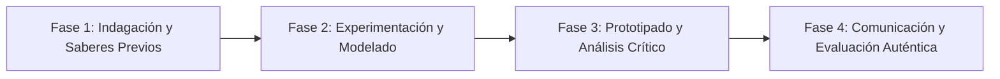

# Planeación Didáctica: 1521, El Encuentro y la Ruptura: Señoríos Mesoamericanos, Tlaxcaltecas y la Caída de Tenochtitlan

> [!INFO] Ficha Técnica y Curricular (NEM 2024 - Fase 6)
> - **Docente Titular:** [[Prof. Israel López Ángeles]] (`usr-teacher-1`)
> - **Nivel y Fase:** Educación Secundaria — [[Fase 6 (1º, 2º y 3º de Secundaria)]]
> - **Grado:** **2º de Secundaria**
> - **Campo Formativo:** [[Ética, Naturaleza y Sociedades]]
> - **Disciplina / Materia:** [[Historia]]
> - **Contenido Sintético Oficial SEP 2024:** *La conquista de México-Tenochtitlan: alianzas indígenas y campañas militares*
> - **MOC General:** [[00_Indice_Maestro_Secundaria_Fase6_NEM2024]]

---

## 🎯 Proceso de Desarrollo de Aprendizaje (PDA Oficial SEP 2024)
```text
Fase 6 (2º Secundaria) - Problematiza los factores políticos, militares, tecnológicos y epidémicos (viruela) que determinaron la caída de Tenochtitlan en 1521, analizando las alianzas indígenas con Hernán Cortés.
```

---

## ❓ Preguntas Detonadoras e Indagación Crítica
- **¿Por qué la conquista no fue una hazaña de 500 españoles sino el levantamiento de decenas de miles de guerreros tlaxcaltecas, totonacas y texcocanos contra el tributo mexica?**
- **¿Qué papel desempeñó Malintzin (la Malinche) como diplomática e intérprete trilingüe?**
- **¿Cómo devastó la epidemia de viruela a la población antes del asalto final a la ciudad lacustre?**

---

## 📋 Secuencia Didáctica Detallada (10 Sesiones de 50 Minutos)



### 🚀 Sesiones 1 y 2: Indagación, Diagnóstico y Recuperación de Saberes
- **Inicio (15 min):** Lectura comentada de la Visión de los Vencidos de Miguel León-Portilla.
- **Desarrollo (30 min):** Planteamiento del reto integrador, conformación de equipos colaborativos y delimitación del alcance del proyecto.
- **Cierre (5 min):** Registro en la bitácora individual de metas de aprendizaje.

### 🔬 Sesiones 3 a 7: Desarrollo Metodológico, Trabajo Experimental y Producción
- **Inicio (10 min):** Reactivación de compromisos y revisión del cronograma de trabajo.
- **Desarrollo (35 min):** Taller de Análisis Historiográfico Multiperspectiva: Contrastar crónicas españolas (Bernal Díaz del Castillo) con códices indígenas (Lienzo de Tlaxcala, Códice Florentino) y elaborar un mapa del sitio de Tenochtitlan.
- **Cierre (5 min):** Coevaluación intermedia mediante lista de cotejo y retroalimentación entre pares.

### 🏁 Sesiones 8 a 10: Integración, Socialización Comunitaria y Evaluación
- **Inicio (10 min):** Ensayos de presentación y ajuste final de entregables.
- **Desarrollo (30 min):** Debate histórico: ¿Fue 1521 una derrota, una victoria o el doloroso nacimiento del México mestizo?
- **Cierre (10 min):** Metacognición grupal, balance de impacto social y firma del acta de entrega de proyectos.

---

## 📊 Rúbrica Analítica de Evaluación Formativa y Auténtica

| Nivel de Desempeño | Criterios Curriculares y Evidencias Observables | Ponderación |
| :--- | :--- | :---: |
| **Excelente (10)** | Análisis multicausal de la caída de Tenochtitlan (alianzas, tecnología, epidemias, cosmovisión) con fundamentación teórica sólida, rigurosa y aplicación práctica contextualizada. | 40% |
| **Satisfactorio (8-9)** | Valoración crítica del papel de Malintzin y de los pueblos aliados de manera autónoma, estructurada y con calidad metodológica. | 35% |
| **En Proceso (6-7)** | Manejo riguroso de fuentes primarias y códices mesoamericanos con apoyo docente y áreas de mejora identificadas. | 25% |

---

## 📦 Materiales, Recursos Didácticos y Entregable Final

- **Materiales y Recursos:** Fragmentos de crónicas coloniales, reproducciones de códices, mapas antiguos de Tenochtitlan.
- **Entregable Principal:** `Dossier Historiográfico Comparativo "Las Voces de 1521: Crónicas, Códices y Alianzas".`
- **Instrumentos de Evaluación:** Rúbrica analítica, bitácora de coevaluación entre pares, lista de verificación de entregables.

---

## 🔗 Enlaces Bidireccionales (Obsidian Knowledge Graph)
- [[00_Indice_Maestro_Secundaria_Fase6_NEM2024]]
- [[Ética, Naturaleza y Sociedades]]
- [[Historia]]
- [[Secundaria_2do_Grado]]
- [[Prof_Israel_Lopez_Angeles]]
