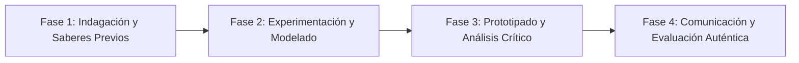

# Planeación Didáctica: La Plata y las Cadenas: Minería Novohispana, Sistema de Castas y Yanga

> [!INFO] Ficha Técnica y Curricular (NEM 2024 - Fase 6)
> - **Docente Titular:** [[Prof. Israel López Ángeles]] (`usr-teacher-1`)
> - **Nivel y Fase:** Educación Secundaria — [[Fase 6 (1º, 2º y 3º de Secundaria)]]
> - **Grado:** **2º de Secundaria**
> - **Campo Formativo:** [[Ética, Naturaleza y Sociedades]]
> - **Disciplina / Materia:** [[Historia]]
> - **Contenido Sintético Oficial SEP 2024:** *El Virreinato de la Nueva España: minería, castas y resistencia esclava*
> - **MOC General:** [[00_Indice_Maestro_Secundaria_Fase6_NEM2024]]

---

## 🎯 Proceso de Desarrollo de Aprendizaje (PDA Oficial SEP 2024)
```text
Fase 6 (2º Secundaria) - Distingue las formas de gobierno virreinal, la economía extractiva minera (Zacatecas, Guanajuato) y reflexiona sobre el sistema de castas y la gesta libertaria de Gaspar Yanga en Veracruz.
```

---

## ❓ Preguntas Detonadoras e Indagación Crítica
- **¿Cómo financió la plata extraída de la Nueva España el comercio global del Galeón de Manila y el Imperio Español?**
- **¿Cómo operaba la pirámide racista del sistema de castas en la sociedad colonial?**
- **¿Quién fue Gaspar Yanga y por qué fundó en 1609 el primer pueblo libre de América (San Lorenzo de los Negros)?**

---

## 📋 Secuencia Didáctica Detallada (10 Sesiones de 50 Minutos)



### 🚀 Sesiones 1 y 2: Indagación, Diagnóstico y Recuperación de Saberes
- **Inicio (15 min):** Observación de cuadros de castas novohispanos del siglo XVIII identificando etiquetas raciales.
- **Desarrollo (30 min):** Planteamiento del reto integrador, conformación de equipos colaborativos y delimitación del alcance del proyecto.
- **Cierre (5 min):** Registro en la bitácora individual de metas de aprendizaje.

### 🔬 Sesiones 3 a 7: Desarrollo Metodológico, Trabajo Experimental y Producción
- **Inicio (10 min):** Reactivación de compromisos y revisión del cronograma de trabajo.
- **Desarrollo (35 min):** Taller de Historia Social: Reconstruir las condiciones laborales en las minas de plata (el peonaje por deudas), el papel de las haciendas y redactar la proclama de libertad de los cimarrones de Yanga.
- **Cierre (5 min):** Coevaluación intermedia mediante lista de cotejo y retroalimentación entre pares.

### 🏁 Sesiones 8 a 10: Integración, Socialización Comunitaria y Evaluación
- **Inicio (10 min):** Ensayos de presentación y ajuste final de entregables.
- **Desarrollo (30 min):** Juicio simulado al Tribunal del Santo Oficio de la Inquisición en el salón.
- **Cierre (10 min):** Metacognición grupal, balance de impacto social y firma del acta de entrega de proyectos.

---

## 📊 Rúbrica Analítica de Evaluación Formativa y Auténtica

| Nivel de Desempeño | Criterios Curriculares y Evidencias Observables | Ponderación |
| :--- | :--- | :---: |
| **Excelente (10)** | Comprensión del modelo económico extractivo novohispano y rutas comerciales con fundamentación teórica sólida, rigurosa y aplicación práctica contextualizada. | 40% |
| **Satisfactorio (8-9)** | Crítica fundamentada al sistema colonial de castas y discriminación de manera autónoma, estructurada y con calidad metodológica. | 35% |
| **En Proceso (6-7)** | Reconocimiento de las rebeliones indígenas y afrodescendientes cimarronas con apoyo docente y áreas de mejora identificadas. | 25% |

---

## 📦 Materiales, Recursos Didácticos y Entregable Final

- **Materiales y Recursos:** Imágenes de cuadros de castas, mapas de la Ruta de la Plata, biografías de Yanga.
- **Entregable Principal:** `Periódico Histórico Colonial "El Pregonero Novohispano: Economía, Castas y Libertad".`
- **Instrumentos de Evaluación:** Rúbrica analítica, bitácora de coevaluación entre pares, lista de verificación de entregables.

---

## 🔗 Enlaces Bidireccionales (Obsidian Knowledge Graph)
- [[00_Indice_Maestro_Secundaria_Fase6_NEM2024]]
- [[Ética, Naturaleza y Sociedades]]
- [[Historia]]
- [[Secundaria_2do_Grado]]
- [[Prof_Israel_Lopez_Angeles]]
