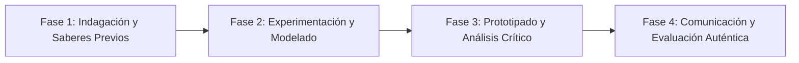

# Planeación Didáctica: Sentimientos de la Nación: Las Cuatro Etapas de la Independencia de México

> [!INFO] Ficha Técnica y Curricular (NEM 2024 - Fase 6)
> - **Docente Titular:** [[Prof. Israel López Ángeles]] (`usr-teacher-1`)
> - **Nivel y Fase:** Educación Secundaria — [[Fase 6 (1º, 2º y 3º de Secundaria)]]
> - **Grado:** **2º de Secundaria**
> - **Campo Formativo:** [[Ética, Naturaleza y Sociedades]]
> - **Disciplina / Materia:** [[Historia]]
> - **Contenido Sintético Oficial SEP 2024:** *La Guerra de Independencia de 1810: de Hidalgo y Morelos a la Consumación*
> - **MOC General:** [[00_Indice_Maestro_Secundaria_Fase6_NEM2024]]

---

## 🎯 Proceso de Desarrollo de Aprendizaje (PDA Oficial SEP 2024)
```text
Fase 6 (2º Secundaria) - Aplica conceptos organizadores para dar cuenta de las 4 etapas de la Independencia (Iniciación, Organización, Resistencia y Consumación), analizando los "Sentimientos de la Nación" de Morelos.
```

---

## ❓ Preguntas Detonadoras e Indagación Crítica
- **¿Qué ideales de justicia social plasmó José María Morelos al exigir "que se modere la opulencia y la indigencia"?**
- **¿Cómo cambió la lucha desde el levantamiento popular de Hidalgo en 1810 hasta el pacto militar del Plan de Iguala en 1821?**
- **¿Quiénes fueron las heroínas insurgentes (Leona Vicario, Josefa Ortiz, Gertrudis Bocanegra)?**

---

## 📋 Secuencia Didáctica Detallada (10 Sesiones de 50 Minutos)



### 🚀 Sesiones 1 y 2: Indagación, Diagnóstico y Recuperación de Saberes
- **Inicio (15 min):** Lectura en atril de los artículos clave de los "Sentimientos de la Nación" (1813).
- **Desarrollo (30 min):** Planteamiento del reto integrador, conformación de equipos colaborativos y delimitación del alcance del proyecto.
- **Cierre (5 min):** Registro en la bitácora individual de metas de aprendizaje.

### 🔬 Sesiones 3 a 7: Desarrollo Metodológico, Trabajo Experimental y Producción
- **Inicio (10 min):** Reactivación de compromisos y revisión del cronograma de trabajo.
- **Desarrollo (35 min):** Construcción del Friso Cronológico de la Independencia: Mapear en 4 paneles las campañas de Hidalgo, el Congreso de Anáhuac, la resistencia guerrillera de Vicente Guerrero y el Abrazo de Acatempan.
- **Cierre (5 min):** Coevaluación intermedia mediante lista de cotejo y retroalimentación entre pares.

### 🏁 Sesiones 8 a 10: Integración, Socialización Comunitaria y Evaluación
- **Inicio (10 min):** Ensayos de presentación y ajuste final de entregables.
- **Desarrollo (30 min):** Análisis de la Constitución de Apatzingán de 1814 como raíz de los derechos humanos en México.
- **Cierre (10 min):** Metacognición grupal, balance de impacto social y firma del acta de entrega de proyectos.

---

## 📊 Rúbrica Analítica de Evaluación Formativa y Auténtica

| Nivel de Desempeño | Criterios Curriculares y Evidencias Observables | Ponderación |
| :--- | :--- | :---: |
| **Excelente (10)** | Secuenciación y caracterización rigurosa de las 4 etapas de la Independencia con fundamentación teórica sólida, rigurosa y aplicación práctica contextualizada. | 40% |
| **Satisfactorio (8-9)** | Análisis del pensamiento político y social de Morelos y los insurgentes de manera autónoma, estructurada y con calidad metodológica. | 35% |
| **En Proceso (6-7)** | Visibilización de la participación de mujeres y sectores populares con apoyo docente y áreas de mejora identificadas. | 25% |

---

## 📦 Materiales, Recursos Didácticos y Entregable Final

- **Materiales y Recursos:** Documentos facsimilares de 1810-1821, cartulinas, líneas del tiempo.
- **Entregable Principal:** `Friso Histórico Insurgente y Ensayo "Vigencia de los Sentimientos de la Nación".`
- **Instrumentos de Evaluación:** Rúbrica analítica, bitácora de coevaluación entre pares, lista de verificación de entregables.

---

## 🔗 Enlaces Bidireccionales (Obsidian Knowledge Graph)
- [[00_Indice_Maestro_Secundaria_Fase6_NEM2024]]
- [[Ética, Naturaleza y Sociedades]]
- [[Historia]]
- [[Secundaria_2do_Grado]]
- [[Prof_Israel_Lopez_Angeles]]
