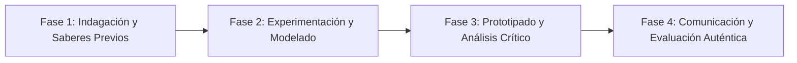

# Planeación Didáctica: Soberanía Inquebrantable: El 5 de Mayo de 1862, la Resistencia Republicana y el Segundo Imperio

> [!INFO] Ficha Técnica y Curricular (NEM 2024 - Fase 6)
> - **Docente Titular:** [[Prof. Israel López Ángeles]] (`usr-teacher-1`)
> - **Nivel y Fase:** Educación Secundaria — [[Fase 6 (1º, 2º y 3º de Secundaria)]]
> - **Grado:** **2º de Secundaria**
> - **Campo Formativo:** [[Ética, Naturaleza y Sociedades]]
> - **Disciplina / Materia:** [[Historia]]
> - **Contenido Sintético Oficial SEP 2024:** *La Segunda Intervención Francesa, la Batalla de Puebla y el Imperio de Maximiliano*
> - **MOC General:** [[00_Indice_Maestro_Secundaria_Fase6_NEM2024]]

---

## 🎯 Proceso de Desarrollo de Aprendizaje (PDA Oficial SEP 2024)
```text
Fase 6 (2º Secundaria) - Comprende la relevancia histórica de la Batalla del 5 de mayo de 1862 en Puebla, la resistencia militar popular frente al ejército francés y la restauración de la República en 1867.
```

---

## ❓ Preguntas Detonadoras e Indagación Crítica
- **¿Cómo venció el ejército mexicano al mando de Ignacio Zaragoza, apoyado por los indígenas zacapoaxtlas, al ejército más poderoso del mundo en los Fuertes de Loreto y Guadalupe?**
- **¿Por qué Maximiliano de Habsburgo no pudo sostener su imperio sin el apoyo de las bayonetas francesas?**

---

## 📋 Secuencia Didáctica Detallada (10 Sesiones de 50 Minutos)



### 🚀 Sesiones 1 y 2: Indagación, Diagnóstico y Recuperación de Saberes
- **Inicio (15 min):** Telegrama de Zaragoza al presidente Juárez: "Las armas nacionales se han cubierto de gloria".
- **Desarrollo (30 min):** Planteamiento del reto integrador, conformación de equipos colaborativos y delimitación del alcance del proyecto.
- **Cierre (5 min):** Registro en la bitácora individual de metas de aprendizaje.

### 🔬 Sesiones 3 a 7: Desarrollo Metodológico, Trabajo Experimental y Producción
- **Inicio (10 min):** Reactivación de compromisos y revisión del cronograma de trabajo.
- **Desarrollo (35 min):** Laboratorio de Cartografía Militar: Diseñar la maqueta táctica de los Fuertes de Loreto y Guadalupe, analizar las cartas diplomáticas de la Alianza Tripartita de Londres y redactar el juicio de fusilamiento en el Cerro de las Campanas.
- **Cierre (5 min):** Coevaluación intermedia mediante lista de cotejo y retroalimentación entre pares.

### 🏁 Sesiones 8 a 10: Integración, Socialización Comunitaria y Evaluación
- **Inicio (10 min):** Ensayos de presentación y ajuste final de entregables.
- **Desarrollo (30 min):** Exposición sobre el triunfo definitivo de la República en 1867.
- **Cierre (10 min):** Metacognición grupal, balance de impacto social y firma del acta de entrega de proyectos.

---

## 📊 Rúbrica Analítica de Evaluación Formativa y Auténtica

| Nivel de Desempeño | Criterios Curriculares y Evidencias Observables | Ponderación |
| :--- | :--- | :---: |
| **Excelente (10)** | Análisis táctico y político de la Batalla de Puebla del 5 de mayo con fundamentación teórica sólida, rigurosa y aplicación práctica contextualizada. | 40% |
| **Satisfactorio (8-9)** | Comprensión de la resistencia diplomática y guerrillera del gobierno juarista de manera autónoma, estructurada y con calidad metodológica. | 35% |
| **En Proceso (6-7)** | Reconocimiento del principio de no intervención y autodeterminación de los pueblos con apoyo docente y áreas de mejora identificadas. | 25% |

---

## 📦 Materiales, Recursos Didácticos y Entregable Final

- **Materiales y Recursos:** Partes de guerra del 5 de mayo de 1862, mapas de Puebla, maquetas.
- **Entregable Principal:** `Maqueta Táctica de la Batalla de Puebla y Crónica Militar Ilustrada.`
- **Instrumentos de Evaluación:** Rúbrica analítica, bitácora de coevaluación entre pares, lista de verificación de entregables.

---

## 🔗 Enlaces Bidireccionales (Obsidian Knowledge Graph)
- [[00_Indice_Maestro_Secundaria_Fase6_NEM2024]]
- [[Ética, Naturaleza y Sociedades]]
- [[Historia]]
- [[Secundaria_2do_Grado]]
- [[Prof_Israel_Lopez_Angeles]]
