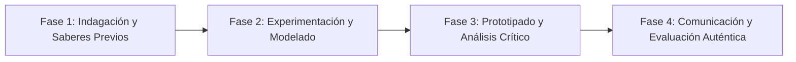

# Planeación Didáctica: 2 de Octubre no se Olvida: El Movimiento Estudiantil Popular de 1968 y la Masacre de Tlatelolco

> [!INFO] Ficha Técnica y Curricular (NEM 2024 - Fase 6)
> - **Docente Titular:** [[Prof. Israel López Ángeles]] (`usr-teacher-1`)
> - **Nivel y Fase:** Educación Secundaria — [[Fase 6 (1º, 2º y 3º de Secundaria)]]
> - **Grado:** **2º de Secundaria**
> - **Campo Formativo:** [[Ética, Naturaleza y Sociedades]]
> - **Disciplina / Materia:** [[Historia]]
> - **Contenido Sintético Oficial SEP 2024:** *El Movimiento Estudiantil de 1968 y la lucha por las libertades democráticas*
> - **MOC General:** [[00_Indice_Maestro_Secundaria_Fase6_NEM2024]]

---

## 🎯 Proceso de Desarrollo de Aprendizaje (PDA Oficial SEP 2024)
```text
Fase 6 (2º Secundaria) - Recupera información de crónicas y narrativas de participantes del movimiento estudiantil de 1968 (Pliego Petitorio de 6 Puntos), reflexiona desde su condición juvenil y emite juicios éticos sobre la represión de Estado.
```

---

## ❓ Preguntas Detonadoras e Indagación Crítica
- **¿Qué exigían los jóvenes estudiantes de la UNAM y del IPN en su Pliego Petitorio de 1968 (libertad a presos políticos, derogación del delito de disolución social, destitución de jefes policiacos)?**
- **¿Por qué el gobierno autoritario de Gustavo Díaz Ordaz temía tanto a las manifestaciones pacíficas frente a los Juegos Olímpicos de 1968?**
- **¿Cómo el 68 sembró la semilla de la transición democrática y la defensa de los derechos humanos en México?**

---

## 📋 Secuencia Didáctica Detallada (10 Sesiones de 50 Minutos)



### 🚀 Sesiones 1 y 2: Indagación, Diagnóstico y Recuperación de Saberes
- **Inicio (15 min):** Lectura de testimonios de La Noche de Tlatelolco de Elena Poniatowska.
- **Desarrollo (30 min):** Planteamiento del reto integrador, conformación de equipos colaborativos y delimitación del alcance del proyecto.
- **Cierre (5 min):** Registro en la bitácora individual de metas de aprendizaje.

### 🔬 Sesiones 3 a 7: Desarrollo Metodológico, Trabajo Experimental y Producción
- **Inicio (10 min):** Reactivación de compromisos y revisión del cronograma de trabajo.
- **Desarrollo (35 min):** Taller de Memoria Histórica y Gráfica del 68: Analizar los volantes y grabados que los estudiantes imprimían en mimeógrafos clandestinos y diseñar un cartel conmemorativo de exigencia democrática.
- **Cierre (5 min):** Coevaluación intermedia mediante lista de cotejo y retroalimentación entre pares.

### 🏁 Sesiones 8 a 10: Integración, Socialización Comunitaria y Evaluación
- **Inicio (10 min):** Ensayos de presentación y ajuste final de entregables.
- **Desarrollo (30 min):** Minuto de silencio y marcha pacífica de antorchas simbólicas en el patio escolar.
- **Cierre (10 min):** Metacognición grupal, balance de impacto social y firma del acta de entrega de proyectos.

---

## 📊 Rúbrica Analítica de Evaluación Formativa y Auténtica

| Nivel de Desempeño | Criterios Curriculares y Evidencias Observables | Ponderación |
| :--- | :--- | :---: |
| **Excelente (10)** | Comprensión de las causas y demandas democráticas del movimiento de 1968 con fundamentación teórica sólida, rigurosa y aplicación práctica contextualizada. | 40% |
| **Satisfactorio (8-9)** | Juicio crítico y ético sobre el autoritarismo y la represión estatal de manera autónoma, estructurada y con calidad metodológica. | 35% |
| **En Proceso (6-7)** | Empatía histórica y vinculación con las luchas juveniles contemporáneas con apoyo docente y áreas de mejora identificadas. | 25% |

---

## 📦 Materiales, Recursos Didácticos y Entregable Final

- **Materiales y Recursos:** Fragmentos de La Noche de Tlatelolco, copias de grabados del 68, cartulinas.
- **Entregable Principal:** `Cartel Conmemorativo de Gráfica Popular del 68 y Ensayo Crítico de Memoria Democrática.`
- **Instrumentos de Evaluación:** Rúbrica analítica, bitácora de coevaluación entre pares, lista de verificación de entregables.

---

## 🔗 Enlaces Bidireccionales (Obsidian Knowledge Graph)
- [[00_Indice_Maestro_Secundaria_Fase6_NEM2024]]
- [[Ética, Naturaleza y Sociedades]]
- [[Historia]]
- [[Secundaria_2do_Grado]]
- [[Prof_Israel_Lopez_Angeles]]
